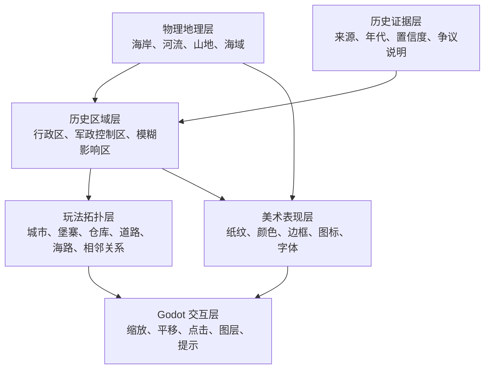
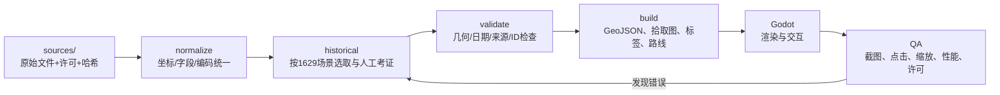

# 东亚历史地图纠偏与自动制作方案

> 状态：`WORKING-DESIGN`（生产方案已经确定；历史边界尚待逐区考证）  
> 场景基准：1629 年前后，服务于“宁远急饷”垂直切片  
> 写给谁：第一次做地图、不会 GIS、但需要判断地图是否做对的项目负责人

## 1. 先纠正昨晚的错误

昨晚生成的 `ming-strategy-map-natural-earth.*` **不是明代地图**。

现有脚本 `tools/build_real_china_map.py` 从 Natural Earth 现代全球一级行政区数据中筛选：

```text
adm0_a3 = CHN
```

筛出的 32 条记录是现代中国省级轮廓。它只能证明“程序能够读取 Shapefile 并画出轮廓”，不能证明：

- 轮廓属于明代；
- 轮廓代表 1629 年的行政区；
- 明、后金、朝鲜、蒙古诸部等政治关系得到表达；
- 辽西军政控制与粮道可以用于玩法。

因此立即采用以下裁决：

| 资产 | 新定位 |
| --- | --- |
| `ming-strategy-map-natural-earth.*` | 现代数据实验样张，退出正式游戏入口 |
| Natural Earth Admin-1 | 不再用于明代行政区或势力区 |
| Natural Earth 海岸线、河流、湖泊 | 可以作为现代物理地理参考，但必须登记来源，并承认历史水系可能变化 |
| ImageGen 水墨地图 | 只能作为色彩、纸纹、山水笔触参考，绝不能当边界、距离或点击判定 |

## 2. 一张游戏地图其实是五张叠在一起的透明片



白话解释：

- **物理地理层**像桌子的木板，告诉我们哪里是海、哪里是陆地；
- **历史证据层**像每条线背后的脚注，告诉我们为什么这样画；
- **历史区域层**才回答“谁管哪里”，而且不强迫所有地方都有现代国界般的硬线；
- **玩法拓扑层**回答“粮食能不能从北京运到宁远”；
- **美术表现层**负责好看，但没有修改历史事实的权力；
- **Godot 交互层**负责玩家如何看到、点击和理解它们。

## 3. 东亚地图采用三档观察尺度

不要一次在同一张图上同时画完东亚所有县、卫、所、驿站。那样既看不清，也无法考证。

| 尺度 | 玩家看到什么 | 当前用途 |
| --- | --- | --- |
| 东亚全局 | 明、后金、朝鲜、日本、蒙古诸部、琉球及周边政权/影响区 | 理解天下格局，不做精细运输结算 |
| 明朝区域 | 两京十三布政使司、辽东等特殊军政区域，以及主要省级中心 | 国家治理与跨区域调度 |
| 辽西前线 | 北京、通州、山海关、宁远、锦州、登莱等节点和陆海粮道 | MVP 实际玩法与精确点击 |

缩放不会凭空创造更精确的史实。只有通过来源账本审核的数据，才能进入更细一级。

## 4. 边界不能只分成“有”和“没有”

17 世纪东亚不能照搬现代民族国家地图的画法。建议使用四种区域语义：

| `boundary_kind` | 玩家看到的样式 | 表达的含义 |
| --- | --- | --- |
| `administrative` | 细实线 | 有史料支持的行政隶属分界 |
| `military_control` | 粗实线或前线齿线 | 某一时点相对明确的军政实际控制 |
| `contested` | 双线、斜纹或交叠色 | 双方争夺、控制随时间变化 |
| `influence` | 点状纹理或渐隐色块 | 朝贡、联盟、游牧活动或影响范围，不冒充精确国界 |

每个区域还必须带：

```json
{
  "id": "stable-machine-id",
  "name_zh": "玩家看到的名称",
  "valid_from": "起始日期或年代",
  "valid_to": "结束日期或年代",
  "boundary_kind": "administrative",
  "confidence": "high | medium | low",
  "source_ids": ["SRC-..."],
  "review_status": "draft | reviewed | accepted",
  "notes": "不确定性或争议说明"
}
```

没有 `source_ids` 的区域不能进入正式场景，只能显示在开发者草稿层。

## 5. ChatGPT/Codex 能自动做什么

### 可以自动完成

1. 下载并校验已获许可的地理数据；
2. 把 Shapefile、GeoJSON、CSV 统一为 WGS84 坐标；
3. 按场景年份筛选历史区域；
4. 简化复杂多边形，同时保留海岸和关键边界；
5. 为每个区域生成稳定 ID、显示标签点和点击拾取色；
6. 从同一份数据生成：
   - `regions.geojson`：历史可视区域；
   - `pick-mask.png` + `pick-table.json`：鼠标点击识别；
   - `routes.json`：玩法路线；
   - `labels.json`：分级标签；
   - `source-ledger.csv`：每条数据的出处与许可；
7. 自动检查重复 ID、自交多边形、断裂路线、未知节点、未登记来源；
8. 自动输出 Godot 可加载资源、调试图和验收报告；
9. 使用 ImageGen 生成无文字的纸纹、面板材质、肖像等原创表现资产；
10. 运行 Godot、模拟点击、截图并做视觉验收。

### 不能替人决定

1. 不能把模型记忆中的“明朝大概疆域”直接当史实；
2. 不能从一张有版权的《中国历史地图集》扫描图偷偷描边；
3. 不能根据现代省界自动推断明代行政区；
4. 不能把朝贡关系、名义册封和实际控制混成同一种颜色；
5. 不能让 ImageGen 决定城市经纬度、政治边界和运输距离；
6. 不能在史料互相冲突时悄悄挑一个答案，必须把冲突留在来源账本里供人确认。

## 6. 推荐的自动生产流水线



建议命令最终收敛成一条：

```powershell
python tools/build_east_asia_map.py --scenario content/scenarios/ming_1629/map/map-build.json
```

这条命令必须是**可重复的**：同一批输入和同一版本脚本应产生相同哈希的输出。

## 7. 推荐目录

```text
assets/maps/
├─ sources/                         # 原始数据，只读保存
│  ├─ natural-earth/                # 只取许可明确的物理地理
│  ├─ hartwell-cc0/                 # 已下载的 1391 明代近似行政区，仍待逐区复核
│  └─ openhistoricalmap/            # 逐要素检查 license 标签
├─ working/                         # 人工考证和修订中的 GeoJSON
├─ generated/ming_1629/             # 自动生成，禁止手改
│  ├─ regions.geojson
│  ├─ pick-mask.png
│  ├─ pick-table.json
│  ├─ labels.json
│  ├─ routes.json
│  ├─ debug-map.png
│  └─ build-manifest.json
└─ archive/modern-china-demo/       # 昨晚现代省界样张移到这里

content/scenarios/ming_1629/map/
├─ map-build.json
├─ political-regions.geojson
├─ military-control.geojson
├─ places.json
├─ routes.json
└─ source-ledger.csv
```

## 8. 数据来源的当前裁决

| 来源 | 当前裁决 | 理由 |
| --- | --- | --- |
| Natural Earth | 物理参考可用；现代 Admin-1 禁作明代区域 | 公共领域，但数据描述的是现代地理/行政内容 |
| Hartwell China Historical GIS | 已下载并固定哈希；只作 15 个明代行政草稿的近似几何基线 | 数据集标为 CC0，包含 1391 明代近似空间实体；其自身明确承认是基于现代县单元重建的近似结果，不能冒充 1629 精确边线 |
| CHGIS V3/V6 | 仅研究参考，不能直接打包进游戏 | 页面规定学术研究使用、禁止商业使用或再分发 |
| OpenHistoricalMap | 按要素逐项候选 | 默认 CC0，但个别要素可能是 CC BY/CC BY-SA，必须检查 `license=*`；中国明代数据完整度不能预设 |
| 中研院 1582 明代历史图瓦片 | 研究对照，不直接下载进游戏 | 页面所述为学术用途和特定版权体系；不能因为网页可看就视为可再分发资产 |
| 北京大学明时期地图 | 不直接使用 | 明确限科学研究并限制复制、修改和传播 |
| Wikimedia 明代行政区 SVG | 可作带署名、相同方式共享的参考资产，不作为唯一史据 | CC BY-SA 4.0/GFDL；年份、边界依据和精度仍需独立核验 |
| Open Historia | 学习编辑器和 GeoJSON 工作流 | MIT 代码；地图数据和社区场景必须另查许可，不整仓照搬 |
| OpenVic | 仅作概念参考，暂时禁止复制代码和资产 | 根 `LICENSE.md` 与仓库 `COPYRIGHT` 对主游戏/Simulation 的 MIT、GPL-3.0-only 表述冲突，图形音频又多为 CC BY-SA；维护者澄清并固定提交前不能复用 |
| Sparta | 可研究相机/选区/数据加载等小型实现 | MIT 代码，但 Godot 4.7 GDScript 与本项目 4.6 C# 不同；资产另有许可 |

特别提醒：Open Historia 根代码虽然是 MIT，但它的现代地图生成链保留 GADM 来源；GADM 地图二进制不能因为装在 MIT 仓库里就变成 MIT。这里只学习编辑器交互和资产流水线，禁止复制其地图数据。

## 9. UI 美术如何使用 ImageGen 与开源组件

### ImageGen 负责

- 无文字的御案式 UI 视觉基准；
- 宣纸、漆木、铜边、朱砂选中态等材质；
- 虚构人物肖像；
- 不带地理信息的云纹、波纹、山形装饰；
- 宣传图和概念图。

### 程序与 SVG 负责

- 所有文字和数值；
- 地图边界、城市、路线、军队、库存和情报状态；
- 图标的正常/悬停/选中/禁用状态；
- 九宫格面板、焦点框、键盘导航；
- 色盲辅助图案和高对比模式。

### 开源组件候选

- Tabler Icons：MIT，适合选取少量通用线性图标后重着色；
- Material Symbols：Apache-2.0，适合作为缺少的功能图标候选；
- Kenney UI Pack：CC0，可借鉴控件状态和九宫格切片，但其现代通用风格需重新包裹为明代御案视觉；
- Godot 原生 `Control`、`Theme`、`StyleBoxTexture`：承担真正可交互 UI，不把整张生图当按钮。

## 10. 最小代码原则在地图上的具体含义

不是“用一张 PNG 最省代码”。一张 PNG 无法可靠点击、换图层、显示情报，也无法追踪史料。

真正的最小正确方案是：

1. 一份规范化历史数据；
2. 一个离线构建脚本；
3. 一个地图视图；
4. 一个只读地图快照模型；
5. 一个交互控制器；
6. 少量可复用 UI 组件。

暂时不做：矢量瓦片服务器、PostGIS、运行时 GIS、通用世界地图编辑器、任意年代插值、3D 地球和完整 Mod SDK。

## 11. 验收门槛

### 历史正确性

- 正式政治图层中不存在现代中华人民共和国省界；
- 每个正式区域都有场景年份、边界语义、置信度和来源；
- 明、后金、朝鲜、日本、蒙古诸部等不能被现代国界画法抹平；
- 争议或模糊影响区不会被画成伪精确实线。

### 玩法正确性

- 北京、通州、山海关、宁远、锦州等 MVP 节点可独立点击；
- 陆路和海路来自 `routes.json`，不是从背景图猜出来；
- 地图只显示玩家已知的动态信息；
- 点击和缩放不修改 `WorldState`。

### 工程正确性

- 同样输入重复构建得到相同输出哈希；
- 每个可点击颜色唯一，反查表无遗漏；
- 所有路线端点存在，拓扑没有幽灵节点；
- 1600×960 下标签不遮住关键节点；
- 5 档缩放、平移、图层切换和键盘焦点均可测试；
- 许可证清单能追溯到每份被打包资产。

### 视觉正确性

- 美术不掩盖地图信息；
- 颜色之外还有线型、纹理和图标；
- 生成图不含伪文字、虚假地理和不可点击的假按钮；
- UI 截图是 Godot 实际运行结果，不是只交概念图。

## 12. 推荐实施顺序

1. 将现代中国省界样张从主场景下线并归档；
2. 下载、校验并审计 Hartwell 1391 CC0 数据：**已完成输入固定和许可证记录；逐区史实复核仍在进行**；
3. 建立 `source-ledger.csv`，先审核东亚全局政权和辽西 MVP 节点；
4. 先做 6—10 个辽西节点的可点击地图，不等全国历史行政区全部完工；
5. 接入平移、缩放、选中、两种 Overlay 和时间控制；
6. 生成并接入可九宫格切片的 UI 材质；
7. 再扩展两京十三布政使司和东亚全局区；
8. 最后才考虑地图编辑器和更多年代。

这套顺序允许地图从第一周起就可验证，又不会把临时现代省界永久固化进游戏。
