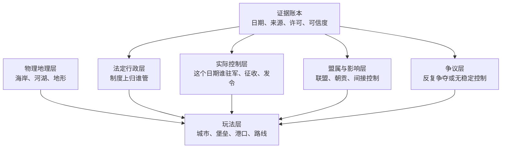
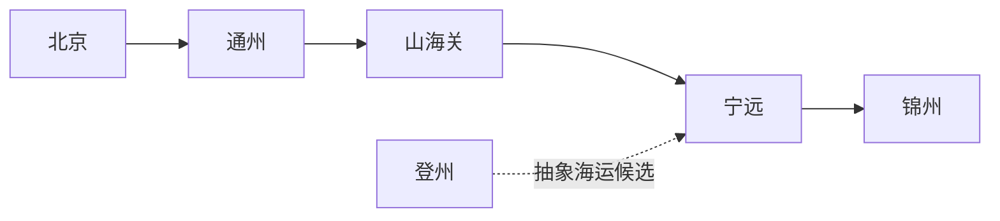

# 1629 东亚势力分区与证据计划

> 状态：`WORKING-DESIGN`（分层方法和 P0 范围已定；大部分精确边线尚未考证）  
> 固定快照：`1629-01-01`（游戏使用的 ISO 日期标签；史料原始历法另存）  
> 查阅日期：2026-08-13  
> 写给谁：第一次做历史地图、不会 GIS、需要知道“哪条线能信、为什么能信”的项目负责人  
> 本文只规划数据和证据，不授权把候选边界直接写入正式游戏

## 0. 30 秒结论

1. **这不是现代中国省级地图。** Natural Earth、GADM、geoBoundaries 的现代省界不能充当 1629 年行政区或势力区。
2. **一块地方可以同时有四种答案。** 例如辽东可同时存在“明朝法定建制”“后金实际控制”“明军堡垒控制”“双方争议带”，不能只涂一种国色。
3. **首版只做约 39 个东亚宏区。** 它们用于看天下格局；首个真正可玩的地图仍只有北京、通州、山海关、宁远、锦州、登州 6 个节点。
4. **正式边界必须带证据。** 每个点、线、面都要写清日期、来源、许可证、绘制方法、可信度和仍有何争议；没有 `source_ids` 的对象只能留在草稿层。
5. **固定日暂定 `1629-01-01`。** 同一年内将领、城池、军队和外交关系都会变化。把“1629 年地图”做成全年不变的一张图，会把年初和年末的事实错误地拼在一起。
6. **眼下最安全的资产组合**是：Natural Earth 的物理海岸/河湖 + USGS 高程 + 人工依据可复用古图和史料重建的历史层。现代行政边界、许可受限数据库和来源不明的网友矢量一律不进入发布包。

一句白话比喻：**物理底图是桌面，法定行政是户籍册，实际控制是“今天谁拿着钥匙”，盟属影响是关系网，争议区是双方都可能进出的走廊。它们不是同一张表。**

## 1. 本文的三个证据标签

本文每个事实块和表格条目使用以下标签。标签判断的是“来源能否支持这句话”，不是作者觉得它像不像真的。

| 标签 | 白话解释 | 可否进入正式地图 |
| --- | --- | --- |
| `FACT` | 可打开的一手材料、官方馆藏说明或权威数据库直接支持，且时间、地点、对象相符 | 可以作为初始事实，但几何边线仍要单独审核 |
| `INFERENCE` | 根据多条事实作出的历史解释、制图归纳或游戏设计取舍 | 可以做可替换的设计层；UI 和账本不得把它伪装成史料原话 |
| `OPEN` | 证据缺失、来源冲突、日期未换算或精确边线尚未完成 | 不得写死；只能作为研究任务、草稿对象或明显的模糊区 |

特别注意：

- `FACT：某政权或行政单元存在`，**不等于** `FACT：我们画出的每个拐点都准确`；
- `争议区` 是 1629 年当时的控制不稳；`confidence=low` 是我们今天证据不足，两者必须分开；
- 本文用 `INFERENCE` 表示制图和游戏化推导，对应总蓝图中的 `INTERPRETATION` 或 `DESIGN`，不是新增一种“史实”。

## 2. 为什么固定到 1629-01-01

### 2.1 `[INFERENCE]` 固定日是制作边界，不是宣称一天内世界静止

P0 暂定使用：

```text
snapshot_id: east_asia_1629_01_01
snapshot_date: 1629-01-01
engine_calendar: proleptic_gregorian_label
source_calendar: preserve_original
```

白话解释：游戏先用一个统一的 ISO 日期标签冻结地图；史料写“崇祯二年六月”等日期时，原文日期必须保留，不能在没有历法换算记录的情况下偷偷改成公历。

### 2.2 `[FACT]` 同一个 1629 年内，地图确实会改变

- 一手史料汇编记载毛文龙在崇祯二年六月被杀，东江镇的统帅和组织关系随之改变。参见[《明史纪事本末补遗》相关卷](https://ctext.org/wiki.pl?chapter=867360&if=en&remap=gb)。因此 `1629-01-01` 的东江镇不能套用同年六月以后的指挥状态。
- 辽宁省文化和旅游部门的东京城遗址说明记载，后金 1621 年攻取辽阳并建东京城，1625 年迁都沈阳。参见[东京城城址官方介绍](https://whly.ln.gov.cn/whly/wlzt/lnww/zdwwbhdw/3D3F77FF561C4367A540E61575E0598F/index.shtml)。因此 1629 年不能继续把辽沈腹地涂成明军稳定控制。
- 韩国国家历史内容平台说明，1627 年后金入侵后议和撤军。参见[韩国官方历史教材条目](https://contents.history.go.kr/id/ta_m71_0060_0030_0030_0010)。因此 1629 年朝鲜是单独治理的国家，不是后金的一块行政领土。

这些材料证明“年份内会变化”，但没有自动给出所有边线。

### 2.3 `[OPEN]` 还没有关闭的日期问题

- `1629-01-01` 与“崇祯元年/二年”史料日期的逐条换算规则；
- 跨午夜、月份和季节时，军事控制对象何时切换；
- 史料只写“某月”或“某季”时，使用区间、模糊日期还是事件触发；
- 未来剧本是否从 `1629-01-01` 开始，还是只把它作为东亚全局地图基线。

在上述问题关闭前，来源账本必须同时保存 `date_original` 和 `date_normalized`，不能只留一个转换结果。

## 3. 一张地图实际由六张透明片叠成



### 3.1 `[FACT]` 法定行政 `legal_administration`

回答“制度和公文上归哪个行政单位”。例如明两京十三布政使司、朝鲜八道。它可以在某地已经失守后仍作为名义建制存在，所以不能代替实际控制层。

推荐表现：细实线、低饱和底色。

### 3.2 `[FACT]` 实际军政控制 `de_facto_control`

回答“冻结日期当天，谁能在这里驻军、发令、征收或维持据点”。它可能是连续面，也可能只是城堡、岛屿和道路组成的网络。

推荐表现：较深填色；堡垒控制使用节点和走廊，不强行补成完整多边形。

### 3.3 `[INFERENCE]` 盟属与影响 `affiliation_or_influence`

回答“谁与谁结盟、朝贡、受军事压力或受到间接约束”。这种关系通常不是现代主权吞并。

推荐表现：半透明渐变、关系线、徽记；不得与行政实线共用同一种视觉语法。

### 3.4 `[FACT + OPEN]` 争议区 `contested_control`

回答“当时双方争夺、控制反复或无法稳定确认”。“这里有争夺”可以是 `FACT`，而争议区的精确外沿通常仍是 `OPEN`。

推荐表现：交叉斜纹或双方颜色交叠；工具提示中列明争议双方和证据日期。

### 3.5 `[INFERENCE]` 图形不是装饰，而是语义

| 地图样式 | 唯一允许表达的含义 |
| --- | --- |
| 细实线 | 有来源支持的法定行政分界 |
| 深色面 | 相对稳定的实际控制核心 |
| 堡垒点 + 走廊 | 沿城、关、岛和道路维持的控制网络 |
| 斜纹 | 当时的争夺或不稳定控制 |
| 渐隐色/点纹 | 盟属、朝贡、间接控制或活动影响 |
| 虚线 | 边线为制图近似，不是测绘级事实 |

颜色之外必须还有线型和纹理，避免色盲玩家无法分辨，也避免一块纯色误导成现代主权国界。

## 4. 每个地图对象必须携带的证据字段

### 4.1 `[INFERENCE]` 最小对象记录

```yaml
object_id: "front-guanningjin-001"
object_type: "region | node | route | label | relation"
name_zh: "关宁锦明军堡垒走廊"
names_original: ["原文异名"]

snapshot_date: "1629-01-01"
valid_from: "已知起始日或区间"
valid_to: "已知结束日或区间"
date_original: "史料原写法"
date_calendar: "ming_regnal | gregorian | unknown"

legal_parent_id: "法定上级，可为空"
controller_id: "实际控制者，可为空"
control_type: "civil_admin | military_core | fort_network | enclave | allied | tributary | influence | contested"
boundary_kind: "administrative | de_facto | influence | contested"

claim_status: "fact | inference | open"
confidence: "high | medium | low"
confidence_reason: "为什么给这个置信度"

geometry_method: "primary_map_trace | multi_source_reconstruction | schematic | point_only"
geometry_crs: "EPSG:4326"
geometry_precision_note: "误差、概化和不能表达的内容"

source_ids: ["SRC-LOC-DA-MING-YU-DI-TU"]
source_locators: ["具体图页、卷、页、条目或对象ID"]
evidence_summary: "来源直接支持了什么，不支持什么"
conflicts: ["相反材料或不同口径"]

license_id: "Public Domain | CC0 | CC-BY-4.0 | research-only | unknown"
asset_inclusion: "allowed | research_only | forbidden | pending_review"
attribution_text: "发布时必须显示的署名"
source_url: "稳定直达链接"
downloaded_at: "YYYY-MM-DD"
source_version: "数据版本或馆藏对象版本"
source_sha256: "下载文件哈希"

review_status: "draft | evidence_checked | geometry_checked | accepted"
reviewed_by: "审核人"
reviewed_at: "YYYY-MM-DD"
notes: "面向团队的剩余说明"
```

### 4.2 `[INFERENCE]` 小白版字段解释

| 字段组 | 它在防止什么错误 |
| --- | --- |
| `snapshot/valid/date_*` | 防止把不同年份、不同历法的事实拼在一起 |
| `legal_parent/controller/control_type` | 防止把名义归属、实际占领和盟属混成一个“国家”字段 |
| `claim_status/confidence` | 防止作者的猜测伪装成高置信史实 |
| `geometry_method/precision_note` | 防止人工描出来的近似线被称为“精确古代边界” |
| `source_ids/locators/evidence_summary` | 防止只贴首页链接、其他人找不到真正支持句 |
| `license/asset_inclusion/attribution` | 防止能在线看却不能打包进游戏的数据被误用 |
| `version/hash/downloaded_at` | 防止网站更新后无法还原当时用了哪一份文件 |
| `review_status` | 防止草稿多边形悄悄混入正式场景 |

### 4.3 `[INFERENCE]` 四道硬门

一个对象只有全部通过才可以标为 `accepted`：

1. **证据门**：至少一个可重新打开的来源，且确实支持该对象在该日期存在；
2. **语义门**：明确它是行政、实际控制、影响还是争议，不能只写 `owner`；
3. **几何门**：说明边线怎样得到，并由第二人检查关键点；
4. **许可门**：确认游戏发布包可以再分发，署名和相同方式共享义务已处理。

`OPEN` 对象可以有草稿几何，但构建器必须默认排除，不允许靠“看起来差不多”进入正式图层。

## 5. 1629-01-01 各区域的历史表达方案

### 5.1 明朝内地、两京十三布政使司与九边

#### `[FACT]` 能确认到什么程度

- 美国国会图书馆馆藏[《大明舆地图》](https://www.loc.gov/item/2002626776/)说明该图册包含十三省、两直隶、辽东和总图，可用来确认晚明法定行政骨架与名称。
- 同馆[《广舆图》1579](https://www.loc.gov/item/2021666327/)包含道路、行政组织、城镇和军政地理信息，可作为节点和路线的历史对照。
- 兵部职方司官员陈祖绶编绘的[《皇明职方地图》1636](https://www.loc.gov/item/2021668270/)接近目标年代，包含两京十三省、边镇、关隘、道路和周边地理信息；但它比快照晚 7 年。

以上馆藏证明行政体系和大量地名存在，不证明古图上的笔画已经是现代坐标中的精确边界。

#### `[INFERENCE]` 游戏怎样画

- P0 内地使用 15 个法定行政宏区：北直隶、南直隶、山东、山西、河南、陕西、浙江、江西、湖广、四川、福建、广东、广西、云南、贵州。
- 九边重镇、卫、所、关、堡是军事层或节点，不升级成与布政使司同级的“省”。
- 西南土司地区在法定行政层可挂在相应布政使司下，实际控制层使用间接控制或节点网络，不涂成与内地州县同等密实的行政色。

#### `[OPEN]` 还不能写死

- 15 个宏区的 1629 精确外边线和内部府州边线；
- 黄河、长江三角洲、海岸和湖泊相对现代底图的历史变化；
- 九边、卫所和土司在 `1629-01-01` 的实际驻防、辖区和有效控制；
- 陕西等地早期民变的当日活动范围。流动群体应先做事件点或热区，不提前画成稳定国家。

### 5.2 辽东、辽西与后金

#### `[FACT]` 能确认到什么程度

- 辽宁省官方遗址介绍记载后金 1621 年攻取辽阳、建东京城，1625 年迁都沈阳：[东京城城址](https://whly.ln.gov.cn/whly/wlzt/lnww/zdwwbhdw/3D3F77FF561C4367A540E61575E0598F/index.shtml)。因此 1629 年辽阳—沈阳不能表现为明朝稳定实际控制。
- 日本国立国会图书馆检索到的辽东都司研究说明，明代辽东都司以辽阳为中心；该记录可作为制度线索，但不是可直接复制的边界数据：[明代辽阳东宁卫研究记录](https://ndlsearch.ndl.go.jp/books/R000000004-I2774901)。
- 一手史料汇编记载毛文龙直到崇祯二年六月才被杀：[《明史纪事本末补遗》](https://ctext.org/wiki.pl?chapter=867360&if=en&remap=gb)。因此年初东江镇仍应作为单独的明方军政网络表达。

#### `[INFERENCE]` 游戏怎样画

辽东不画成一个纯色省，最少拆成四种对象：

1. **后金建州—辽沈核心控制区**：相对稳定的实际控制面；
2. **关宁锦明军堡垒走廊**：由关、城、堡和道路组成的控制网络，不自动扩成整个辽东；
3. **东江镇海岛—辽南沿岸节点网**：岛屿、港口、据点和海路组成的网络；
4. **辽东/辽西争夺带**：双方活动和控制反复的斜纹区。

法定行政层仍可保存“辽东都司”这一历史建制，但它不能覆盖或抹掉实际控制层。

#### `[OPEN]` 还不能写死

- `1629-01-01` 双方堡垒清单、驻军和连接线；
- 关宁锦走廊及争夺带的精确宽度；
- 东江镇对辽南陆地的真实可持续控制程度；
- 后金核心、附属女真群体、蒙古盟部之间的行政和军事边界；
- 锦州、觉华岛、旅顺等节点在该日应采用点、走廊还是小型控制面。

### 5.3 蒙古诸部

#### `[FACT]` 当前证据边界

晚明官方舆图能证明北部边镇和周边部族是同时代制图关心的对象，参见[《皇明职方地图》1636](https://www.loc.gov/item/2021668270/)，但本轮尚无足以批准 `1629-01-01` 精确部界的逐部材料。

#### `[INFERENCE]` 游戏怎样画

- 不建立一个统一、硬边界的“蒙古国”多边形；
- P0 暂分为科尔沁诸部、察哈尔、喀尔喀、土默特—鄂尔多斯等四个研究宏区；
- 科尔沁与后金的关系先作为联盟/依附关系线和渐变，不直接并入后金行政区；
- 游牧政治空间优先使用营地、部族中心、季节活动带和模糊边缘。

#### `[OPEN]` 还不能写死

- 四个宏区是否足以表达 1629 年各部差异；
- 林丹汗、科尔沁诸部、喀尔喀诸部及南蒙古各部在快照日的控制、盟约和活动范围；
- 牧地边缘是否随季节变化，以及游戏是否需要季节状态；
- 可合法重建部族分布的具体一手地图、档案和现代研究定位。

在这些 `OPEN` 关闭前，四区只是研究容器，不是史实国界。

### 5.4 朝鲜

#### `[FACT]` 能确认到什么程度

- 韩国国家历史内容平台说明朝鲜采用八道行政体系：[朝鲜八道条目](https://contents.history.go.kr/mobile/ta/view.do?levelId=ta_h51_0060_0020_0010)。
- 同一官方平台说明 1627 年后金入侵后议和撤军：[丁卯胡乱教材条目](https://contents.history.go.kr/id/ta_m71_0060_0030_0030_0010)与[专题说明](https://contents.history.go.kr/mobile/kc/view.do?code=kc_age_30&levelId=kc_i305600)。

因此 `1629-01-01` 的朝鲜不是后金行政领土。

#### `[INFERENCE]` 游戏怎样画

- 东亚全局 P0 使用一个“朝鲜王国”宏区；
- 放大后可使用八道作为法定行政子层；
- 与明、后金之间用外交、军事压力和盟约关系线表示，不用领土吞并色表达。

#### `[OPEN]` 还不能写死

- 八道在 1629 年的精确边线和地方军事配置；
- 1627 议和在 `1629-01-01` 应映射成何种游戏关系值；
- 对东江镇、边境贸易和女真群体的具体互动节点。

### 5.5 日本、琉球与北海道

#### `[FACT]` 能确认到什么程度

- 日本国立公文书馆说明德川幕府曾命各地绘制“国绘图”，其图可显示国、郡、村、道路和城下町：[国绘图官方说明](https://www.digital.archives.go.jp/DAS/pickup/view/category/categoryArchivesEn/0300000000/0303000000/01)。现存集中展示多属元禄、天保时期，不能直接当作 1629 边线。
- 日本国立国会图书馆资料说明 1609 年萨摩入侵并控制琉球：[NDL Newsletter 琉球资料](https://dl.ndl.go.jp/view/prepareDownload?contentNo=1&itemId=info%3Andljp%2Fpid%2F11481319)。这不等于琉球作为一个地方行政区完全消失。

#### `[INFERENCE]` 游戏怎样画

- 日本基础地理单元使用历史“国”或更粗的历史区域，不使用现代都道府县；
- 东亚全局 P0 先使用“德川幕府统辖诸国”宏区，实际大名控制以后用城郭—领地关系图补充；
- 蝦夷地南部松前活动区与其他阿伊努群体活动区分开，不把整个北海道涂成日本稳定行政领土；
- 琉球王国保留为单独宏区，同时连接“对明朝贡”和“受萨摩控制”两类关系。

#### `[OPEN]` 还不能写死

- 1629 年各“国”、大名领地及幕府直辖地的精确边线；
- 松前氏活动区和各阿伊努群体的空间范围；
- 琉球本土与奄美的不同控制状态、萨摩驻留和财政关系；
- 日本国绘图扫描件能否作为发布资产复用；当前仅作研究引用，逐件许可未审核。

### 5.6 台湾、澳门与欧洲据点

#### `[FACT]` 能确认到什么程度

- 台湾国史馆台湾文献馆说明荷兰于 1624 年进入台湾，西班牙于 1626 年进入鸡笼：[官方展览说明](https://www.th.gov.tw/CP/104/176/)。因此 1629 年台湾不能画成明朝行政省，也不能被荷兰或西班牙整岛填色。
- 澳门特别行政区政府旅游局说明葡萄牙人在 16 世纪中叶经广东地方官允许建立居留和贸易据点：[澳门简史](https://www.macaotourism.gov.mo/en/travelessential/about-macao/brief-history)。澳门文化部门资料还说明明代澳门属于香山县范围：[澳门历史资料](https://www.icm.gov.mo/rc/viewer/20036/1334)。

#### `[INFERENCE]` 游戏怎样画

- 台湾主体先使用“原住民诸群体研究宏区”，内部不在没有证据时填成单一政权；
- 大员荷兰据点、鸡笼西班牙据点使用小型堡垒/港口节点，不画成全岛殖民地；
- 澳门使用“明朝法定辖区中的葡萄牙居留与贸易节点”双重语义，不画成现代式葡萄牙海外主权面；
- 马尼拉、巴达维亚、摩鹿加等欧洲据点优先用港口和贸易网络节点表达。

这些是东亚全局背景节点，不计入“宁远急饷”六节点切片：

| 候选节点 ID | 暂定对象 | 当前证据标签与处理 |
| --- | --- | --- |
| `ENCLAVE-MACAO` | 澳门葡萄牙居留/贸易节点 | `FACT` 居留贸易背景；`OPEN` 1629 管辖、占地和港区几何 |
| `ENCLAVE-TAYOUAN` | 大员荷兰堡垒/港口节点 | `FACT` 1624 后存在；`OPEN` 1629-01-01 有效控制范围 |
| `ENCLAVE-KEELUNG` | 鸡笼西班牙堡垒/港口节点 | `FACT` 1626 后存在；`OPEN` 1629-01-01 有效控制范围 |
| `ENCLAVE-TAMSUI` | 淡水西班牙据点候选 | `OPEN` 具体建立日期和快照日是否激活，未关闭前不显示 |
| `ENCLAVE-MANILA` | 马尼拉西班牙港口网络候选 | `OPEN` 本轮尚未完成逐对象来源和几何审核 |
| `ENCLAVE-BATAVIA` | 巴达维亚 VOC 港口网络候选 | `OPEN` 本轮尚未完成逐对象来源和几何审核 |
| `ENCLAVE-MOLUCCAS` | 摩鹿加 VOC/地方政权节点群候选 | `OPEN` 必须拆成具体岛、堡垒和地方政权后再审核 |

#### `[OPEN]` 还不能写死

- `1629-01-01` 大员、鸡笼等据点的精确占地、附属聚落和有效控制半径；
- 台湾各原住民政治共同体、村社和关系网；
- 澳门明方管理机构、葡方自治、租税和防务关系的游戏字段；
- 淡水西班牙据点在固定日是否已经形成。来源对具体月份和设施阶段需要专项核对。

### 5.7 东南亚

#### `[FACT]` 当前证据边界

- 美国国会图书馆馆藏的[1619 年东南亚地图](https://www.loc.gov/item/2003663634/)可作为同时代地名和制图视角的一手图像，但不能直接转成精确政权多边形。
- 大都会艺术博物馆的[东南亚历史时期概览](https://www.metmuseum.org/toah/ht/08/sse.html)可用于核对王朝时期和继续寻找专门来源，但不是边界数据库。

本轮没有足以批准全部东南亚 `1629-01-01` 边线的证据集。

#### `[INFERENCE]` 游戏怎样画

- 不采用今天越南、老挝、泰国、柬埔寨、缅甸、菲律宾的国界；
- 政权核心区可用实色，朝贡和曼陀罗式外围用渐变和关系线；
- P0 先放入北部大越、南部大越、高平莫氏、占城/潘郎、澜沧、阿瑜陀耶、高棉、东吁王朝、菲律宾南部海上政权群等研究宏区；
- 西班牙马尼拉、VOC 港口和其他欧洲据点作为节点网络，不让港口节点自动拥有周围整片岛屿。

#### `[OPEN]` 还不能写死

- 上述名称、统治者、有效日期和中文译名的逐项权威来源；
- 各政权 1629 年核心控制、附属地、朝贡关系和争议带；
- 海岛东南亚应拆成哪些苏丹国、港口政权和殖民据点；
- 是否把爪哇、摩鹿加、吕宋南部纳入首屏范围，还是只作为离屏贸易节点。

东南亚 P0 宏区全部先标为 `OPEN`；它们是研究任务清单，不是已经验收的史实边界。

## 6. P0：39 个宏区，不做县级全集

### 6.1 `[INFERENCE]` 为什么是约 30—40 个

宏区的任务是让玩家看懂东亚格局，不承担每支粮队的精确路径计算。39 个对象足以证明图层、缩放、选中、证据提示和不同边界语义；再多会把第一阶段拖入数百条未经审核的边线。

### 6.2 `[FACT + OPEN]` 明朝法定行政/军政建制宏区 16 个

以下“两直隶、十三布政使司”15 个内地宏区和辽东都司法定覆盖层，由[《大明舆地图》馆藏说明](https://www.loc.gov/item/2002626776/)及[辽东都司研究记录](https://ndlsearch.ndl.go.jp/books/R000000004-I2774901)支持；每条精确几何仍为 `OPEN`。辽东都司与后面的实际控制区重叠是有意设计：前者回答“法定建制”，后者回答“当天谁实际控制”。

| ID | P0 宏区 | 对象语义 | 当前证据标签 |
| --- | --- | --- | --- |
| `MING-01` | 北直隶 | 法定行政 | `FACT` 名称/层级；`OPEN` 精确边线 |
| `MING-02` | 南直隶 | 法定行政 | `FACT` 名称/层级；`OPEN` 精确边线 |
| `MING-03` | 山东 | 法定行政 | `FACT` 名称/层级；`OPEN` 精确边线 |
| `MING-04` | 山西 | 法定行政 | `FACT` 名称/层级；`OPEN` 精确边线 |
| `MING-05` | 河南 | 法定行政 | `FACT` 名称/层级；`OPEN` 精确边线 |
| `MING-06` | 陕西 | 法定行政 | `FACT` 名称/层级；`OPEN` 精确边线 |
| `MING-07` | 浙江 | 法定行政 | `FACT` 名称/层级；`OPEN` 精确边线 |
| `MING-08` | 江西 | 法定行政 | `FACT` 名称/层级；`OPEN` 精确边线 |
| `MING-09` | 湖广 | 法定行政 | `FACT` 名称/层级；`OPEN` 精确边线 |
| `MING-10` | 四川 | 法定行政 | `FACT` 名称/层级；`OPEN` 精确边线 |
| `MING-11` | 福建 | 法定行政 | `FACT` 名称/层级；`OPEN` 精确边线 |
| `MING-12` | 广东 | 法定行政 | `FACT` 名称/层级；`OPEN` 精确边线 |
| `MING-13` | 广西 | 法定行政 | `FACT` 名称/层级；`OPEN` 精确边线 |
| `MING-14` | 云南 | 法定行政 | `FACT` 名称/层级；`OPEN` 精确边线 |
| `MING-15` | 贵州 | 法定行政 | `FACT` 名称/层级；`OPEN` 精确边线 |
| `MING-16` | 辽东都司法定覆盖层 | 法定军政建制覆盖 | `FACT` 建制/中心线索；`OPEN` 1629 法定边线；不代表明军实际控制 |

### 6.3 `[INFERENCE + OPEN]` 辽东、蒙古、朝鲜、日本、琉球、北海道与台湾 14 个

| ID | P0 宏区 | 对象语义 | 当前证据标签 |
| --- | --- | --- | --- |
| `FRONT-01` | 后金建州—辽沈核心控制区 | 实际控制核心 | `FACT` 辽沈已失守；`INFERENCE` 合并方式；`OPEN` 边线 |
| `FRONT-02` | 关宁锦明军堡垒走廊 | 城堡/道路控制网 | `INFERENCE` 表达方式；`OPEN` 节点和外沿 |
| `FRONT-03` | 东江镇海岛—辽南沿岸节点网 | 海岛、港口、据点网络 | `FACT` 年初东江镇仍存在；`OPEN` 控制范围 |
| `FRONT-04` | 辽东/辽西争夺带 | 争议控制 | `INFERENCE` 分层；`OPEN` 日期和几何 |
| `MONG-01` | 科尔沁诸部 | 盟属/影响候选 | `OPEN` 逐部关系和几何 |
| `MONG-02` | 察哈尔 | 部族政权候选 | `OPEN` 控制和几何 |
| `MONG-03` | 喀尔喀诸部 | 多部族研究容器 | `OPEN` 拆分和几何 |
| `MONG-04` | 土默特—鄂尔多斯等南/西蒙古 | 临时合并研究容器 | `INFERENCE` 合并；`OPEN` 全部边界 |
| `KOR-01` | 朝鲜王国 | 单独政权宏区 | `FACT` 政权与八道体系；`OPEN` 宏区边线 |
| `JPN-01` | 德川幕府统辖诸国 | 政治统辖宏区 | `INFERENCE` P0 合并；`OPEN` 1629 领地细节 |
| `JPN-02` | 蝦夷地南部松前活动区 | 节点/影响区 | `OPEN` 有效控制范围 |
| `AINU-01` | 阿伊努诸群体活动区 | 多群体模糊区 | `OPEN` 分组、名称和几何 |
| `RYU-01` | 琉球王国 | 单独政权 + 双重关系 | `FACT` 王国及萨摩控制背景；`OPEN` 关系细节 |
| `TWN-01` | 台湾原住民诸群体宏区 | 多共同体研究容器 | `INFERENCE` P0 合并；`OPEN` 全部内部结构 |

这里把台湾的荷兰/西班牙据点、澳门和日本城郭放在“节点层”，不靠增加伪精确宏区充数。

### 6.4 `[OPEN]` 东南亚研究宏区 9 个

| ID | P0 宏区 | P0 暂定语义 | 当前证据标签 |
| --- | --- | --- | --- |
| `SEA-01` | 北部大越（黎朝名义/郑氏控制候选） | 核心区 + 政治关系 | `OPEN` 名称、日期、控制和几何 |
| `SEA-02` | 南部大越（阮氏控制候选） | 核心区 + 争议边缘 | `OPEN` 名称、日期、控制和几何 |
| `SEA-03` | 高平莫氏候选区 | 山地政权/附属关系 | `OPEN` 全部生产字段 |
| `SEA-04` | 占城/潘郎候选区 | 地方政权核心 | `OPEN` 全部生产字段 |
| `SEA-05` | 澜沧候选区 | 核心 + 模糊外围 | `OPEN` 全部生产字段 |
| `SEA-06` | 阿瑜陀耶候选区 | 核心 + 模糊外围 | `OPEN` 全部生产字段 |
| `SEA-07` | 高棉候选区 | 核心 + 模糊外围 | `OPEN` 全部生产字段 |
| `SEA-08` | 东吁王朝候选区 | 核心 + 模糊外围 | `OPEN` 全部生产字段 |
| `SEA-09` | 菲律宾南部海上政权群候选区 | 港口/航路/多政权容器 | `OPEN` 必须拆分后才能验收 |

计数：明朝法定行政/军政建制 16 + 辽东/蒙古/朝鲜/日本等 14 + 东南亚 9 = **39 个 P0 宏区**。

这 39 个不是 39 个同质“省份”。其中既有行政区、法定军政覆盖，也有实际控制核心、堡垒网络、模糊影响区和研究容器；代码和 UI 必须保留类型差异。

## 7. 首个可玩切片：只做 6 个节点

### 7.1 `[INFERENCE]` 六节点清单

| 节点 ID | 玩家看到的名称 | P0 作用 | 当前证据标签 |
| --- | --- | --- | --- |
| `NODE-BEIJING` | 北京 | 决策中心、中央资源抽象起点 | `FACT` 地名/都城；`INFERENCE` 资源汇总；`OPEN` 具体仓库和库存 |
| `NODE-TONGZHOU` | 通州 | 漕运与陆路转运候选节点 | `FACT` 地名；`INFERENCE` P0 转运作用；`OPEN` 1629 仓储和运力 |
| `NODE-SHANHAIGUAN` | 山海关 | 关口与陆路瓶颈 | `FACT` 关城存在；`INFERENCE` 拓扑瓶颈；`OPEN` 管理、仓储和容量 |
| `NODE-NINGYUAN` | 宁远 | 急饷目标与前线消耗点 | `FACT` 前线城镇存在；`INFERENCE` 场景目标；`OPEN` 驻军、库存和日耗 |
| `NODE-JINZHOU` | 锦州 | 前沿压力与情报节点 | `FACT` 城镇存在；`INFERENCE` 风险源；`OPEN` 快照日驻防和控制细节 |
| `NODE-DENGZHOU` | 登州 | 登莱海运候选起点的代表节点 | `FACT` 港城存在；`INFERENCE` 单节点抽象；`OPEN` 船运、港口和季节能力 |

节点地理和道路的第一批图面核对使用[《广舆图》1579](https://www.loc.gov/item/2021666327/)与[《皇明职方地图》1636](https://www.loc.gov/item/2021668270/)；它们只提供历史证据和相对关系，不直接给出现代 GPS 精度。

### 7.2 `[INFERENCE + OPEN]` 首轮候选拓扑



- 实线表示 P0 拟测试的陆路拓扑，不代表路线距离和时长已经成为 `FACT`；
- 虚线表示登州至宁远方向的抽象海运候选，真实港口、登陆点、中继岛、航季和风险全部为 `OPEN`；
- 前屯、觉华岛、皮岛、旅顺等先进入研究候选表，只有它们能改变玩法且证据通过后，才升级为第 7 个以上节点；
- 任何路线在 `OPEN` 关闭前只能写“游戏中存在候选边”，不能向玩家显示“史实精确需要 N 日”。

### 7.3 `[INFERENCE]` 六节点切片的完成门

1. 六个节点都有坐标来源、定位误差和许可记录；
2. 五条候选边都能说明史料依据、抽象了哪些中间点；
3. 北京到宁远不能一步跳达，陆路和海路各有可解释代价；
4. 节点选中只发查询或意图，不直接修改 `WorldState`；
5. 相同输入可重复生成相同节点、路线和哈希；
6. UI 能显示 `FACT / INFERENCE / OPEN`，玩家不会把设计数值误读为史实数字。

## 8. 数据源和许可证裁决

> 这不是法律意见，而是项目的保守发布规则。任何网页“能下载”都不等于“能随游戏再分发”。

### 8.1 `[FACT]` 绿色：可直接用于相应用途

| 来源 | 只允许的用途 | 许可证/权利说明 | 项目动作 |
| --- | --- | --- | --- |
| [Natural Earth 使用条款](https://www.naturalearthdata.com/about/terms-of-use/)与[1:10m 物理矢量](https://www.naturalearthdata.com/downloads/10m-physical-vectors/) | 现代海岸、岛屿、主要河湖等物理底图 | 官网声明所有版本矢量和栅格为公有领域，可修改、再分发和商用 | 固定版本与 SHA-256；署名虽非强制，仍建议写 `Made with Natural Earth` |
| [USGS GMTED2010](https://www.usgs.gov/centers/eros/science/usgs-eros-archive-digital-elevation-global-multi-resolution-terrain-elevation) | 高程、山体阴影 | 美国政府数据，页面声明公有领域 | 保存产品类型、分辨率、下载日期和哈希 |
| [GEBCO 使用条款](https://www.gebco.net/data-products/gridded-bathymetry/terms-of-use) | 海底地形和远洋深浅表现 | 可用于商业和非商业地图；发布时按条款注明来源，不能用于航海安全 | 仅作视觉层，不生成航行安全结论 |
| [《大明舆地图》](https://www.loc.gov/item/2002626776/)、[《广舆图》](https://www.loc.gov/item/2021666327/)、[《皇明职方地图》](https://www.loc.gov/item/2021668270/) | 历史对照、人工定位和可追溯描绘 | LOC 馆藏页分别给出自由使用/再使用或无已知限制说明，并要求/建议信用行 | 每张实际使用图页记录馆藏号、图页和 credit line；古图示意性必须写入 `geometry_precision_note` |
| [Wikidata 数据访问说明](https://www.wikidata.org/wiki/Wikidata:Data_access) | 候选地名、异名、实体 ID 和初始坐标线索 | 数据为 CC0 | 每项历史日期与坐标仍需跟随其引用继续核证；不能因 CC0 就把内容自动标为 `FACT` |

### 8.2 `[FACT + OPEN]` 黄色：仅研究或逐对象审核

| 来源 | 当前裁决 | 风险与进入条件 |
| --- | --- | --- |
| [OpenHistoricalMap 版权页](https://www.openhistoricalmap.org/copyright) | 只作候选线索，逐对象审核 | 默认 CC0，但单个要素可能标 CC BY/CC BY-SA；还要查 `source=*`、`license=*`、日期和原始出处。缺来源或标签异常的对象不得直接进入游戏 |
| [Wikimedia Commons 复用说明](https://commons.wikimedia.org/wiki/Commons:Reusing_content_outside_Wikimedia) | 逐文件审核 | 全站没有统一许可证；逐文件保存作者、原始来源、PD/CC 条款、署名和衍生作品义务 |
| [geoBoundaries](https://www.geoboundaries.org/index.html) | 现代定位/管线测试可用，不作为历史边界 | `gbOpen` 为 CC BY 4.0且需署名，但内容是现代行政区。若用于测试，产物必须带 `modern-demo` 标记并隔离正式场景 |
| [CHGIS 项目介绍](https://gis.harvard.edu/china-historical-gis)与[复旦许可声明](https://yugong.fudan.edu.cn/CHGIS/bqsm.htm) | 研究和交叉核对 | 总体条款限制商业使用、整库/修改后再分发，商业及特定使用需书面许可；不得把其几何或数据库打进发布包 |
| [World Historical Gazetteer 许可](https://docs.whgazetteer.org/content/license.html) | 地名研究线索 | CC BY-NC 4.0，不进入未来商业发布资产 |
| 日本国立公文书馆、韩国历史平台、台湾国史馆等网页/扫描 | 事实引用和研究 | “官方网页”不自动等于其所有扫描图可再分发；只有逐件权利说明通过后才能打包图像 |

### 8.3 `[FACT]` 红色：当前禁止进入正式发布包

| 数据/做法 | 禁止原因 |
| --- | --- |
| Natural Earth Admin-1、geoBoundaries、GADM 的现代行政面充当晚明边界 | 年代和制度错误；合法下载也不能让现代边界变成史实 |
| [GADM](https://gadm.org/license.html) 数据或其衍生地图二进制 | 官网只允许学术等非商业使用；未经许可禁止再分发或商用 |
| CHGIS/WHG 的原始或修改几何打入游戏 | 许可分别有非商业、再分发或书面授权限制 |
| 来源不明、只有截图、只有论坛贴、无法定位原图页的历史边界 | 不能复核史实，也不能证明版权链 |
| 从受版权保护的商业《中国历史地图集》等扫描图描边 | “自己描了一遍”不自动消除底图的版权和数据库权利风险 |
| ImageGen、概念图或模型记忆生成的政治边界、路线和城市坐标 | 生成图可做美术参考，不能成为历史证据或点击判定几何 |
| OpenHistoricalMap 中缺 `source`、日期异常或许可不清的对象 | CC0 默认声明不能代替来源真实性和逐对象许可审核 |

### 8.4 `[FACT]` 开源代码与地图资产的许可证不能混为一谈

| 项目 | 可借鉴 | 当前禁止或风险 |
| --- | --- | --- |
| [OpenVic 仓库](https://github.com/OpenVicProject/OpenVic) | 地图输入、相机、时间控制、数据与模拟分层的概念 | 当前根 [LICENSE.md](https://github.com/OpenVicProject/OpenVic/blob/master/LICENSE.md) 与 [COPYRIGHT](https://github.com/OpenVicProject/OpenVic/blob/master/COPYRIGHT) 对主程序出现 MIT/GPL-3.0-only 冲突，图形音频又有 CC BY-SA；维护者澄清并固定提交前不得复制代码或资产 |
| [Open Historia](https://github.com/Open-Historia/open-historia) | 地图编辑器的绘制、分割、合并和资产流水线思路 | 根代码 MIT 不会把外部地图变成 MIT；其[默认地图构建脚本](https://github.com/Open-Historia/open-historia/blob/main/scripts/build-default-map.mjs)保留 GADM 来源，地图二进制不得直接复用 |
| [Sparta](https://github.com/Lacaedemon/sparta) | 小型地图状态、JSON 校验和确定性重放思路 | 代码与资产分开查许可；它是 Godot 4.7/GDScript 回合制原型，不能把回合权威复制进本项目实时模拟 |

许可证结论必须绑定**具体文件和固定提交**，不能只写“这个仓库是 MIT”。

## 9. 从证据到地图的最短生产流程

### 9.1 `[INFERENCE]` 不写屎山的七步


最小实现只需要：

1. 一份规范化的 `source-ledger`；
2. 一份 39 宏区草稿数据；
3. 一份 6 节点/候选路线数据；
4. 一个离线构建步骤；
5. 一个只读地图视图；
6. 一套自动检查。

暂时不做 PostGIS、在线瓦片服务器、任意年代自动插值、全球县级数据库、3D 地球和通用地图编辑器。

### 9.2 `[INFERENCE]` 实施顺序

1. 冻结 `1629-01-01` 和历法保存规则；
2. 下载并锁定 Natural Earth 物理数据、USGS 高程及其哈希；
3. 建立 39 个只有 ID、名称、类型和 `OPEN` 状态的空壳记录，**先不编造边线**；
4. 先审核 15 个明朝法定宏区的名称与粗略骨架；
5. 优先考证后金—辽东—关宁锦—东江镇四层，因为它直接影响首个玩法；
6. 完成 6 节点位置和候选拓扑，先跑通点击、路线、证据提示；
7. 再扩展朝鲜、日本、琉球、台湾和蒙古；
8. 东南亚逐政权建立专门来源条目，未通过前保持 `OPEN`；
9. 最后才生成美术边框、纸纹、标签和发布包。

### 9.3 `[INFERENCE]` 自动检查清单

- `snapshot_date`、`boundary_kind`、`claim_status`、`confidence`、`source_ids` 不得缺失；
- `legal_parent_id` 与 `controller_id` 不得被合并成一个 `owner_id`；
- `asset_inclusion != allowed` 的数据不能进入发布构建；
- `OPEN` 对象默认不进入正式图层；
- 关系线两端、路线两端和区域引用必须存在；
- 每个下载源都有版本、日期、URL 和 SHA-256；
- 相同输入重复构建产生相同哈希；
- 现代行政数据一旦进入正式 `ming_1629` 目录，构建立即失败；
- 颜色之外必须有线型或纹理；
- UI 点开任何对象都能看到“事实、推断、未决”及来源链接。

## 10. 目前必须保持 `OPEN` 的决策

| OPEN ID | 未决问题 | 为什么不能猜 | 关闭条件 |
| --- | --- | --- | --- |
| `OPEN-DATE-001` | 史料历法与 ISO 日期怎样换算 | 一天误差可能把事件放到快照两侧 | 选定历法库/对照表，保存原始日期并用样例复核 |
| `OPEN-LIAO-001` | 关宁锦、东江镇和后金的精确控制几何 | 控制依赖城堡和道路，不是连续现代国界 | 至少两类独立来源 + 堡垒清单 + 人工复核 |
| `OPEN-MONG-001` | 蒙古四宏区的拆分、盟约与季节范围 | 部族政治和牧地具有流动性 | 逐部档案/专门研究，记录有效期与置信度 |
| `OPEN-JPN-001` | 1629 日本国界、大名领地和蝦夷地控制 | 后期国绘图不能直接倒推到 1629 | 目标年代材料 + 逐对象描绘说明 |
| `OPEN-RYU-001` | 琉球、萨摩、明朝之间的字段语义 | 朝贡和控制不是同一种领土关系 | 一手/权威资料分别支持法定、实际和外交字段 |
| `OPEN-TWN-001` | 台湾原住民共同体和荷西据点范围 | 两个欧洲据点不能代表整岛 | 村社/据点清单、时点地图和逐件许可审核 |
| `OPEN-SEA-001` | 东南亚九候选宏区的精确构成 | 当前只有总览，无法批准边线 | 每个政权至少一条权威时间证据和一条空间证据 |
| `OPEN-ROUTE-001` | 登州—宁远海运实际中继、航季、时长和运力 | P0 候选边不等于史实直达航线 | 港口/航路证据、单位口径和可配置范围 |
| `OPEN-SCOPE-001` | 东亚全局地图是否包含爪哇、摩鹿加全图 | 影响美术尺寸和研究量 | 玩家体验测试确认首屏范围与离屏贸易方案 |

## 11. P0 验收标准

### 11.1 `[FACT]` 证据验收

- 正式政治层不存在现代中华人民共和国省级边界；
- 每个正式对象都有固定日期、语义类型、来源、定位、许可和置信度；
- 来源页面能打开，确实支持该对象而不是只与标题相似；
- 古图描线明确写“示意、校准、人工修正和误差”，不宣称测绘级精确；
- 来源冲突并列保存，不偷偷选择更符合玩法的一条。

### 11.2 `[INFERENCE]` 地图验收

- 玩家能一眼分辨法定行政、实际控制、盟属影响和争议区；
- 辽东不再是一个纯色“明朝省”，朝鲜不并入后金，蒙古不合并成现代硬边界国家；
- 琉球、北海道、台湾和澳门不会被现代主权颜色误导；
- 39 宏区只负责格局，6 节点负责首个玩法，两个尺度不互相冒充；
- 点开地图对象能看到 `FACT / INFERENCE / OPEN` 和直达来源。

### 11.3 `[OPEN]` 发布前总门

以下任一项存在，就不能称“1629 东亚正式地图完成”：

- 仍有对象使用 `unknown` 许可证；
- 任何被打包几何来自 GADM、CHGIS、WHG 或来源不明扫描；
- `OPEN` 边界被当作实线正式行政界；
- 没有固定数据版本和文件哈希；
- 只有静态截图，没有 Godot 实际点击、缩放和图层验证；
- 1629 年内事件发生后，地图仍无法按有效日期切换对象状态。

## 12. 官方/一手来源索引

以下链接是本轮允许写入来源账本的入口；真正录入对象时还要补图页、卷页或条目定位。

### 历史地图与制度

- [美国国会图书馆：《大明舆地图》，1547—1559](https://www.loc.gov/item/2002626776/)
- [美国国会图书馆：《广舆图》，1579](https://www.loc.gov/item/2021666327/)
- [美国国会图书馆：《皇明职方地图》，1636](https://www.loc.gov/item/2021668270/)
- [美国国会图书馆：1619 年东南亚地图](https://www.loc.gov/item/2003663634/)
- [中国哲学书电子化计划：《明史纪事本末补遗》相关卷](https://ctext.org/wiki.pl?chapter=867360&if=en&remap=gb)
- [辽宁省文化和旅游厅：东京城城址](https://whly.ln.gov.cn/whly/wlzt/lnww/zdwwbhdw/3D3F77FF561C4367A540E61575E0598F/index.shtml)
- [韩国国家历史内容平台：朝鲜八道](https://contents.history.go.kr/mobile/ta/view.do?levelId=ta_h51_0060_0020_0010)
- [韩国国家历史内容平台：丁卯胡乱](https://contents.history.go.kr/mobile/kc/view.do?code=kc_age_30&levelId=kc_i305600)
- [日本国立公文书馆：国绘图](https://www.digital.archives.go.jp/DAS/pickup/view/category/categoryArchivesEn/0300000000/0303000000/01)
- [日本国立国会图书馆：琉球与萨摩资料](https://dl.ndl.go.jp/view/prepareDownload?contentNo=1&itemId=info%3Andljp%2Fpid%2F11481319)
- [台湾国史馆台湾文献馆：荷西时期说明](https://www.th.gov.tw/CP/104/176/)
- [澳门特别行政区政府旅游局：澳门简史](https://www.macaotourism.gov.mo/en/travelessential/about-macao/brief-history)
- [大都会艺术博物馆：东南亚历史时期概览](https://www.metmuseum.org/toah/ht/08/sse.html)

### 数据与许可

- [Natural Earth 使用条款](https://www.naturalearthdata.com/about/terms-of-use/)
- [Natural Earth 1:10m 物理矢量](https://www.naturalearthdata.com/downloads/10m-physical-vectors/)
- [USGS GMTED2010](https://www.usgs.gov/centers/eros/science/usgs-eros-archive-digital-elevation-global-multi-resolution-terrain-elevation)
- [GEBCO 使用条款](https://www.gebco.net/data-products/gridded-bathymetry/terms-of-use)
- [GADM 许可](https://gadm.org/license.html)
- [geoBoundaries 许可说明](https://www.geoboundaries.org/index.html)
- [OpenHistoricalMap 版权和逐对象许可说明](https://www.openhistoricalmap.org/copyright)
- [Wikidata 数据访问和 CC0 说明](https://www.wikidata.org/wiki/Wikidata:Data_access)
- [Wikimedia Commons 复用说明](https://commons.wikimedia.org/wiki/Commons:Reusing_content_outside_Wikimedia)
- [复旦 CHGIS 许可声明](https://yugong.fudan.edu.cn/CHGIS/bqsm.htm)
- [World Historical Gazetteer 许可](https://docs.whgazetteer.org/content/license.html)

## 13. 最终裁决

`[INFERENCE]` 当前应立即生产的是：**一个固定到 `1629-01-01`、约 39 个异质宏区的证据草稿层，以及北京—通州—山海关—宁远—锦州—登州 6 节点的可玩拓扑。**

`[FACT]` 当前可以安全进入发布管线的是：**许可明确的物理底图、权利说明清楚的馆藏古图引用，以及经过逐对象证据审核后由项目自行重建的点线面。**

`[OPEN]` 当前绝不能冒充已经完成的是：**辽东前线精确控制面、蒙古部界、台湾原住民政治区、1629 日本大名领地和东南亚政权边界。**这些对象宁可先显示为节点、渐变或不显示，也不要画出一条没有证据的漂亮实线。
