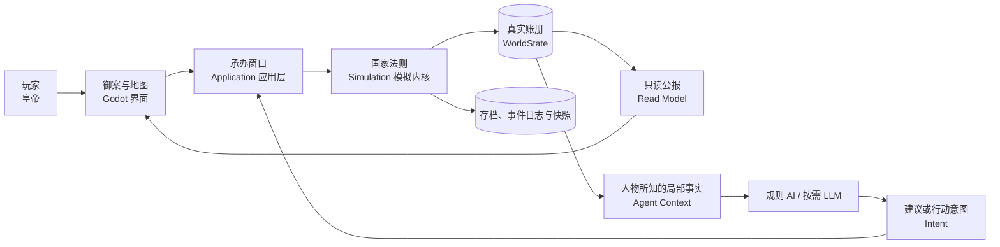

# MingSim 设计蓝图：先读这里

> 版本：0.1（2026-08-13）  
> 状态：详细图纸 v0.1 已完成校审；M0 仍须通过史料账本与数值试玩质量门后才冻结
> 读者：第一次做游戏的产品负责人、程序员、美术、策划和测试人员

## 先给结论

我们要做的不是“让 AI 用文字假装世界发生了变化”，而是一款真正会自行运转的、可暂停调速的历史大战略游戏：

- **C# 模拟器**负责世界事实；
- **Godot**负责把世界画出来并接收玩家操作；
- **AI 角色**只负责像人一样理解、判断和提议；
- **SQLite 存档**负责把已经发生的事实安全保存；
- 所有模块先放在一个程序里，边界清楚即可，不提前拆微服务。

可以把它想象成一座官署：

图中只有“国家法则”可以批准改变“真实账册”。界面、AI 文本和动画都不能越过它直接改数据。

## 这套文档怎么读

如果你是项目负责人，按这个顺序读：

1. [01-产品定义与设计宪法](01-产品定义与设计宪法.md)
2. [02-玩家体验与玩法详细设计](02-玩家体验与玩法详细设计.md)
3. [03-MVP垂直切片与范围](03-MVP垂直切片与范围.md)
4. [11-生产计划质量门与风险](11-生产计划质量门与风险.md)
5. [12-现状差距与实施顺序](12-现状差距与实施顺序.md)

如果你准备开发，按这个顺序读：

1. [04-总体技术架构](04-总体技术架构.md)
2. [05-模块职责与交互](05-模块职责与交互.md)
3. [06-领域对象数据与封装](06-领域对象数据与封装.md)
4. [08-时间调度确定性与存档](08-时间调度确定性与存档.md)
5. [10-工程规范与最小代码原则](10-工程规范与最小代码原则.md)

如果你负责 AI、UI 或内容：

- AI：[07-AI角色代理记忆与权限](07-AI角色代理记忆与权限.md)
- UI：[09-UI信息架构与交互](09-UI信息架构与交互.md)
- 不懂术语时：[13-小白术语表](13-小白术语表.md)
- 想知道某条要求来自哪里：[14-需求追踪矩阵](14-需求追踪矩阵.md)
- 查看已经定下的架构取舍：[15-架构决策记录索引](15-架构决策记录索引.md)
- 制作史实人物、地图和数值：[16-历史内容与证据生产规范](16-历史内容与证据生产规范.md)
- 查看宁远场景哪些是事实、设计值或仍待考证：[17-宁远急饷MVP来源账本](17-宁远急饷MVP来源账本.md)

## 文档分类

| 类别 | 文档 | 回答的问题 |
| --- | --- | --- |
| 产品 | 01 | 这是什么游戏，哪些原则绝不能破坏？ |
| 游戏设计 | 02 | 玩家每天在做什么，为什么好玩？ |
| 范围 | 03 | 第一版究竟做多少，什么明确不做？ |
| 架构 | 04 | 整个系统分几层，依赖方向是什么？ |
| 模块设计 | 05 | 每个模块干什么，互相怎样说话？ |
| 数据设计 | 06 | 哪些东西做成对象，谁拥有和修改数据？ |
| AI 设计 | 07 | 角色怎样思考、记忆、撒谎又不破坏世界？ |
| 基础设施 | 08 | 时间怎样流动，存档怎样不坏，结果怎样重放？ |
| 交互设计 | 09 | 玩家怎样看懂世界并下达命令？ |
| 开发规范 | 10 | 怎样用最少必要代码保持长期可维护？ |
| 生产管理 | 11 | 按什么顺序做，怎样判断真正完成？ |
| 现状审计 | 12 | 已有代码到目标架构还差什么？ |
| 词典 | 13 | 技术词翻译成人话是什么意思？ |
| 追踪 | 14 | 原始策划、设计、代码、测试如何互相对应？ |
| 决策 | 15 | 为什么选这条技术/范围路线，何时才允许重评？ |
| 内容生产 | 16 | 历史资料怎样变成可信、可追的游戏数据？ |
| 场景账本 | 17 | 宁远 MVP 当前哪些是定案、设计值，哪些仍不能冒充史实？ |

## 已经定下的十条基线

1. 玩家体验是 **CK3 式可暂停实时流动 + 多档变速**，不是季度按钮回合。
2. 内核使用 **离散游戏时钟 + 到期事件队列**，不随画面帧率计算世界。
3. `WorldState` 是唯一权威事实；LLM 文本、UI 控件和缓存都不是事实。
4. AI 只能提交结构化 `Intent`，绝不能直接写世界或数据库。
5. 一个世界只有一个权威写入者；后台任务只发命令或接收只读快照。
6. 重要 NPC 是持久身份，但 LLM 只是按需唤醒的大脑。
7. 普通人物用规则/Utility AI；普通人口与士兵使用群体模型，不逐人模拟。
8. 从 **模块化单体**起步：Godot 4.6 .NET、C#/.NET 10、SQLite；首版无服务器、微服务、Kafka、Redis、Orleans、Temporal。
9. 本蓝图通过 ADR 暂选“北京—山海关—宁远”可玩纵切，不先造完整大明；1629 并非原稿最终定案。
10. 最小代码的含义是“最少必要概念和实现”，不是把代码挤成难懂的一行。

## 原始输入与取舍规则

本设计基于：

- 文件：本地原始策划文档（包含私人工作记录，未随公开仓库发布）
- UTF-8 行数：16,691
- SHA-256：`AF5825C4183E32A18A2ED0415C9D131E3FEB8A3FBAEDCFBB48CE77AA88632D61`

原文是多轮研究和讨论的合并稿，前后存在修正。本文档集采用以下优先级：

1. 原文后部明确说“修正、改为、正式采用”的决定优先；
2. 原文仍有多个候选时标为 `DECIDED_BY_ADR`，不把本地选择伪装成原文结论；
3. 能形成最小可玩闭环的决定优先于完整世界设想；
4. 确定性、数据安全和可测试性优先于 AI 自由发挥；
5. 已验证的本机工具链优先于为了追新版本而迁移；
6. 尚无真实需求支撑的抽象不进入首版。

因此，原文早期的“季度回合”“每个角色持续运行一个子代理”“一开始做完整大明”等设想，均由后期的实时离散模拟、分层智能和垂直切片方案取代。

## 蓝图与现状不是一回事

文档中的标签含义如下：

| 标签 | 意思 |
| --- | --- |
| 已验证 | 当前机器已经实际运行或测试通过 |
| 已有原型 | 有代码，但还没有达到生产质量门 |
| 设计基线 | 团队以后应按此实现，目前可能还没有代码 |
| 延后 | 方向保留，但 MVP 不实现 |
| 未决 | 需要试玩、史料或技术实验后再定 |

任何文档都不能仅凭“代码文件存在”就写成“功能完成”。完成必须满足对应验收测试。

## 文档变更规则

- 产品原则变化：先改 01，再更新受影响文档和追踪矩阵。
- 架构方向变化：在 04 中登记一条 ADR（架构决策记录），写明原因和代价。
- 对象或接口变化：先改 05/06，再写代码和测试。
- MVP 范围变化：必须同时说明新增内容替换掉了什么，禁止只加不减。
- 史实数据变化：记录来源、置信度和适用年代，不把历史观察直接写成万能规则。
