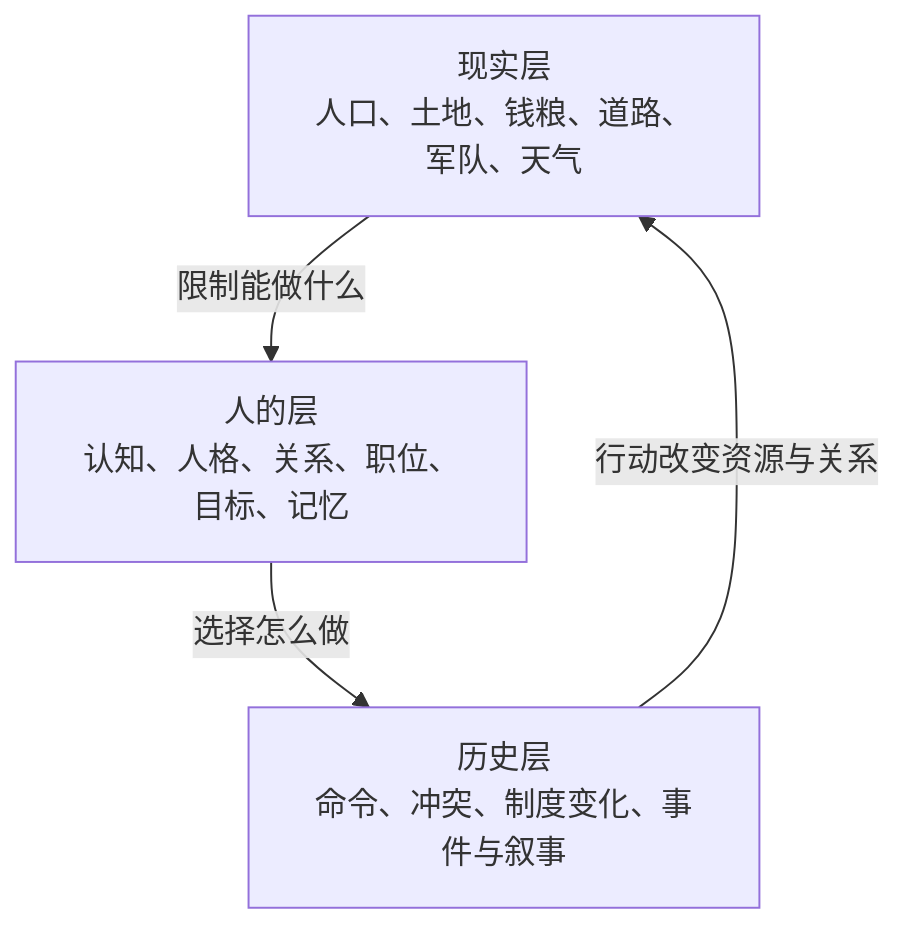

# 产品定义与设计宪法

> 一句话定义：玩家不是全知全能的上帝，而是身处制度、信息延迟和人物关系中的皇帝；玩家通过人和机构下令，世界依照可验证的规则持续运行。

## 1. 玩家最终买到的体验

玩家看到的是一张持续变化的历史地图和一张堆满奏疏的御案。他可以暂停时间，召见大臣，选择命令渠道，调拨钱粮，任命官员，再观察命令如何被理解、传递、执行、拖延、扭曲或抵抗。

游戏的乐趣不是“点一下国库加 10%”，而是：

> 我想做一件事 → 我必须找对人、走对渠道、拿出资源 → 世界中的其他人会回应 → 结果留下长期后果。

## 2. 六个产品支柱

### 2.1 活世界

世界时间持续流动。公文在路上，粮队在移动，军队在消耗，人物会任职、患病、结党和记仇。玩家暂停只是暂停世界时钟，不是把世界变成一次性文字问答。

### 2.2 通过人治理，而不是直接改数值

玩家的权力必须经过人物、职位、机构和流程。皇帝可以权力很大，但不能隔空把宁远仓库增加五千石粮。

### 2.3 AI 有谋略，没有魔法

AI 可以误判、隐瞒、欺骗、讨价还价，也可以提出玩家没想到的方案；但它不能凭一句话生成军队、金钱、道路或历史事实。

### 2.4 因果可追踪

玩家应能问：“为什么宁远缺粮？”系统必须沿着真实数据回答：哪座仓、哪条路、多少运力、何时中断、谁批准、谁延误。不能只回答“后勤不佳 -20%”。

### 2.5 有限认知

角色只知道他合理能知道的事。角色的“相信”可以与世界事实不同；玩家也只看到由身份、情报和文书渠道提供的信息。

### 2.6 历史约束下的自由

玩家可以改变历史策略，但不能跳过物质、知识、组织和时间条件。自由是选择办法和承担后果，不是输入一句现代名词便立即得到成品。

## 3. 三层世界观

- **现实层**由确定性模拟器维护；
- **人的层**由规则 AI、关系系统和按需 LLM 共同决策；
- **历史层**是前两层交互后留下的事件链，不是预写剧情强行播放。

## 4. 十二条不可破坏的设计宪法

| 编号 | 宪法 | 一旦违反会发生什么 |
| --- | --- | --- |
| C01 | 世界事实只有一个权威来源 | UI、AI 和存档会互相矛盾 |
| C02 | AI 不得直接修改世界 | 模型幻觉变成真实数据 |
| C03 | 先提交事实，再生成叙事 | 奏报会宣称没有发生的事 |
| C04 | 状态变化必须守恒、可审计 | 兵、钱、粮会凭空出现或消失 |
| C05 | 失败是一等结果 | 玩家只知道“没成功”，不知道为何和怎么办 |
| C06 | 角色只看有限上下文 | 所有人都变成共享上帝视角的机器人 |
| C07 | 时间与画面帧率分离 | 快电脑和慢电脑跑出不同历史 |
| C08 | 重要人物按事件唤醒 | API 成本、延迟和调度完全失控 |
| C09 | 内容数据与规则代码分离 | 加一个剧本就要改引擎代码 |
| C10 | MVP 只证明一个好玩的闭环 | 个人开发者永远造不完完整世界 |
| C11 | 每个抽象必须解决已出现的问题 | 类、接口和框架比业务本身还多 |
| C12 | 无测试证明的“完成”不算完成 | 配置和注释看似正确，实际路径不可用 |

## 5. 玩家身份与权力边界

MVP 中玩家扮演皇帝，但皇帝是一个特殊 Actor，不是调试控制台。

玩家可以：

- 阅读由渠道送达的奏疏和情报；
- 召见人物、发起廷议、询问方案；
- 通过正式或非正式渠道下令；
- 任免自己权限范围内的职位；
- 批准预算、调动和制度试点；
- 暂停、调速和设置自动暂停规则。

玩家不能：

- 直接编辑国库、库存、军队人数和角色忠诚；
- 立即知道所有隐藏事实；
- 绕过路程让公文瞬间抵达；
- 让未掌握的技术、人员和产能凭空出现；
- 用自然语言绕过结构化规则校验。

调试版本可以另有开发者控制台，但它必须与正式玩法明确隔离，且所有作弊写入带审计标记。

## 6. 目标平台与技术边界

首要平台是 Windows PC 单机；离线时核心规则、普通 AI、存档和完整 MVP 必须可玩。联网模型只增强重要人物的开放式语言和谋略，不是游戏启动条件。

技术基线沿用本机已存在且已验证的工具链：

- Godot 4.6 .NET：地图、UI、输入和动画；
- C# / .NET 10：领域、模拟、应用和 AI 适配；
- SQLite + WAL：本地权威存档；
- JSON + Schema：剧本和内容数据；
- OpenAI-compatible 接口：可选模型适配，不绑定厂商。

Godot 4.6 的 .NET 版本支持 C#；.NET 10 是 LTS。版本升级属于独立决策，不能只因为“有更新”就打断纵切开发。官方参考：[Godot 4.6 .NET 文档](https://docs.godotengine.org/en/4.6/tutorials/scripting/c_sharp/index.html)、[.NET 发布与支持](https://learn.microsoft.com/en-us/dotnet/core/releases-and-support)、[SQLite WAL](https://www.sqlite.org/wal.html)。

## 7. 历史真实性怎样落地

所有历史内容标四类证据状态：

| 状态 | 含义 | 能否直接成为规则 |
| --- | --- | --- |
| 史料确认 | 有可核对的一手或权威二手来源 | 仍需转成适合玩法的抽象 |
| 高置信解释 | 多项证据支持的机制解释 | 可以试作，需标假设 |
| 游戏化推导 | 为形成玩法而作的简化 | 必须通过试玩验证 |
| 未决假设 | 尚无足够史料或设计证据 | 不写死，保留配置或暂缓 |

历史人物不能因为某篇资料中的一次行为就永久获得单一性格标签。数值、关系和认知都要允许随时间变化。

## 8. 成功标准

第一阶段不以“有多少系统、多少人物、多少代码”衡量，而以五个问题衡量：

1. 不接 LLM，世界能否连续跑 90 个游戏日？
2. 玩家下达“向宁远运粮”后，能否看见从命令到结果的完整因果链？
3. 同一剧本、同一命令和同一随机种子能否得到同一结果？
4. 中途断电或故障后，存档能否恢复到最后一次完整提交？
5. 玩家能否解释至少一次失败是“谁、因为什么、在哪一步”造成的？

五项都成立，才说明我们有了游戏骨架；漂亮对话框或大段 AI 文案不能替代它们。

## 9. 明确非目标

首版不追求：

- 模拟每一个士兵、农户或商品；
- 复刻 CK3、EU、Vic 或任何现成游戏的全部机制；
- 一开始覆盖全国和整个崇祯朝；
- 战术 3D 战斗；
- 联机、云存档和跨设备同步；
- 让玩家创建任意代码式制度；
- 用微服务展示“架构先进”；
- 通过无限上下文让 LLM 记住整个世界。

