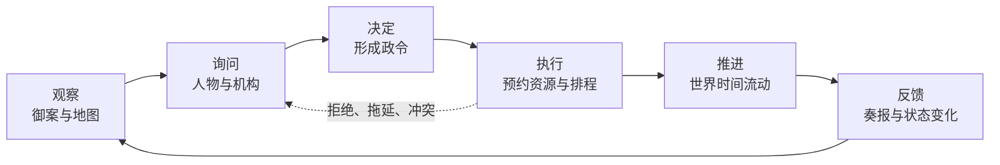
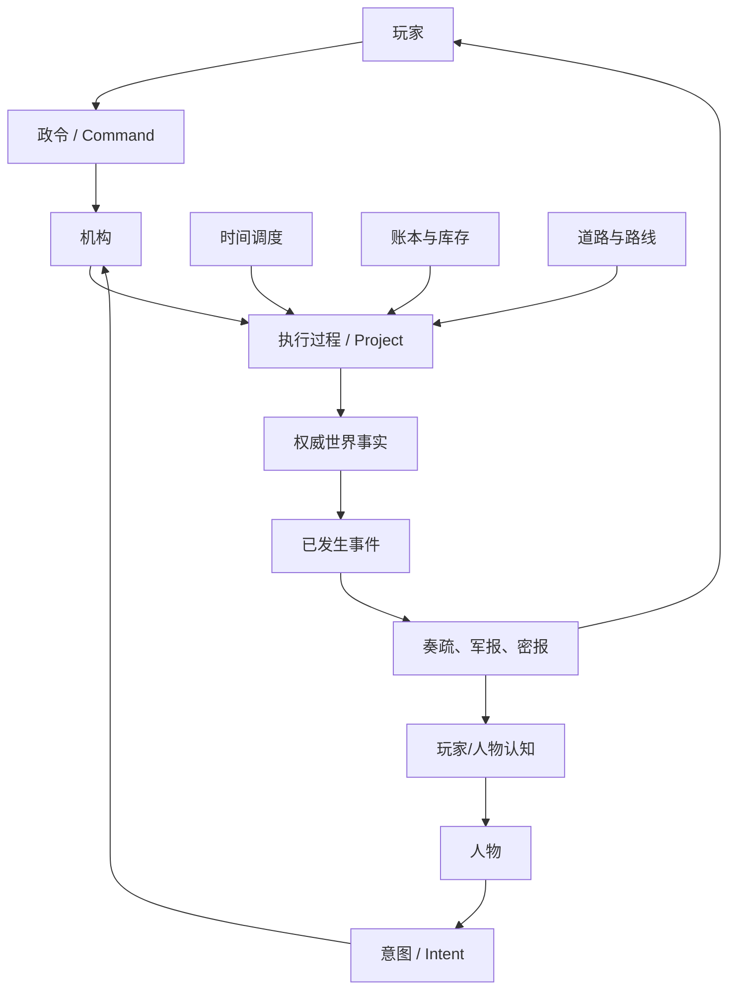
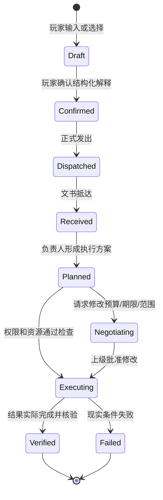
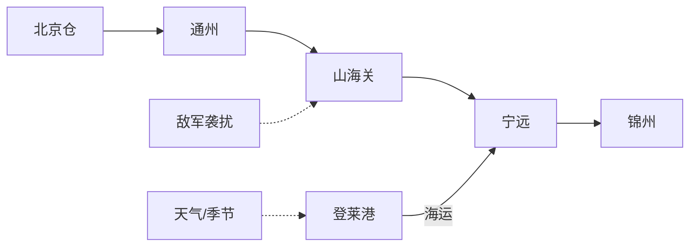
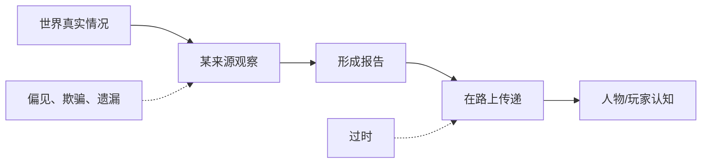
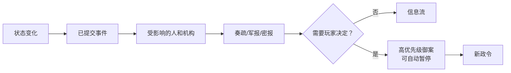

# 玩家体验与玩法详细设计（GDD）

## 1. 玩家在这款游戏里究竟做什么

玩家扮演皇帝，通过一张“御案 + 活地图”治理国家。地图告诉玩家事情发生在哪里，御案告诉玩家有哪些事需要处理，人物与机构告诉玩家事情可以怎样办。

玩家的基本动词只有七类：

1. **看**：看地图、账目、奏疏、军报和项目进度；
2. **问**：询问人物、要求复核、召集廷议；
3. **判断**：比较互相矛盾的信息和方案；
4. **下令**：指定目标、负责人、范围、预算、期限和禁令；
5. **任用**：任命、调任、授权、撤权和追责；
6. **等待**：解除暂停，让公文、人物、军队和物资真实移动；
7. **应变**：面对延期、误解、腐败、袭击、天气和政治反弹。

## 2. 三层玩法循环

### 2.1 几分钟的小循环



### 2.2 一场危机的中循环

```text
危机出现
→ 选择人物、机构和命令路径
→ 调动财政、人事、信息与运输能力
→ 行动产生成功、妥协或副作用
→ 人物关系与机构能力改变
→ 下一次危机的条件随之改变
```

### 2.3 一局游戏的长循环

```text
维持王朝生存
→ 建立可信的人事班底
→ 修复财政和行政能力
→ 处理边疆与地方危机
→ 推动玩家选择的改革路线
→ 面对改革制造的新利益冲突
```

## 3. 玩法的共同语言

为了让系统多但代码不乱，所有玩法尽量建立在少数共同概念上：

| 共同概念 | 人话比喻 | 被哪些玩法复用 |
| --- | --- | --- |
| Person | 一个持续存在的人 | 政治、军事、外交、生产、情报 |
| Institution | 一台国家机器 | 六部、内阁、军镇、监察、临时机构 |
| Appointment | 官印和钥匙 | 任职、权限、升迁、罢免 |
| Command / Intent | 正式工单 / 人物提议 | 玩家和 NPC 的所有行动入口 |
| Project | 办事进度表 | 调查、改革、建设、训练、谈判 |
| Stock / Ledger | 仓库账 / 银行流水 | 钱、粮、军械、义务和债务 |
| Route / Journey | 路线 / 在途物 | 公文、粮队、军队、使节 |
| Domain Event | 世界收据 | 审计、存档、奏报、记忆、统计 |
| Report / Belief | 某人听到的版本 | 情报差、误判、欺骗、角色记忆 |



这里的复用有边界：公文和粮队都可以复用“在途”机制，但公文没有重量，粮队需要运力；共同生命周期复用，业务规则仍分别实现。

## 4. 时间玩法

玩家控制暂停与 1、2、3、5 档速度。倍速只改变“现实一秒推进多少游戏时间”，不改变规则结果。

| 频率 | MVP 示例 | 完整版可能加入 |
| --- | --- | --- |
| 精确时刻 | 公文、粮队、军队抵达 | 使节、项目节点、战斗阶段 |
| 每日 | 军粮消耗、运输风险 | 疲劳、伤病、围城消耗 |
| 每周 | 轻量人物判断、路线安全 | 市场、治安、派系动员 |
| 每月 | 预算、军饷和最低财政结算 | 俸禄、生产、账册汇总 |
| 季节 | MVP 不做 | 农业、人口、贸易季节性 |

以下情况默认自动暂停：

- 前线补给跌破玩家设置的危险线；
- 关键路线中断；
- 需要玩家确认的政令或谈判到期；
- 重要人物死亡、离任或被捕；
- 敌军进入关键区域；
- 玩家关注的项目失败；
- 权威存档提交或内核不变量出现不可恢复错误。

模型服务故障不暂停世界主循环：系统提示“已切换规则模式”并让 Utility AI 接手。只有玩家正在等待一次主动对话时，该对话面板可以停在降级提示上；这不等于暂停整个世界。

## 5. 角色玩法

### 5.1 人物不是一张“好感度卡”

下表是**完整版人物目标**，用于避免把人压成忠诚/能力两个数；它不是 P0 字段清单。P0 只实现：身份、职位、办事能力、一个利益倾向、最小信任和已知报告。家庭、健康、长期目标、复杂心理、资源网络与长期记忆等到真实玩法读取/改变它们时再加。

| 方面 | 示例 | 影响 |
| --- | --- | --- |
| 身份 | 年龄、家庭、籍贯、经历 | 能接触谁、懂什么、承担什么义务 |
| 能力 | 财计、吏治、军略、谋略、学识 | 方案质量与执行能力 |
| 性格 | 刚直、圆滑、谨慎、冒进、贪婪、清廉 | 偏好的行动与承受的心理代价 |
| 目标 | 报国、保官、建功、富家、报仇 | 长期选择方向 |
| 关系 | 亲属、同乡、座师、门生、朋友、政敌 | 合作、偏袒、阻挠与信息来源 |
| 资源 | 声望、人脉、私产、兵权、把柄 | 能真正调动什么 |
| 心理 | 压力、恐惧、野心、怨恨、荣誉感 | 决策阈值和失控风险 |
| 认知 | 知道、相信、怀疑、误解的事实 | 决策使用的信息边界 |
| 记忆 | 被提拔、受辱、承诺、失败 | 关系和策略的长期连续性 |

### 5.2 玩家和人物互动

玩家可以召见、询问、委托、任命、调任、奖惩、调查、公开支持、驳斥或让多人廷议。

界面不直接暴露“忠诚 72、贪婪 83”这类后台答案。玩家看到的是行为证据：

> 过去三次调粮中按期完成两次；与登莱粮商往来密切；本月两次反对增加辽东预算。

### 5.3 人物决策链

```text
收到他能知道的信息
→ 根据目标、性格、利益、关系和记忆判断
→ 提出行动或意见
→ 机构权限与世界规则检查
→ 成功、部分成功、延期或拒绝
→ 记住结果并更新关系
```

角色智能分层见 [07-AI角色代理记忆与权限](07-AI角色代理记忆与权限.md)。

## 6. 机构与官职玩法

机构决定“国家具备哪些正式能力”，人物决定“怎样使用这些能力”。某人因担任官职获得权限；换人以后，机构、档案和积案仍然存在。

一个机构至少有：

- 职责和能力清单；
- 管辖范围和上下级；
- 官职和当前任职者；
- 预算、人员和执行能力；
- 档案、已知信息和当前积案；
- 与其他机构的协作或冲突关系。

MVP 只需要这些机构角色：

- 皇帝与御前决策；
- 内阁/协调层；
- 户部：银粮和拨款；
- 兵部：军令与军务；
- 运输/工部承办角色；
- 辽东督师或前线军镇；
- 文书传递渠道；
- 一个监察/审计角色。

完整游戏允许新设临时机构，但只能组合已经存在的能力和资源。新名字不会自动产生无限权力。

## 7. 政令玩法

政令是玩家改变世界的主要入口，不是自由文本直接执行器。

### 7.1 一道政令至少包含

- 目标；
- 负责人和协作机构；
- 地区、对象和资源范围；
- 预算或资源上限；
- 截止时间；
- 禁止事项；
- 命令渠道；
- 保密级别；
- 成功判据；
- 失败后是自动调整还是回来请示。

### 7.2 生命周期



### 7.3 政令草案与确认

P0 默认使用结构化模板。M6 加入受限自然语言后，玩家可能输入：

> 给宁远尽快运粮，不要再向灾民加派，缺钱让户部从其他项目调。

界面必须先展示：

```text
目标：提高宁远粮食储备
承办：辽东督师
协作：户部、运输机构
限制：不得新增灾区税负
授权：允许从非紧急项目调整预算
期限：20日内发出首批运输
```

只有玩家确认后才提交。解析不确定时必须明确标黄并要求选择，不能“猜一个最像的意思”偷偷执行。

### 7.4 命令路径（完整版目标）

| 路径 | 优点 | 代价 |
| --- | --- | --- |
| 正式政令 | 合法性和审计强 | 慢、知情人多 |
| 交主管机构议办 | 专业、便于协作 | 可能拖延或被改写 |
| 直接命负责人 | 快 | 容易造成权限冲突 |
| 秘密差遣 | 保密 | 难监督，泄露后政治风险高 |

历史名称与细节要由独立史料文档确认。P0 只实现一个正式政令渠道和一个固定送达延迟；四种渠道的速度、合法性、知情范围与监督差异整体属于 P1，不能为此提前建四套工作流。

## 8. 财政、账本与库存玩法

### 8.1 核心原则

“账面有钱”不等于“现在能花”。资源可能处于应收、已收、地方留存、指定用途、已预约、在途、拖欠、到账或已支出状态。


界面必须说明：

```text
账面总额
- 指定用途
- 已预约
- 到期必须支付
= 当前真正可动用数额
```

MVP 只做银、粮、军饷义务、仓储和运输成本；不做完整全国市场和税制改革。

### 8.2 玩家动作

- 调整支出优先级；
- 批准专项预算；
- 调拨仓储；
- 催办和检查拖欠；
- 审计亏空；
- 在代价可见的情况下追加筹资。

短期强征可以增加收入，但会通过事件影响地方负担、治安、关系和长期能力，而不是简单扣“民心”。

## 9. 后勤玩法

后勤是 MVP 的主角。节点像水箱，路线像水管；后方资源再多，也会被最窄的一段运力限制。

范围边界：P0 只交付可重放的预制/固定种子风险样本——一次天气延误、一次袭粮、一次护卫自动结算和三份差异报告。下面列出的动态天气、随风险改道、通用侦察网络与通用接战结算是 P1 目标；P0 不为它们先造通用引擎。



路线至少有距离、时长、容量、风险、控制者和天气影响；节点至少有库存、仓储上限、装卸能力和驻军消耗。

### 9.1 一批粮食怎样移动

```text
来源仓预约
→ 正式装运，来源可用库存减少
→ 建立“在途库存”
→ 沿路线移动
→ 发生延误、损耗或袭击
→ 抵达
→ 实到量进入目的仓
```

资源必须守恒。粮食离开来源后，不能既留在原仓又出现在前线。

### 9.2 玩家动作

- 选择陆运、海运或混合路线；
- 安排护卫；
- 分批运输或集中运输；
- 建立/启用中继仓；
- 调整道路优先级；
- 减少前线消耗；
- 在风险变化后改道或撤回（P1；P0 只在固定样本中提供受限应对）。

界面应给出因果解释，例如：

> 宁远缺粮的主要原因不是北京无粮，而是山海关—宁远每日通过能力只有需求的 68%。

## 10. 军事玩法

MVP 中一支部队只保留真正会影响“宁远急饷”的字段：

- 人数群体；
- 已配发装备的概要；
- 组织、士气、疲劳；
- 粮食和军饷状况；
- 统帅；
- 位置、路线和当前命令。

玩家指定军事目标、路线、优先级、护送任务和交战原则；命令仍受传递时间、将领认知、道路、天气和补给约束。

战斗由确定性规则与保存的随机流结算。LLM 可以让将领选择策略，但不能计算伤亡或直接写库存。MVP 只需做袭击粮队和护卫结算，不做战术手操。

## 11. 生产与训练玩法（纵切 P1）

生产不是付款后库存立刻增加：

```text
批准项目
→ 预约预算
→ 准备工坊、工匠和原料
→ 按时间生产
→ 质量检查
→ 合格品入库
```

训练也不是“全国训练 +5”，而是一个有参与部队、地点、天数、教官、装备和补给消耗的过程。

第一条纵切稳定后，只加入一种批量产品和一种部队训练，用来验证共同 `Project` 生命周期是否真的适用。不要提前实现完整工业和科技树。

## 12. 情报玩法

世界真相、报告和人物相信的内容必须分开：



一份情报至少包含来源、观察时间、收到时间、可信度、佐证、潜在偏差和保密级别。

MVP 只实现三种来源：正式军报、侦察报告和可能有偏差的秘密报告。玩家可以要求复核、比较来源或冒险立即行动。

错误情报必须由规则允许的侦察误差、延迟、欺骗或人物偏见产生，不能把模型幻觉包装成玩法。

## 13. 事件与御案

后台事件是世界已经发生的事实，例如粮队出发、文书抵达、路线被袭、库存跌破警戒线。事实经过人物和渠道传播后，才变成奏疏、军报、弹劾或密报。



事件模板可以检查触发条件、挑选参与者、生成报告和提供合法行动选项，但不得绕过内核直接写“民心 -10”或“粮食 +5000”。

## 14. 外交、派系与制度（后续边界）

### 外交

外交条约由可验证条款组成，如停战、贸易、通行、物资交付、释放俘虏和有效期。LLM 负责谈判表达与方案，规则负责条款是否合法、能否履行和是否违约。MVP 不把完整外交作为前置。

### 派系

机构是正式组织，派系是围绕目标临时形成的联盟。它应有成员、目标、资源、手段和升级阈值，而不是单一满意度条。MVP 只让关键人物形成临时支持/反对关系。

### 制度创新

未来允许玩家新设职位或机构，但只能组合已有 Capability，并需要人员、预算、合法性和执行网络。制度编辑器是 P2，首版只保证底层对象不把“六部”写死。

## 15. 反馈设计：失败也必须好玩

每个重要结果固定回答：

1. 原计划是什么；
2. 实际执行了什么；
3. 哪些资源和关系变化；
4. 为什么偏离计划；
5. 现在有哪些可行补救。

示例：

```text
政令：20 日内向宁远发粮 12,000 石
结果：已发出 8,000 石，预计实到 7,360 石
差异：山海关路段运力不足；另有 8% 预期损耗
责任链：户部已拨粮；运输官只征集到计划的 71% 车马
可选行动：延长期限 / 增派银两 / 分配海运 / 减少驻军日耗
```

这种解释必须来自结构化数据，不依赖 AI 临场编故事。

## 16. 胜利、失败与长期后果

完整游戏不以涂满地图为唯一胜利，可有生存、军事、治理和路线四类目标。综合评价王朝存续、财政可持续、军事安全、社会稳定、合法性、机构能力和玩家选择的使命。

MVP 的具体胜败见 [03-MVP垂直切片与范围](03-MVP垂直切片与范围.md)。它允许混合结局，并把未解决的问题带入下一场景，而不是只有“胜利/失败”两个弹窗。

## 17. GDD 完成判据

玩法设计只有在以下问题有明确答案时才能进入编码：

- 玩家看到了什么信息？
- 玩家能做哪些动作？
- 动作形成什么结构化命令？
- 哪个模块拥有并修改相应状态？
- 需要经过多少游戏时间？
- 成功、部分成功、延期和失败怎样区分？
- 结果怎样解释给玩家？
- 不接 LLM 时是否仍能运行？
- 有什么自动测试可以证明资源守恒和结果确定？
