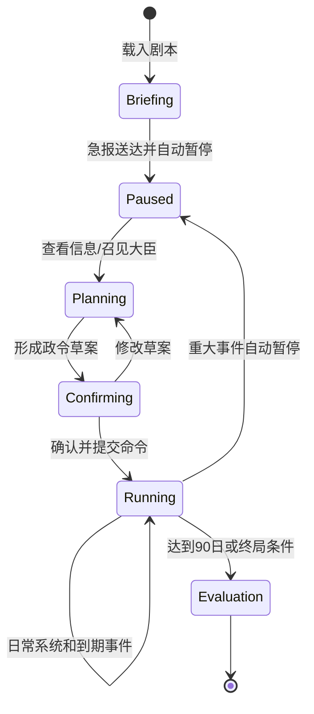

# MVP 垂直切片与范围

## 1. 先理解“垂直切片”

垂直切片不是把全国地图做 10%，而是把一段真正可玩的因果链从界面一直打通到存档。

切蛋糕时，横着只切到奶油，尝不到整块蛋糕；竖着切一小块，能同时吃到奶油、蛋糕和夹心。游戏开发也一样：

这条链全部能玩，比先做二十个互不相连的菜单更有价值。

## 2. 推荐的第一段游戏

工作名：**《崇祯二年：宁远急饷》**

时间范围：90 个游戏日。  
玩家身份：崇祯皇帝。  
核心困境：在财政、运输、官僚协作和前线风险共同约束下，使宁远前线维持基本战备。

这是本蓝图通过 [ADR-004](ADR/ADR-004-首个1629宁远急饷纵切.md) 作出的 `DECIDED_BY_ADR + DESIGN` 裁决，不是原研究稿的最终定案。研究稿还出现过 1641 MVP 建议和 `ming_1627` 目录示例；1629 的精确开局日、人物、路线和数字必须经[来源账本](17-宁远急饷MVP来源账本.md)验证，若证据/试玩不支持就用新 ADR 替换。

### 2.1 地图节点

MVP 只做 6–7 个有明确作用的区域：

- 北京：决策中心、中央仓库和国库；
- 通州：漕运/转运节点；
- 山海关：关口与陆路瓶颈；
- 宁远：前线主要目标；
- 锦州：前沿压力来源；
- 登莱：海运备选起点；
- 可选前屯：用于证明中继仓与道路容量。

地图是交通图，不是全国装饰图。每个节点至少参与一条规则。

### 2.2 人物与群体预算

| 类型 | MVP 数量 | 决策方式 | 示例 |
| --- | ---: | --- | --- |
| 关键角色 | 4–6 | P0 全用规则 AI；M6 最多 3 个可选模型增强 | 皇帝、户部尚书、兵部尚书、督师/前线将领、粮饷承办人 |
| 背景人物 | 6–12 | 固定资料 + 极小状态机 | 仓官、地方官、护运军官、商人代表 |
| 群体 | 3 个 Cohort | 统计和规则 | 守军、运输民夫、地方百姓 |

原稿的 1629 纵切候选曾提出 30–50 个完整 Agent、200–500 个轻量人物（12269–12275）；本蓝图为个人开发的首个可运行版本，主动裁剪为 4–6 个关键身份、少量背景人物和 3 个群体。这个缩减是本地 `DESIGN` 取舍，不是原稿自己已缩小。

## 3. 一个最小可玩闭环

玩家收到：

> 【辽东急报】宁远存粮只够 18 日，欠饷正在增加。

玩家可以：

1. 查看仓库、国库、道路和已知情报；
2. 召见户部与兵部，获得不同方案；
3. 选择“陆运”“海运”或“两路并行”；
4. 指定预算、数量、期限和承办人；
5. 确认一份结构化政令；
6. 解除暂停，看公文和粮队沿路线移动；
7. 处理 P0 固定风险样本：一次天气延误、一次袭粮、一次护卫自动结算，以及三份时效/可信度不同的报告；
8. 收到从已提交事件生成的回奏；
9. 承担财政、关系、军心和前线战备的后果。

这 9 步全部成立，MVP 才算“可玩”。

## 4. MVP 必须具备的系统

### P0：没有它就不是这款游戏

| 系统 | 最小能力 | 验收例子 |
| --- | --- | --- |
| 世界时间 | 暂停、1/2/3/5 速、可配置离散时间边界；首个候选为一小时 | 不同帧率下事件发生时间相同；一小时边界须经玩法/性能实验 |
| 调度器 | 安排并执行到期事件 | 粮队在指定时间到达，不提前也不重复 |
| 地图拓扑 | 节点、道路、相邻和路线 | 不能从北京一步跳到宁远 |
| 人物/职位 | 身份、职位、办事能力、一个倾向、最小权限/信任 | 无调粮权限的人会被明确拒绝；承办人选择至少影响一次后续报告 |
| 政令 | 结构化模板：目标、范围、预算、承办、期限、限制，可附一句备注 | P0 不依赖模型解析自由文本；提交前必须确认结构化内容 |
| 钱粮库存 | 国库、仓库、预留、消耗 | 运输中的粮不能同时留在原仓 |
| 运输 | 货物、路线、容量、时长、损耗 | 出发、在途、抵达三种状态守恒 |
| 军队战备 | 人数群体、粮饷、装备和固定初始训练值 | 宁远缺粮会逐日影响战备，不直接减“总兵力”；P0 不提供训练玩法 |
| 固定风险样本 | 一次天气延误、一次袭粮、一次护卫结算、三份差异报告 | 相同种子可重放；玩家能解释风险、证据和补救选择 |
| 事件与失败 | 成功、拒绝、延期、中断都有结构化原因 | 玩家看得见哪条前置条件失败 |
| 存档/重放 | 活动 SQLite+WAL、可导出单文件 `.mingsave`、Input/Event Journal、状态哈希 | 同一输入重放得到同一哈希；导出文件可独立加载 |
| UI 查询 | 地图、御案、人物、时间、因果解释 | UI 不直接读取可写领域对象 |

### P1：P0 好玩后加入

- 结构化模板之上的受限自然语言命令编译；
- 3 个关键角色的可选 LLM 语言与谋略增强；
- 文书渠道差异、延迟和留中；
- 更细的人物关系、压力和私人记忆；
- 通用海陆风险、动态天气和侦察网络（P0 只有预制风险样本）；
- 小规模前线接触的自动战斗结算；
- 单一产品的最小工坊与一个训练项目；
- 内容编辑和调试可视化。

### P2：纵切稳定后再考虑

- 全国行政、财政和市场网络；
- 完整派系、科举与官员人生路径；
- 完整技术谱系、工匠迁移和工业生产网络；
- 制度创建器；
- 多剧本、Mod、联机和云服务。

## 5. MVP 明确不做

- 不做全国可点击省份；
- 不做数百个同时调用 LLM 的角色；
- 不做逐兵个体；
- 不做完整税制、农业、外交、科技和海战；
- 不做战术地图或手操战斗；
- 不做微服务、服务器和账号系统；
- 不做“输入任何话都能执行”的万能 Prompt；
- 不做无法解释来源的历史精确数值；
- 不做最终美术量，只建立一套可替换的 UI 组件和视觉基线。

## 6. MVP 状态机

## 7. 胜败不是单一血条

### 7.1 场景控制表（`DESIGN`，不是史实断言）

下表是第一轮纸面/数值试玩的**可调设计起点**。它必须经过试玩调整，并在内容文件中标为 `DESIGN`，不能伪装成 1629 年史实精确值。

| 控制量 | 初始设计值 | 设计作用 |
| --- | ---: | --- |
| 宁远存粮 | 5,400 石（按 300 石/日约 18 日） | 制造明确倒计时 |
| 可调用粮源 | 24,000 石 | 允许多次运输但不能无限调粮 |
| 场景银预算 | 20,000 两 | 让速度、风险和财政互相制约 |
| 陆运基线 | 5,000 石/批；12 日；1,000 两；基准损耗 8% | 较稳、较慢、容量受瓶颈限制 |
| 海运基线 | 7,000 石/批；8 日；1,600 两；风险事件概率较高 | 较快、较贵、波动大 |
| 护卫 | 每批 +400 两，袭粮损失上限下降 | 明确机会成本 |
| 地方负担 | 初始 20/100 | 超额征发会升高，并在后半段降低配合度 |
| 大臣信任 | 初始 50/100 | 越权/甩责会降低，并影响后续报告速度 |
| 前线战备 | 初始 60/100 | 缺粮、欠饷逐日下降；到粮后缓慢恢复 |

天气、袭粮的具体概率与损失先用固定种子场景校准；在至少三条路线策略都出现合理取舍之前，不扩展通用气候或战斗系统。

### 7.2 可执行结局门槛（首轮调参基线）

先判断硬失败，再按 90 日终局分档：

| 结局 | 可自动检查的首轮门槛 |
| --- | --- |
| 硬失败 | 连续 7 日可用粮为 0，或战备低于 25 |
| 勉强维持 | 未硬失败；终局存粮不少于 7 日；战备不少于 45；审计链完整 |
| 成功 | 终局存粮不少于 18 日；战备不少于 60；银预算未透支；地方负担低于 70 |
| 优秀 | 满足“成功”，且存粮不少于 25 日、战备不少于 70、大臣信任不少于 55 |

这些门槛不是永久平衡值。纸面试玩、自动模拟和真实玩家测试若显示某方案支配所有选择，就改数据，不先加新系统掩盖问题。

存档损坏、账实不变量失败属于**技术故障**：停止推进、保留旧 Commit、恢复/诊断并向用户说明，绝不能把程序错误算成玩家战败。

### 7.3 结局解释维度

90 日结束时至少评价：

- 宁远可用粮天数；
- 前线有效战备；
- 中央财政余量与新增欠款；
- 场景级 `地方负担`；
- 场景级 `大臣信任` 与责任归属；
- 命令执行的及时性和审计完整性。

允许“军事上守住、财政上透支”或“物资送达、政治上失信”等混合结局。MVP 不需要复杂胜利树，只需让后果真实并可解释。

## 8. 功能进入 MVP 的四问

一个新想法只有四项全为“是”才进入 P0：

1. 它是否直接服务“宁远急饷”闭环？
2. 没有它是否无法验证产品宪法中的某条核心承诺？
3. 是否能写出自动验收或清晰试玩验收？
4. 它加入后，团队是否明确删掉或推迟了等量工作？

否则放进 P1/P2 备选，不在当前代码中提前留空接口。
