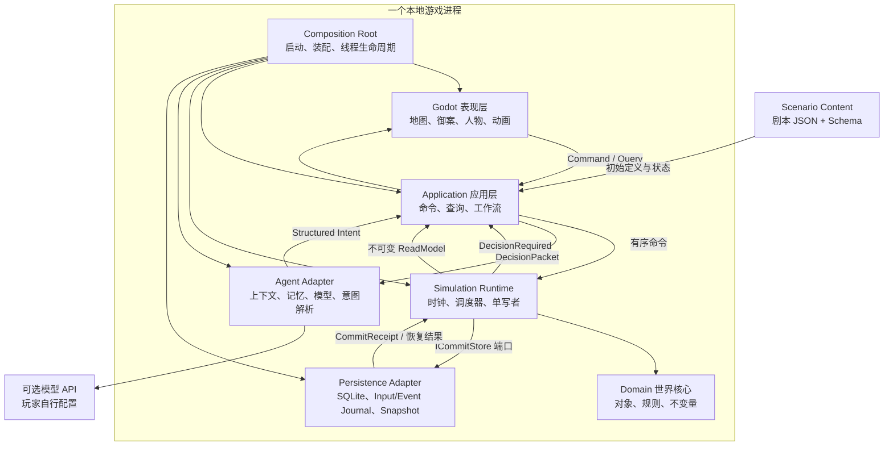
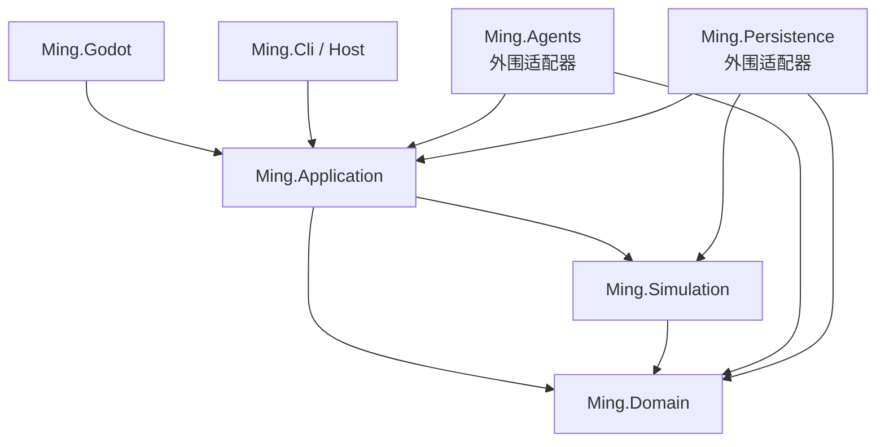
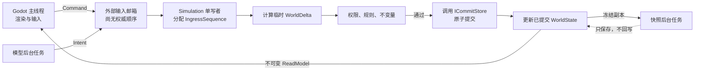
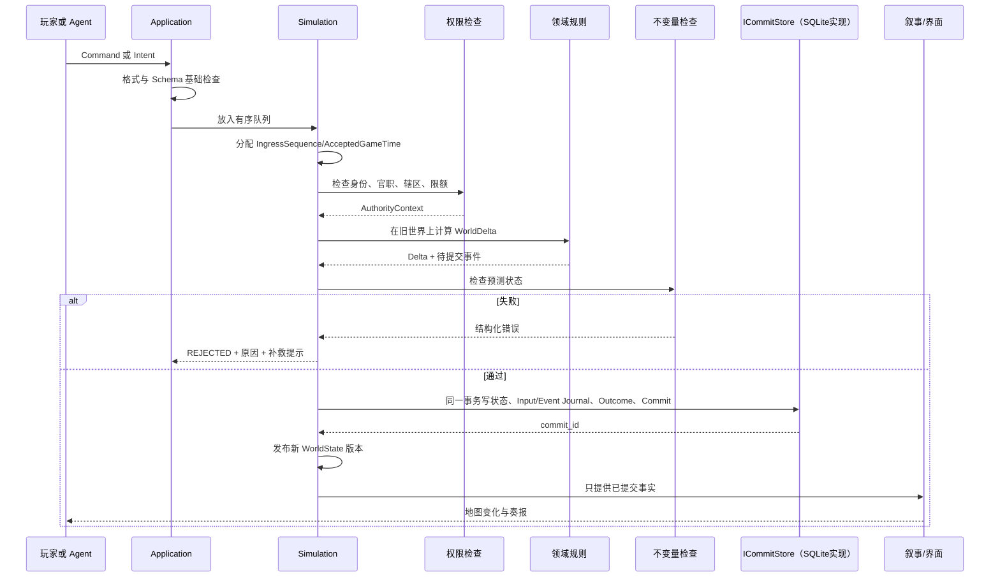

# 总体技术架构

## 1. 30 秒结论

MingSim 第一版是一个本地单机程序，不是云平台：

> **Godot 负责看和点，Application 负责接件，Simulation 负责执行，Domain 负责规则，SQLite 负责保存，Agents 负责人物建议。**

程序外面是一个普通游戏，里面是一台边界严格、可重放、可验证的历史世界机器。

## 2. 用宫城理解各层

| 软件部分 | 宫城比喻 | 做什么 | 绝不能做什么 |
| --- | --- | --- | --- |
| `Ming.Godot` | 御案、宫门和地图 | 展示、输入、动画 | 直接改钱粮、军队、人物 |
| `Ming.Application` | 通政司/承办窗口 | 接件、编号、排队、查询、协调流程 | 私自决定税收和战斗规则 |
| `Ming.Domain` | 世界名词与基本法 | 定义人物、机构、库存、权限和不变量 | 认识 Godot、SQLite、HTTP、LLM |
| `Ming.Simulation` | 国家执行机器 | 推进时间、执行命令、结算、检查 | 等待模型、依赖画面帧率 |
| `Ming.Agents` | 大臣的大脑适配器 | 编译上下文、规则/模型决策、产出意图 | 读取完整世界、修改状态或数据库 |
| `Ming.Persistence` | 档案库 | SQLite 事务、事件日志、快照、迁移 | 决定某项业务是否合法 |
| `content` | 剧本资料册 | 人物、地点、机构、初始数据 | 写 C# 代码或绕过规则 |
| `Ming.Cli`/启动处 | 总管/装配处 | 创建对象、连接接口、管理生命周期 | 塞入领域规则 |

## 3. 系统全景图



## 4. 为什么采用模块化单体

“模块化单体”包含两个同时成立的意思：

- **单体**：玩家安装和启动一个游戏；模块在进程内用普通 C# 调用，不走 HTTP/Kafka。
- **模块化**：代码职责、依赖和状态所有权清楚，不能随便跨层访问。

第一版不使用微服务的原因很朴素：

- 个人项目不需要部署十几个进程；
- 进程内调用代码更少、调试更直接；
- 单机存档事务容易保证；
- 网络、服务发现、重试、分布式锁都不是当前玩法；
- 如果以后出现真实的服务器负载，清楚的接口仍可帮助拆分。

没有量化瓶颈之前，不引入 Redis、Kafka、PostgreSQL、Orleans、Temporal、Kubernetes 或独立 API Gateway。

## 5. 依赖方向



核心口诀：

> 外层可以认识内层，内层不能认识外层。

具体规则：

1. Domain 只依赖 .NET 基础库；
2. Simulation 依赖 Domain，并定义提交所需的最小 `ICommitStore` 端口；端口只表达“原子提交/恢复”，不出现 SQL 类型；
3. Application 依赖 Domain、Simulation 的公开 API，并定义查询、模型等应用外围端口；
4. Persistence 依赖 Simulation 并实现 `ICommitStore`，也可实现 Application 的只读/导出端口；Agents、Godot 调用 Application 契约；
5. Domain/Simulation 禁止引用 Godot、SQLite、HTTP 或任一模型 SDK；Simulation 只认识端口，不认识数据库实现；
6. 业务模块不直接执行 SQL；
7. UI 和 Agent 只能读 `ReadModel`/`PerceptionSnapshot`；
8. 禁止通过全局 `GameManager.Instance.World...` 绕开入口；
9. 跨模块写入必须经过命令处理和一次正式提交；
10. 查询不能产生隐藏副作用。

这里的关键不是“谁直接调用 SQLite”，而是谁拥有**提交时机**：Simulation 单写者在规则和不变量通过后调用 `ICommitStore.CommitWorld(commitPackage)`；Persistence 适配器用一个 SQLite 事务实现它。Composition Root 负责把二者接起来。这样单写者掌握原子边界，同时核心仍可用内存适配器测试。

V1 端口只需两个明确写语义：`CommitWorld(CommitPackage)` 原子写权威变化并递增 `WorldVersion`；`RecordOutcome(InputOutcome)` 原子记录未改变世界的拒绝/过期结果且版本不变。恢复可用一个具体 `LoadCommittedWorld()` 端口。不要为此创建万能 `IRepository<T>`、UnitOfWork/Factory/Builder 全家桶。

## 6. 唯一写者与线程边界



只有 Simulation 写者可以：

- 推进权威游戏时间；
- 修改 `WorldState`；
- 分配事件序号与世界版本；
- 消耗权威随机流；
- 提交状态、Input/Event Journal、Outcome 和 Commit；
- 发布新的只读世界版本。

UI、存档后台任务和模型请求只能发送命令、读取冻结数据或返回尚未生效的建议。

“有序”不能靠并发队列或线程运气：Simulation 在固定安全点接纳消息，分配连续 `IngressSequence` 和权威 `AcceptedGameTime`。玩家命令、模型返回与 Utility 回退都通过同一入口；Scheduled Action 另按 `(DueGameTime, Phase, Priority, CreationSequence)` 排序。完整同刻规则见[时间、调度、确定性与存档](08-时间调度确定性与存档.md)。

第一版不必急着建立多个 OS 线程。可以先在一个明确的模拟循环中保持“逻辑单写者”；当 UI 卡顿或模型接入出现真实并发需求时，再把相同边界搬到独立线程。边界先定，线程按测量结果再加。

## 7. 六种通信对象

| 对象 | 人话 | 来源 | 已经发生了吗？ |
| --- | --- | --- | --- |
| Command | 请世界执行一件事 | 玩家、系统工作流 | 否 |
| Intent | 这个人物想做一件事 | Agent、Utility AI | 否 |
| Scheduled Action | 到某个时间再处理 | Simulation | 否 |
| Domain Event | 世界已经正式发生一件事 | 成功提交后的 Simulation | 是 |
| Query | 让我看某类信息 | UI、Agent Context Compiler | 不修改 |
| Narrative | 把已知事实讲成人话 | 模板或受限模型 | 不具权威性 |

示例：

```text
Intent: RequestGrainShipment（户部尚书建议运粮）
Command: CreateShipment（玩家/工作流正式申请创建运输）
Scheduled Action: ResolveShipmentArrival（到期处理抵达）
Domain Event: ShipmentCreated / ShipmentArrived（已经发生）
```

“请求已排队”和“世界已提交”必须分开：

```text
QUEUED     已收到，尚未执行
COMMITTED  已通过检查并正式改变世界
REJECTED   被规则拒绝，世界未改变
EXPIRED    已过决策期限，世界未改变
CANCELLED  在允许取消的阶段撤销
```

## 8. 一次修改世界的标准流程



`WorldDelta` 是一张尚未生效的变更清单，例如：

```text
山海关粮仓 -5000
在途粮食 +5000
新增 Shipment
道路当日运力预约 +5000
```

任一检查失败，整张清单作废。数据库提交失败，内存也不能假装成功。

`WorldDelta` 只是 Simulation 内部的概念名，V1 不建立反射式 Patch DSL、通用字段路径或 `Dictionary<string, object>` 万能补丁。黄金用例用少量强类型变更记录（如 `StockTransferChange`、`ShipmentStateChange`、`ScheduleChange`），由 Simulation 组合成 `CommitPackage`；只有出现第二个真实复用场景才继续抽象。

## 9. 技术栈基线

| 部分 | 基线 | 选择原因 |
| --- | --- | --- |
| UI/地图 | Godot 4.6 .NET | 本机已安装并成功加载现有工程；适合 2D 地图与桌面 UI |
| 主语言 | C# / .NET 10 | 本机 SDK 10.0.400 已验证；同语言覆盖核心和 Godot 适配 |
| 核心模拟 | 纯 C# 类库 | 可在无 Godot、无网络时运行和测试 |
| 本地存档 | SQLite 3 + WAL | 单机、事务、部署简单；读取和写入可并行 |
| SQLite 驱动 | `Microsoft.Data.Sqlite`（实现阶段再引入） | 轻量，不先上重 ORM |
| 内容 | JSON + JSON Schema | 人类可读、可校验、剧本与引擎分离 |
| 序列化 | `System.Text.Json` | .NET 内置，减少依赖 |
| 调度 | `PriorityQueue` + 小型自研 Scheduler | 标准库已有优先队列，无需工作流平台 |
| 普通 AI | Utility AI + 状态机 + 规则 | 快、稳定、离线可用 |
| 重要人物 | 薄 `IModelProvider` + OpenAI-compatible adapter | 按需增强、可换厂商 |
| 测试 | 标准 .NET 测试项目 + 场景/重放测试 | 规则无需启动 Godot 即可证明 |

SQLite 官方说明其事务具备 ACID；WAL 允许读者与写者并行，但同一时刻仍只有一个写者，正好匹配本项目单写者模型：[SQLite 事务](https://www.sqlite.org/transactional.html)、[SQLite WAL](https://www.sqlite.org/wal.html)。

## 10. 推荐目录（渐进式）

保留现有模块边界，不因文档列出更多领域就新增十几个 `.csproj`。截至 2026-08-13 地图交互阶段，当前准确现状是：`src` 下共有 8 个 `.csproj`/模块项目（其中 `Ming.Godot` 是 Godot 4.6 C# 表现层），另有 1 个测试 `.csproj`：

```text
MyGame/
├─ src/
│  ├─ Ming.Domain/
│  │  ├─ Common/ Characters/ Institutions/ Information/
│  │  ├─ Map/ Economy/ Logistics/ Military/ Projects/
│  │  └─ Events/ Intents/
│  ├─ Ming.Simulation/
│  │  ├─ Runtime/ Scheduler/ Commands/ Systems/
│  │  ├─ Random/ Invariants/
│  │  └─ ReadModels/
│  ├─ Ming.Application/
│  │  ├─ Commands/ Queries/ Workflows/ Ports/
│  │  └─ ReadModels/
│  ├─ Ming.Agents/
│  │  ├─ Runtime/ Context/ Memory/ UtilityAI/
│  │  ├─ IntentParsing/ Providers/
│  │  └─ Audit/
│  ├─ Ming.Persistence/
│  │  ├─ Sqlite/ Journal/ Snapshots/ Migrations/
│  │  └─ InMemory/
│  ├─ Ming.Godot/
│  │  ├─ scenes/ Map/ UI/ Presenters/
│  │  └─ Composition/
│  └─ Ming.Cli/
├─ content/ming_1629/
├─ schemas/
├─ tests/
└─ docs/
```

这些文件夹按真实功能出现时创建，不一次性生成空目录。现有 `content/ming_1627` 暂不重命名；先在场景年份 ADR 落地、迁移内容后再改，避免文档设计阶段制造无意义文件变化。

目标依赖落地时需要显式迁移：把 `ICommitStore` 从现有分散端口收敛到 Simulation；让 `Ming.Persistence` 引用 Simulation 并实现该端口；让 `Ming.Agents` 通过 Application 的决策契约接入；到 M3 才创建 Godot C# 工程，并且只引用 Application/展示 DTO。上述是后续代码任务，本轮没有假装它们已经完成。

## 11. 首批架构决策记录（ADR）

ADR 是“为什么这样选”的短记录。重新评估条件未出现时，不反复摇摆。

正式记录及全文见 [ADR 索引](15-架构决策记录索引.md)。

| ADR | 决定 | 主要原因 | 何时重评 |
| --- | --- | --- | --- |
| 001 | V1 采用 Godot/C# + SQLite 模块化单体 | 最少部署和调试复杂度 | 单进程/SQLite 成为实测瓶颈或批准联机 |
| 002 | 可暂停实时 + 离散调度 | 符合目标体验且可确定重放 | 原型试玩证明时间制不合适 |
| 003 | WorldState 单一真相 + Simulation 单写者 | 消除并发写冲突和双真相 | 服务端分片成为真实需求 |
| 004 | 本蓝图暂选 1629 宁远急饷作为首个切片 | 解决原稿多候选冲突，玩法链集中且个人可完成 | 史料/试玩证明另一年份更合适 |
| 005 | Current State + Input/Event Journal + Verified Snapshot | 查询简单且可审计、重放、恢复 | 全量溯源真实必要，或同步 Commit 实测成瓶颈 |
| 006 | Utility first，关键人物按需 LLM | 控成本、延迟并保证离线可玩 | 完成纵切的数据支持扩大覆盖 |

其他不可破坏的工程约束——Godot 与纯 C# 模拟分离、Command/Intent/Event 分离、确定性数值与随机、进程内 Capability、快照先验证、Engine/Scenario 分离、World Truth/Belief 分离——已经写入上述 ADR 的验证条件和本蓝图；当某项需要独立权衡或被挑战时再拆成新 ADR，不提前制造记录数量。

## 12. 架构红线

下面任一写法进入正式代码前必须阻止：

- Godot 按钮直接 `world.Grain += 5000`；
- Agent 拿到 `WorldState` 或数据库连接；
- `NarrativeRenderer` 根据模型文字生成状态变化；
- 同一事实既存“工坊产能汇总”又存“各工坊产能”，两边都能改；
- 使用 `DateTime.Now`、`Random.Shared` 决定权威游戏结果；
- UI、AI 和模拟线程同时修改领域对象；
- 先把坏快照设为当前，再尝试验证；
- 每个操作都套 `Factory + Builder + Handler + Dispatcher + Validator`；
- 用一个万能 `GameManager`/`Utils` 跨越所有模块；
- 为可能永远不会出现的联机或多时代需求预留大量接口。

## 13. 架构验收门

总体架构不是画完图就完成。首条纵切必须真实证明：

1. 不启动 Godot，可以加载剧本并推进至少 30 个游戏日；
2. 同一初始状态、命令、内容版本和随机状态得到同一哈希；
3. 同一命令重发不会执行两次；
4. 无权限人物不能调粮；
5. 模型说“已经送达”不会改变库存；
6. 粮食从来源、在途到目的严格守恒；
7. 模型离线时 Utility AI 接管，世界继续；
8. 提交或快照中途故障后能恢复最后完整版本；
9. Godot 只通过命令和 ReadModel 与核心交互；
10. 新增第二条运输用例不需要复制整套生命周期。
