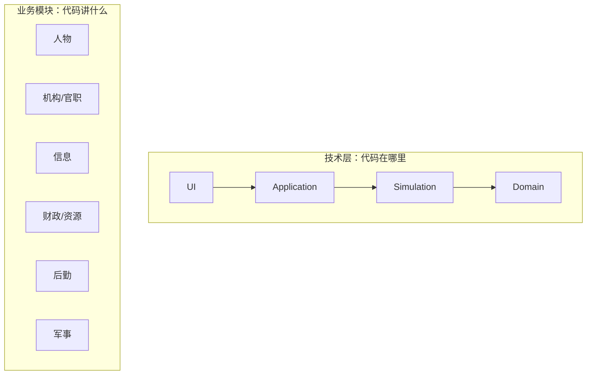
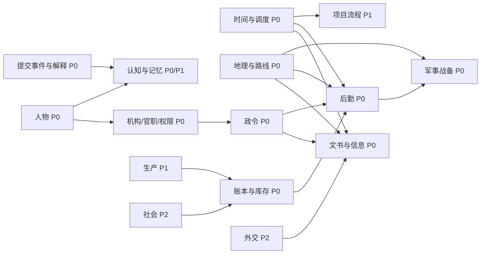
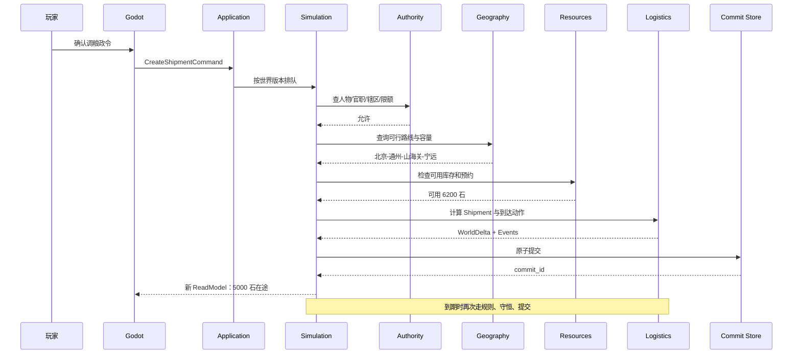
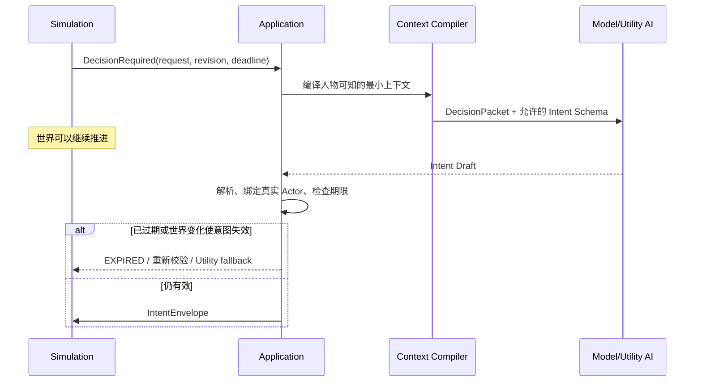

# 模块职责与交互详细设计

## 1. “层”和“模块”不是一回事

这是新手最容易混淆的地方：

- **层**回答“这段代码承担哪种技术责任？”例如 UI、应用、模拟、存储。
- **模块**回答“这段代码属于哪块游戏业务？”例如人物、财政、后勤、军事。

同一个后勤玩法会横跨几层：Godot 显示粮道，Application 接收调粮命令，Simulation 结算运输，Persistence 保存 Shipment。



不要为每个业务模块各做一套 UI→数据库的竖井，否则人物、财政和军事很快会各自拥有一份“世界真相”。

## 2. 模块总图与优先级



`P0/P1/P2` 表示开发优先级，不表示模块技术上更高级。

## 3. 平台模块

### 3.1 时间与调度（Time/Scheduler）

**拥有：**游戏日期、暂停/速度状态、到期事件队列、稳定序号、周期任务日程。  
**负责：**把时间向前推进，按固定顺序处理已经到期的动作。  
**不负责：**决定粮食损耗公式、人物态度或战斗结果。

输入：`AdvanceTo`、`Pause`、`SetSpeed`、新增到期动作。  
输出：到期动作和时间推进事件。

第一版事件排序键：

```text
(due_game_time, phase, priority, creation_sequence)
```

### 3.2 命令入口（Command Ingress）

**拥有：**命令队列、幂等记录、接收状态。  
**负责：**格式、版本、重复、期限等与业务无关的入口检查，并交给单写者。  
**不负责：**替代领域权限或资源规则。

典型输入：玩家确认的 `IssueDecreeCommand`、Agent 的 `IntentEnvelope`。  
典型输出：`QUEUED` 收据和最终 `CommandOutcome`。

### 3.3 提交与审计（Commit/InputJournal/EventJournal）

**拥有：**世界版本、提交编号、输入/事件序号和持久化事务边界。  
**负责：**让状态、事件日志和提交记录要么一起成功，要么一起失败。  
**不负责：**生成业务变化。

### 3.4 查询与只读模型（Queries/Read Models）

**拥有：**从已提交世界派生的只读 DTO。  
**负责：**针对界面和 Agent 提供最小、稳定、不可写的数据。  
**不负责：**把 UI 缓存重新写回世界。

同一份世界可以派生不同视图：

- 皇帝的地图和御案；
- 某位大臣有权看到的账册；
- 某角色基于 Belief 的感知包；
- 调试器的全知视图（只在开发模式）。

## 4. 业务模块卡片

### 4.1 地理与路线（Geography）— P0

**拥有：**`Territory`、`RouteEdge`、相邻关系、静态地形与基础通行定义。  
**提供：**是否可达、候选路线、路线容量上限和路径标识。  
**不拥有：**某支军队当前位置、某批货物状态、当前天气造成的动态风险。

典型查询：

```text
FindRoutes(source, destination, movementKind)
GetEdge(edgeId)
IsAdjacent(a, b)
```

地图多边形和像素坐标属于表现资产；省份 ID 与道路连接才是规则数据。

### 4.2 人物（Characters）— P0 最小版

**P0 拥有：**人物身份、当前位置、办事能力、一个利益倾向、少量有证据的关系和已收到的报告。  
**P0 提供：**人物是谁、能否承办、倾向哪个方案，以及一次“信任”变化如何影响后续配合或报告速度。  
**不拥有：**官职本身的法定能力、机构预算、完整世界事实。

家庭、健康、死亡、完整人生路径、复杂心理和长期私人记忆属于 P1/P2；不因概念词典里列过这些名词，就在 P0 建完整对象系统。

典型事件：`PersonAppointed`、`StressChanged`、`RelationshipChanged`。  
典型查询：`GetPersonProfile`、`GetRelevantRelationships`。

### 4.3 机构、官职与权限（Institutions/Offices/Authority）— P0

**拥有：**机构定义、官职、任职关系、辖区、能力授予、临时委托。  
**提供：**某人在某时刻是否可对某对象执行某项能力。  
**不拥有：**人物自由决策，也不运行一个“户部 LLM”。

核心判断：

```text
人是否在任
+ 官职是否提供能力
+ 目标是否在辖区
+ 金额/人数是否在限额
+ 委托是否有效
= AuthorityDecision
```

机构是受保护的业务能力与流程，不是自由人格 Agent。

### 4.4 政令（Decrees）— P0

**拥有：**政令目标、范围、承办、预算上限、期限、禁令、渠道和生命周期。  
**提供：**把玩家意图固定成可追踪、可验证的办事对象。  
**不拥有：**实际财政、运输或军事结果。

典型命令：`DraftDecree`、`ConfirmDecree`、`DispatchDecree`、`AmendDecree`。  
典型事件：`DecreeConfirmed`、`DecreeDispatched`、`DecreeReceived`、`DecreeFailed`。

### 4.5 文书与信息传递（Documents/Messaging）— P0

**拥有：**文书、发送者、收件者、渠道、密级、发送/到达时间和在途状态。  
**提供：**命令和报告为什么需要时间、谁能看到、何时到达。  
**不拥有：**文书内容声称的事实是否真实。

文书与运输共享“出发→在途→抵达”框架，但拥有自己的重量、风险和权限规则；首版只复用生命周期，不做万能 Journey 类强吞所有差异。

### 4.6 真相、观察、报告与认知（Information/Beliefs）— P0 基础、P1 深化

**拥有：**观察记录、报告来源、可信度、人物 Belief 和更新时间。  
**提供：**人物/玩家在当时合理能知道什么。  
**不拥有：**权威世界事实。

基本链：

```text
World Truth → Observation → Report → Delivery → Belief
```

MVP 先支持三份可能冲突的报告和简单可信度，不先实现通用谣言传播网络。

### 4.7 账户、预算与库存（Economy/Resources）— P0

**拥有：**账户、流水、库存、预约量、指定用途、欠款。  
**提供：**可动用多少、从何处扣、向何处增加、是否守恒。  
**不拥有：**运输过程，也不允许保存另一份“全国总数”独立修改。

典型规则：

```text
available = quantity - reserved
closing_balance = opening + credits - debits
```

典型命令：`ReserveResource`、`ReleaseReservation`、`TransferResource`。  
典型事件：`ResourceReserved`、`LedgerPosted`、`ArrearCreated`。

### 4.8 后勤（Logistics）— P0

**拥有：**`Shipment`、货物、路线选择、在途状态、装卸、损耗、护卫关联。  
**提供：**资源何时离库、在哪里、预计何时抵达、实际到达多少。  
**不拥有：**道路的静态定义、来源仓本身或部队每日消耗公式。

依赖地理、库存、时间和有限军事风险查询。  
典型事件：`ShipmentCreated`、`ShipmentDeparted`、`ShipmentDelayed`、`ShipmentAttacked`、`ShipmentArrived`。

### 4.9 军事战备（Military）— P0 最小版

**拥有：**部队、兵员群体、装备配置、组织、士气、疲劳、统帅、位置和命令。  
**提供：**守备消耗、护卫能力、移动与接战的最小结算。  
**不拥有：**仓库物资、道路定义或将领的完整人格。

MVP 只实现前线日耗、护卫和袭粮结算。完整战斗是独立详细设计缺口，不能用几行随机数冒充完成。

### 4.10 长期事务（Projects/Processes）— P1

**拥有：**跨时间、多阶段、有负责人和预算的事务生命周期。  
**候选复用：**调查、训练、建造、改革试点。  
**不负责：**吞掉所有领域规则。

只有当至少两个真实用例证明阶段、资源预约、延期、取消和验收逻辑相同，才提取共同 `Project`；第一个用例先具体实现。

### 4.11 生产（Production）— P1

**拥有：**设施、生产订单、批次、工匠/工位能力、质检状态。  
**提供：**按时间把原料与劳动转成合格品及损耗。  
**不拥有：**全国汇总产量或技术叙事。

MVP P0 不依赖生产；运输闭环稳定后只加入一种产品验证。

### 4.12 社会、农业、市场（Society）— P2

这些是完整游戏的重要因果层，但原始策划尚未完成足够详细的专项设计。首版只允许用场景输入和少量群体压力值影响宁远急饷，不建立虚假的“完整社会模拟”接口。

### 4.13 外交与边疆（Diplomacy）— P2

外交将使用人物、文书、结构化条约与信誉；MVP 不把外交当成前置。完整条款、代表权、履约和违约需要单独详细设计。

### 4.14 事件与叙事（Events/Narrative）— P0

**事件模块拥有的不是随机故事，而是已提交事实的标准 Envelope。**  
叙事模块把已提交事件翻译成玩家能读懂的奏报；它不创造结果。

“不做独立随机事件系统”与“保留 Domain Event”并不矛盾：前者是不另造一个能偷偷改数值的事件卡引擎，后者是记录世界真实变化。

## 5. 模块之间怎样交互

### 5.1 三种合法方式

1. **同步只读查询**：当前规则必须立即知道答案，例如后勤查询一条路线的容量。
2. **命令/用例调用**：明确要求某个模块改变它拥有的状态。
3. **已提交事件**：一件事已经完整发生，供其他模块生成通知或可重建派生结果。例如 `ShipmentArrived` 可触发奏报和任务进度投影，但不能在提交后才去修改库存。

不要为了“事件驱动”把所有普通函数调用都改成事件；也不要让一个模块拿到另一个模块的可写集合。

特别规定：粮队抵达时的“在途扣减、目的入库、损耗、路线释放、Shipment 状态、Input/Event Journal、Outcome”必须先在同一强类型变化集和同一正式事务里完成；提交后事件只是收据，不是第二次写世界的命令。

### 5.2 交互矩阵

| 发起者 | 接收者 | 使用什么 | 例子 |
| --- | --- | --- | --- |
| UI | Application | Command/Query | 确认政令、查看粮道 |
| Agent | Application | Intent | 户部建议调粮 |
| Application | Simulation | 有序命令 | 将已确认命令入队 |
| Simulation | Authority | 纯查询 | 此人能否调此仓粮 |
| Logistics | Geography | 只读查询 | 求两条可行路线 |
| Logistics | Resources | WorldDelta 中的资源变更 | 来源粮转为在途粮 |
| Scheduler | Logistics | 到期动作 | 处理粮队抵达 |
| Commit | Input/Event Journal | 原子写入 | 记录到期输入与 ShipmentArrived 输出 |
| Event | Narrative | 已提交 Event DTO | 生成宁远到粮回报 |
| World | UI | ReadModel | 显示库存和路线状态 |
| World | Context Compiler | Perception Snapshot | 给人物他能知道的情报 |

## 6. 黄金用例：运 5000 石粮到宁远



出发提交包含：

```text
来源可用粮 -5000
在途粮 +5000
创建 Shipment
预约路线容量
安排 ResolveShipmentArrival
```

到达提交包含：

```text
在途粮 -5000
宁远库存 + 实到量
明确损耗 + 损失量
释放路线容量
Shipment 状态 = Arrived
```

如果第二段尚未发生，界面只能说“已发出”，绝不能说“已到宁远”。

## 7. 异步 Agent 用例



模型返回时世界可能已经变化，所以每个决策请求必须包含：

- `decision_request_id`；
- `observed_world_version`；
- `decision_deadline_game_time`；
- 允许的 Intent 类型；
- 系统绑定的 `actor_id`。

意图回到世界后必须重新校验；不能因为模型思考时曾经有粮，就在回来时透支已经被别人调走的粮。

## 8. 新增模块的模板

新增一个业务模块前先写一页答案：

```text
模块名称：
玩家为什么需要它：
它拥有的唯一状态：
它不拥有的状态：
公开命令：
公开查询：
提交后事件：
主要不变量：
依赖哪些现有模块：
P0/P1/P2：
不做哪些内容：
第一个验收场景：
```

写不清“它拥有的唯一状态”时，不要先建文件夹和接口；它可能只是另一个模块中的一条规则。

## 9. 模块完成标准

一个模块只有同时满足以下条件才算完成：

- 职责和不负责事项写清；
- 状态只有一个所有者；
- 命令、查询、事件名称不混淆；
- 预期失败返回结构化原因；
- 无 Godot、无 LLM 可以测试；
- 与 SQLite 的正式提交在一个明确事务中；
- ReadModel 能告诉玩家发生了什么和为什么；
- 没有为未进入范围的 P2 功能提前堆空抽象。
