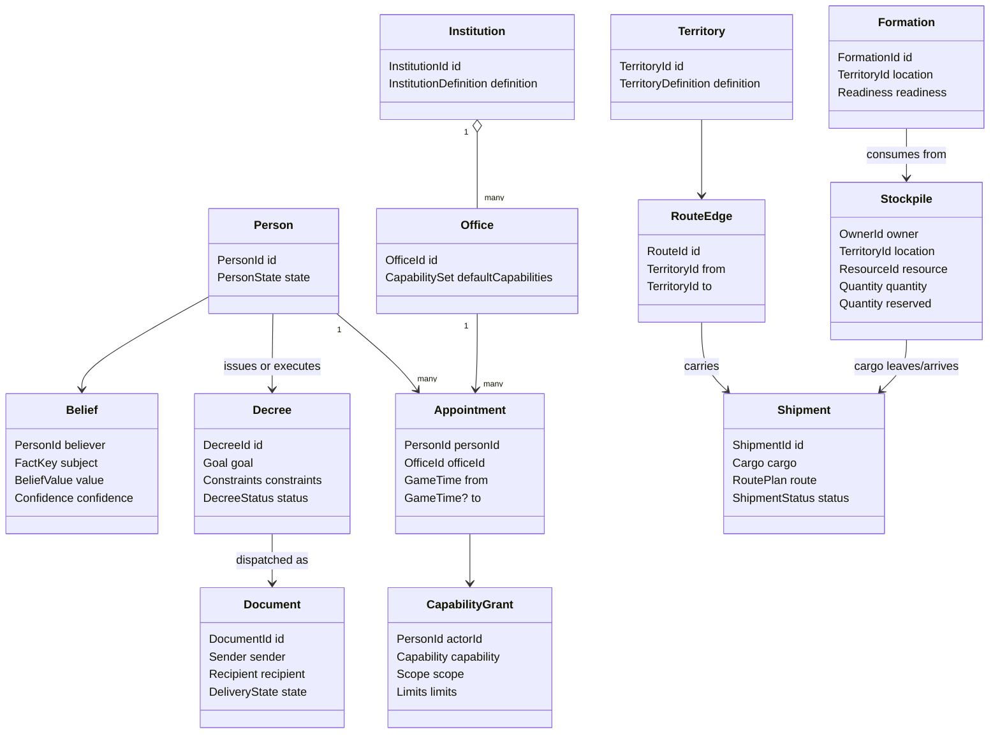
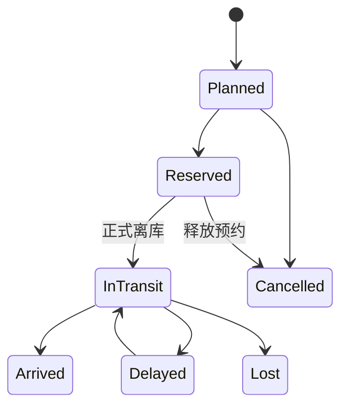

# 领域对象、数据与封装详细设计

## 1. 对象化不是“每个名词建一个类”

对象化真正解决的是三件事：

1. 这份数据代表什么；
2. 谁拥有它；
3. 哪些操作可以合法改变它。

一个概念至少满足一项时，才值得成为独立对象：

- 有稳定身份，例如某个人、某支军队；
- 有独立生命周期，例如一批运输从计划到抵达；
- 会被多个地方引用，例如一个官职；
- 自己维护重要规则，例如库存不能为负；
- 需要单独保存、查询或追踪历史。

不满足时，先用字段、枚举、记录或普通函数，不建 `Service/Factory/Manager` 全家桶。

## 2. 六类数据积木

| 类型 | 人话 | 示例 | 是否可变 |
| --- | --- | --- | --- |
| 实体 Entity | 有身份证、会经历时间的东西 | Person、Shipment、Formation | 通过规则受控变化 |
| 值对象 Value | 只看内容是否相等的概念 | Money、GameTime、RouteId、Quantity | 最好不可变 |
| 定义 Definition | 剧本/规则资料中的静态说明 | OfficeDefinition、ResourceDefinition | 运行中不改 |
| 状态 State | 某一时刻的真实情况 | StockpileState、PersonState | 只由 Simulation 改 |
| 消息 Message | 请求、提议或已发生事实 | Command、Intent、DomainEvent | 创建后不可变 |
| 只读模型 ReadModel | 为一个读者整理的显示数据 | MapReadModel、AgentPerception | 不可写回世界 |

“皇帝看到的国库卡片”是 ReadModel，不是 `TreasuryState` 本体；“大臣请求拨款”是 Intent，不是已经扣款。

## 3. 总体对象关系



这张图表示关系，不要求每个框今天就对应一个 C# 文件。对象只在 MVP 用例实际需要时落地。

## 4. 人、官职、机构必须组合，不能继承

错误设计：

```text
Person
├─ Emperor
├─ Minister
│  ├─ RevenueMinister
│  └─ WarMinister
└─ General
```

现实中同一个人会升迁、罢免、兼任、丁忧和起复。继承会让“人换官”变成“对象换类型”。

正确设计：

```text
Person
+ Appointment（此时担任什么职位）
+ Office（职位法定职责）
+ CapabilityGrant（当下实际获得的受限权限）
```

### 4.1 Person

**身份不随职位改变。** 完整版候选字段很多，但 P0 只建立当前玩法会读取或改变的部分：

```text
PersonId
姓名与内容资料引用
当前位置
办事能力概要
一个利益倾向
场景级信任值
已知报告引用
```

家庭、出生/死亡、健康、完整人格、人生路径和长期目标推迟到真实玩法需要时。少量关系证据和 Belief 使用独立小集合，因为它们有自己的生命周期；也不塞进一个巨大 JSON 字段。

### 4.2 Office

Office 是“职位定义”，包含：

```text
OfficeId
所属 Institution
职责说明
默认 Capability
辖区规则
任职数量限制
资格约束（需要时）
```

### 4.3 Appointment

Appointment 是“某人在某段时间担任某职位”的事实：

```text
AppointmentId
PersonId
OfficeId
开始/结束时间
任命来源
是否正式/署理/兼任
```

不变量：同一唯一席位同一时间不能有两个正式任职者；已结束任职不能继续提供权限。

### 4.4 Institution

机构保存职责、官职结构、预算边界、档案和执行能力。机构不是 Agent；自由意志属于具体人。

六部不写成六个继承类。内容数据说明哪个机构具备哪些 Capability；C# 实现通用规则，例如拨款、查账、调运和任命。

### 4.5 CapabilityGrant

权限由三部分组合：

```text
Capability：能做哪类动作
Scope：能作用于哪些地区/对象
Limits：金额、人数、期限等上限
```

例如：

```text
actor = 户部尚书
capability = logistics.authorize_shipment
scope = 辽东相关中央仓
max_quantity = 8000 石
expires_at = 1629-04-01
```

程序绑定 `ActorId`，不能相信模型在 JSON 里自报身份。

## 5. 世界、事实和认知必须分开

### 5.1 WorldState

`WorldState` 是当前已提交世界的权威内存表示。它可以作为顶层容器，但不能演变成含几千个业务方法的“上帝对象”。

推荐职责：

- 保存当前世界版本、游戏时间和权威随机状态；
- 持有各模块状态的只读入口；
- 支持生成冻结副本/预测工作区；
- 不直接负责每种业务公式。

业务变化由专门规则计算 `WorldDelta`，通过单写者提交。

### 5.2 World Truth

世界事实是确定的，例如：

```text
敌军实际可战人数 = 23,418
粮队实际位置 = 山海关以东路段
```

这些事实不代表玩家或人物知道它们。

### 5.3 Observation / Report / Belief

```text
Observation：某来源在某时刻观察到什么
Report：来源怎样把观察写成报告
Belief：某个接收者最终相信什么
```

示例：

```text
World Truth：敌军 23,418
Observation：侦骑见到约 20,000～25,000
Report：敌军约两万，三日前观察
Belief：袁崇焕相信 18,000～26,000，置信度 0.72
```

认知错误可以是玩法；权威事实自己前后矛盾是 Bug。

## 6. 政令、文书和执行过程

### 6.1 Decree

Decree 不是一句文本，而是玩家确认的结构化目标：

```text
DecreeId
IssuerId
Goal
ResponsibleActor/Institution
Scope
BudgetCeiling
Deadline
Constraints
Channel
Secrecy
SuccessCriteria
Status
```

它描述“要达成什么”，不直接拥有粮食或部队。

### 6.2 Document

Document 是可传递的载体：

```text
DocumentId
DocumentKind
Sender / Recipients
CreatedAt / SentAt / DueAt / ReceivedAt
RoutePlan
Secrecy
PayloadReference
DeliveryStatus
```

同一道政令可能产生给不同机构的多份文书。文书抵达不等于工作完成，只表示收件者现在可以开始处理。

### 6.3 Project/Process

长期事务候选共同状态：

```text
Proposed → Authorized → Prepared → Running → Verifying → Completed
                         ↘ Blocked / Cancelled / Failed
```

第一个运输用例直接使用 `Shipment`，不为“以后所有项目都能复用”先建万能 Process 引擎。等训练/调查第二个真实用例出现后再提取相同部分。

## 7. 钱粮、账户和运输

### 7.1 ResourceDefinition

资源种类是内容定义：

```text
ResourceId
显示名称
权威最小单位
是否可腐坏
体积/重量换算（确有物流需求时）
```

首版可以只有 `silver`、`grain`。单位换算必须集中定义，不能在各系统散落“1 石等于多少”的魔法数字。

### 7.2 Stockpile

Stockpile 表示“谁在何地拥有多少某资源”：

```text
StockpileId
OwnerId
TerritoryId
ResourceId
Quantity
Reserved
Capacity（需要时）
Version
```

本地不变量：

```text
Quantity >= 0
Reserved >= 0
Reserved <= Quantity
```

### 7.3 LedgerAccount / LedgerEntry

库存回答“现在有多少实物”；账本回答“为什么有这些数、谁欠谁什么”。

V1 的权威边界固定为：`Stockpile.Quantity/Reserved` 是当前实物真相；`LedgerEntry` 是不可变的审计/债权义务记录。账本“余额”只能由 Entry 派生或做可重建只读缓存，不能再提供第二个可写余额。若未来决定以账本为真相，必须写新 ADR，并把 Stockpile 改成只读投影；两者绝不能同时可写。

每条正式账务变化使用成对或可平衡的 Entry，至少记录：

```text
EntryId
AccountId
Debit/Credit 或 SignedAmount
ResourceId
CausalCommandId
CommitId
GameTime
MemoCode
```

MVP 不必实现完整会计软件，但必须能解释钱粮来源和去向。

### 7.4 Shipment

Shipment 有独立身份和生命周期：

```text
ShipmentId
Cargo(resource, quantity)
SourceStockpileId
DestinationStockpileId
RoutePlan
DepartAt / ExpectedArrival
ActualArrival
CurrentLeg
Losses
EscortId?
Status
```

状态建议：



取消规则必须区分尚未离库和已经在途；在途运输不能用“取消”让粮食瞬移回仓。

## 8. 地图、军队与群体

### 8.1 TerritoryDefinition 与 TerritoryState

静态定义：ID、名称、相邻、地形、表现资源引用。  
动态状态：控制者、可见度、当前风险、设施引用等。

视觉多边形不进入权威资源/战斗规则，除非某个几何量明确成为规则输入并经过稳定预处理。

### 8.2 RouteEdge

```text
RouteId
From / To
RouteKind（陆/河/海）
BaseTravelTime
BaseCapacity
静态地形标签
```

天气、敌军截断和当日预约属于动态状态/修正，不覆盖静态定义。

### 8.3 Formation

MVP 中一支军队至少保存：

```text
FormationId
Name
Location / MovementState
CommanderId
PersonnelCohorts
EquipmentSummary
Organization / Morale / Fatigue
SupplyState
CurrentOrder
```

“步兵数量”是人员、训练、装备和编制角色的派生视图，不是一键转换后凭空出现的独立物种。

### 8.4 Cohort

普通士兵和人口按群体建模：

```text
CohortId
Count
Origin/Category
TrainingDistribution
Health/Arrears/Loyalty 等少量与当前玩法相关的统计
```

只有某个普通人成为剧情核心时，才从群体升格为 `Person`；不是预先创建十万个空人物对象。

## 9. Command、Intent、Event 和 ReadModel 的封装

### 9.1 命令 Envelope

建议所有写请求共有少量元数据：

```text
command_id
actor_id
expected_world_version
submitted_game_time
idempotency_key
payload
```

`payload` 使用强类型记录，不使用任意字符串字典。

### 9.2 Intent Envelope

在命令信息之外，还应保存：

```text
decision_request_id
observed_world_version
decision_deadline
intent_type
parameters
```

模型只能控制白名单内的 `intent_type` 和参数；Actor、版本和期限由程序绑定。

### 9.3 Domain Event Envelope

```text
event_sequence
event_id
event_type
schema_version
game_time
commit_id
causal_command_id
correlation_id
payload
```

Event 创建后不可修改。修改格式时增加 `schema_version` 和迁移，不重写旧历史。

### 9.4 ReadModel

ReadModel 是为具体页面设计的数据：

```text
MapReadModel
ImperialInboxReadModel
PersonPanelReadModel
ShipmentDetailReadModel
FailureExplanationReadModel
```

它可以重复显示字段，因为它只是派生视图；但不能成为可写状态或被存成第二权威真相。

## 10. 状态所有权表

| 状态 | 唯一所有者 | 其他模块怎样使用 |
| --- | --- | --- |
| 当前游戏时间/调度队列 | Simulation Time | 查询或安排合法动作 |
| 人物身份/心理/关系 | Characters | 只读查询、人物命令 |
| 任职/辖区/授权 | Institutions/Authority | 权限查询 |
| 地区/路线定义 | Geography | 只读路径查询 |
| 钱粮账户/库存 | Resources/Economy | 通过 WorldDelta 转移 |
| 在途货物 | Logistics | 只读状态与到期动作 |
| 部队/战备 | Military | 命令或战备查询 |
| 政令生命周期 | Decrees | 工作流命令 |
| 文书在途状态 | Documents | 到期动作 |
| Belief/报告 | Information | Perception 查询 |
| Commit/Event 序列 | Simulation Commit | 只读日志 |
| UI 卡片与地图标记 | 无权威所有者，是派生视图 | 随新 ReadModel 替换 |

如果两行都声称拥有同一数值，设计必须先修正，不能靠“双向同步”补救。

## 11. 派生值与重复数据

应该派生而不另存的例子：

```text
全国工坊总产量 = 有效工坊实际产量求和
可用库存 = Quantity - Reserved
前线可维持天数 = 可用粮 / 每日预计消耗
部队显示战力 = 人员、训练、装备、补给、士气的只读计算
```

只有在性能测量证明计算太慢时才建立缓存；缓存必须能完全重建，不能拥有独立写入口。

## 12. ID、时间、单位和数值约定

- 每类实体使用强类型 ID，避免把人物 ID 误传成军队 ID；
- ID 一经创建不因改名而变化；
- 权威游戏时间使用明确的游戏日历类型，不用本机时区和 `DateTime.Now`；
- 钱、粮、人数使用整数最小单位；
- 百分比可用基点：`10000 = 100%`；
- 权威模拟避免 `float/double`；展示层可以换算小数；
- 所有排序使用稳定 ID/序号，不依赖字典偶然顺序；
- 所有外部 JSON 带 `schema_version`；
- 所有存档带 `content_hash`、规则版本和世界版本。

## 13. 哪些放数据，哪些写代码

| 放 JSON/内容数据 | 写 C# 规则 |
| --- | --- |
| 人物姓名、生日、初始关系 | 关系如何影响行动评分 |
| 地区名称、相邻和初始控制 | 路线是否可通、运力怎样消耗 |
| 官职和默认 Capability 配置 | 权限校验顺序和委托撤销规则 |
| 初始库存、军队和机构 | 资源预约、转移与守恒 |
| 事件/奏报模板文本 | 事件何时由已提交事实产生 |
| 场景目标和阈值 | 胜败评估算法 |

绝不能出现：

```text
if (person.Name == "袁崇焕") { ... }
```

人物的特殊性来自内容中的能力、关系、职位、记忆和事件条件，而不是姓名硬编码。

## 14. 何时建立接口

建立接口的合理原因：

- 跨层边界，例如 Application 需要存档适配器；
- 当前确有两个实现，例如规则 AI 和模型 AI；
- 测试必须替换真正 I/O，例如时钟/模型/提交存储；
- 需要隔离外部 SDK。

不合理原因：

- “每个类都应该有接口”；
- “以后也许会换”；
- 只有一个 10 行纯函数却套接口、工厂和 DI；
- 为了让目录看起来像企业项目。

## 15. 对象设计验收问题

每新增一个实体或重要记录，必须能回答：

1. 它有什么稳定身份或独立生命周期？
2. 谁是唯一状态所有者？
3. 哪些方法能改变它，谁可以调用？
4. 它维护哪些本地不变量？
5. 它和相邻对象是组合、引用还是派生关系？
6. 它属于引擎机制还是场景内容？
7. 它怎样序列化、版本化和进入状态哈希？
8. 删除它会不会反而让设计更简单而不损失规则？

第 1、2、3 项答不清时，先不要建类。
