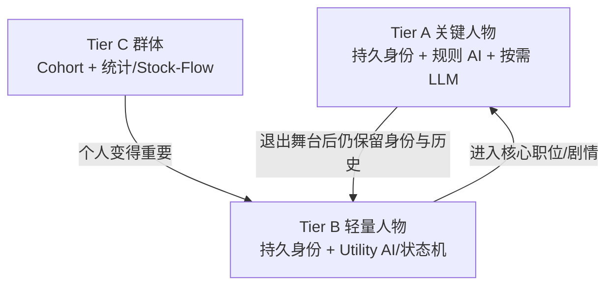
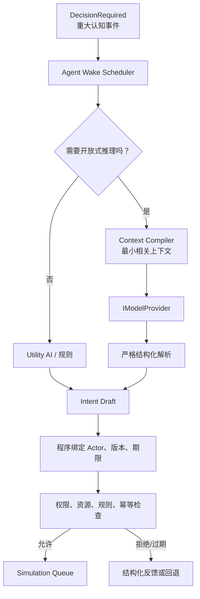
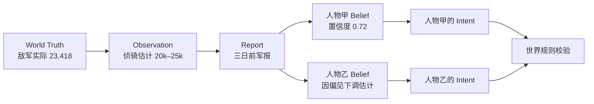
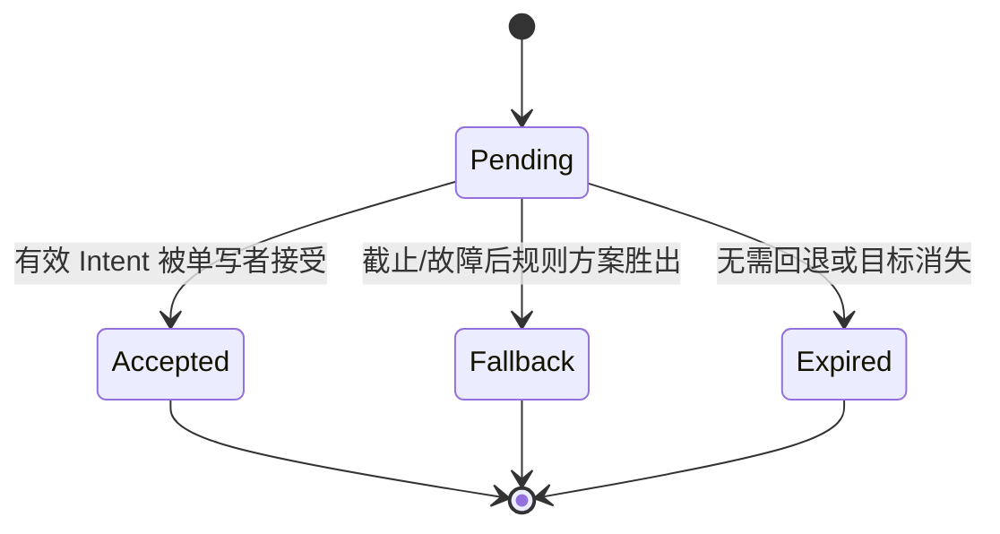

# AI 角色代理、记忆与权限详细设计

## 1. 30 秒结论

> 人物是长期存在的身份；LLM 只是这个人物在少数重要时刻借用的一颗“外接大脑”。

世界没有模型也能运行。普通事务用确定性规则和 Utility AI；只有开放式谈判、复杂战略或玩家深度交谈才按需调用模型。

AI 可以想错、说谎、拒绝和提出新办法，但它不能：

- 读取完整 `WorldState`；
- 直接查询数据库；
- 自报一个身份并取得权限；
- 修改人物、钱粮、军队或存档；
- 把一句“臣已办妥”变成事实。

## 2. 三种智能等级



| 等级 | 数量级 | 是否是人物对象 | 日常决策 | 何时用 LLM |
| --- | ---: | --- | --- | --- |
| Tier A | P0 4–6；扩大纵切后再增加 | 是 | 规则/Utility AI | M6 后仅在重大认知事件、谈判、深度对话时可选使用 |
| Tier B | P0 6–12；完整世界可为数千 | 是 | Utility AI、规则、状态机 | 升格或成为关键事件中心时 |
| Tier C | P0 3 个群体；完整世界覆盖大多数人口和士兵 | 不是逐人对象 | 群体公式 | 从不直接调用 |

“一个人物一个 Agent”应理解为一份独立身份、状态、认知和记忆，不是一个永远占用线程和模型连接的进程。

## 3. 人物决策流水线



LLM 不参与每小时 Tick。世界实时运行，模型稀疏运行。

## 4. 什么事件可以唤醒人物

### 必须考虑唤醒

- 玩家直接召见、询问或要求拟定方案；
- 人物收到与其职责和目标高度相关的重大文书；
- 人物必须在两个以上合法策略之间作开放式选择；
- 人物进入谈判、阴谋、冲突或危机核心；
- 人物晋升为关键职位；
- 世界发生足以推翻人物现有计划的重大变化。

### 不应该唤醒

- 每日吃粮、每月发饷；
- 普通路线移动；
- 固定公式的税收、生产和伤病；
- 数千名普通官员例行判断；
- 只需比较几个数值的选择；
- 为了让模型“保持在线”而定期聊天。

唤醒前先问：Utility AI 是否能可靠完成？如果能，就不花模型调用。

## 5. Context Compiler：只给人物该知道的内容

模型上下文不是把整个数据库转成文本。Context Compiler 根据人物、任务和权限组装 `DecisionPacket`。

### 5.1 DecisionPacket

```text
schema_version
decision_request_id
actor_id（程序内部绑定，不要求模型回填）
observed_world_version
observed_game_time
decision_deadline_game_time
当前任务与可选目标
与任务直接相关的人格和长期目标
人物当前拥有的职位与权限摘要
人物已知的 Belief/报告
近期相关事件和未履行承诺
允许提出的 Intent Schema
可用预算摘要
模型输出语言与长度限制
```

不包含：

- 完整世界状态；
- 所有角色档案；
- 角色不可能知道的敌方真实数值；
- 与任务无关的几十年原始聊天；
- 所有游戏工具；
- API Key、数据库连接、文件系统路径。

### 5.2 上下文选择顺序

```text
任务必需事实
→ 当前职位和权限
→ 直接相关人物/地区/资源
→ 最近相关经历
→ 长期记忆中语义或关系最相关的少量条目
→ 严格 Token 上限内截断
```

截断时先删除修辞和低相关旧事，不能删除权限、期限和约束。

## 6. 记忆设计

### 6.1 记忆不是聊天记录仓库

不保存无限长 Prompt，也不把模型的隐藏推理当作人物记忆。保存能影响未来行为的结构化条目。

| 记忆类别 | 示例 | 来源 | 可否与事实冲突 |
| --- | --- | --- | --- |
| 身份记忆 | 我是谁、担任何职 | 权威人物/任职状态 | 否 |
| 事件记忆 | 皇帝曾当众驳斥我 | 已提交事件 + 人物视角 | 视角可有差异 |
| 关系记忆 | 某人帮过我、欠我人情 | 事件与人物评价 | 可以主观 |
| 承诺/目标 | 三月内筹粮、保住职位 | 正式承诺或决策 | 可以失败/改变 |
| Belief | 敌军约两万 | 报告/观察 | 可以错误、过时 |
| 技能/知识 | 熟悉辽东粮道 | 内容与经历 | 有范围和置信度 |
| 反思摘要 | 上次强硬催征导致抵触 | 受控总结 | 必须引用证据事件 |

### 6.2 共享记忆与私人记忆

原始设想中的“公共记忆”要拆开：

- **世界公共事实**：已经公开且角色有渠道获知的事件；
- **机构档案**：担任相应职位的人可查询；
- **群体流传信息**：可能失真或过时；
- **私人记忆**：只有人物本人或特殊调查可见。

不能建立一个所有 Agent 都能读取的“全知公共 Prompt”，否则有限认知玩法失效。

### 6.3 记忆条目最小结构

```text
memory_id
owner_person_id
memory_kind
summary
source_event_ids
subject_ids
formed_at
last_recalled_at
salience
confidence
secrecy
expires_or_decays_at?
```

`summary` 可以由模板或模型生成，但 `source_event_ids` 使它可追查。没有来源的模型臆测只能作为低置信主观想法，不能升级为世界事实。

## 7. World Truth 与 Belief 的防火墙



Agent 决策只看 Belief/报告。Simulation 结算使用 World Truth。两者不能共用同一个可写对象。

## 8. Utility AI 与 LLM 分工

### Utility AI 适合

- 从几项清晰行动中评分选择；
- 日常预算、路线、休整、巡逻；
- 是否响应普通请求；
- 根据人格调整权重；
- 模型离线/超时时回退。

评分可以简单到：

```text
score = 目标收益 + 性格偏好 + 关系影响 - 风险 - 成本 - 压力
```

每个分量应可解释，不需要先上行为树框架。

### LLM 适合

- 在不完整情报下形成多阶段战略；
- 谈判、说服、威胁和提出条件；
- 对玩家开放式问题作符合人物身份的回答；
- 从允许的 Intent 中组合少见但合法的方案；
- 将结构化已知事实表达成角色语言。

### LLM 不适合

- 数值结算；
- 路径最短路；
- 库存守恒；
- 权限认证；
- 随机数生成；
- 存档事务；
- 判断一件事是否已经发生。

## 9. 动态工具暴露

模型看到的“工具”不是数据库 API，而是一组允许提出的结构化 Intent Schema。

示例：户部尚书处理调粮任务时可看到：

```text
QueryKnownTreasurySummary
QueryKnownStockpileSummary
ProposeBudgetTransfer
ProposeGrainShipment
RequestReport
SendDocument
```

不会看到：

```text
ModifyWorldState
ExecuteSql
SetTreasury
SpawnArmy
WriteMemoryForAnotherPerson
```

工具列表按当前职位、任务、授权和认知动态生成。即使模型伪造了列表外的 Intent，解析器和权限层也会拒绝。

## 10. Structured Intent 契约

模型输出示例：

```json
{
  "schema_version": 1,
  "request_id": "decision_1048",
  "intent_type": "logistics.request_shipment",
  "parameters": {
    "source_id": "shanhaiguan",
    "destination_id": "ningyuan",
    "resource_id": "grain",
    "quantity": 5000
  },
  "public_statement": "臣请调粮五千石赴宁远。"
}
```

程序随后创建真正的 Envelope：

```text
actor_id = 当前被唤醒人物（程序绑定）
observed_world_version = DecisionRequest 中的版本
deadline = DecisionRequest 中的期限
command_id = StableId(decision_request_id, intent_index)
```

解析规则：

- 只接受已登记 `schema_version`；
- `intent_type` 必须在本次白名单；
- 参数类型、单位和 ID 必须校验；
- 多余字段忽略或拒绝的策略必须固定；
- JSON 外的说明文字不能触发动作；
- 解析失败最多有限重试，之后使用规则回退；
- 模型的 `public_statement` 只是人物说法，不是提交结果。

## 11. 权限检查

采用够用的进程内模型：

```text
RBAC：职位带来基础 Capability
+ ABAC：地区、对象、数量、金额、时间限制
+ Delegation：上级临时委托
```

检查顺序：

1. `ActorId` 是否由有效 DecisionRequest/玩家会话绑定；
2. 人物、任职和委托是否仍有效；
3. 是否具有所需 Capability；
4. 目标对象/地区是否在 Scope；
5. 数量、金额、期限是否在 Limits；
6. 委托是否撤销或过期；
7. 当前世界资源与前置条件是否允许；
8. 记录允许或拒绝的结构化原因。

首版不需要 OAuth/JWT/Zanzibar 式系统。角色权限是游戏内规则，不是互联网账号认证。

## 12. 异步返回、过期与竞态

模型思考时世界可以继续。返回结果必须处理三种情况：

| 情况 | 处理 |
| --- | --- |
| 世界版本未变、仍在期限内 | 正常进入规则校验 |
| 世界版本已变但意图仍可能有效 | 用最新状态重新校验，不信任旧资源快照 |
| 已过决策期限或目标不存在 | 标记 `EXPIRED`，执行预先定义的 Utility fallback |

禁止自动把过期模型结果“适配一下”偷偷执行。重要决策可重新触发一个新请求，但必须有新 ID 和新上下文。

每个 `DecisionRequest` 只有一条单向状态机：



`Accepted / Fallback / Expired` 是互斥终态。Simulation 在同一事务中用当前状态进行 compare-and-set：只有仍为 `Pending` 的请求能转一次。模型结果在 `AcceptedGameTime >= deadline` 时一律过期；即使模型任务稍后完成，也只能进入审计，不能再执行。模型输出第 N 个 Intent 的稳定 `CommandId` 由 `DecisionRequestId + N` 派生，重试解析不能生成新 ID 绕过幂等。

## 13. 模型路由、预算和离线

### 13.1 最小 Provider 接口

首版只需：

```text
IModelProvider.DecideAsync(DecisionPacket, CancellationToken)
```

一个 OpenAI-compatible 适配器足够。不要在游戏里复制 LiteLLM、LangChain 或多 Agent 框架。

### 13.2 路由依据

- 是否真的需要 LLM；
- 玩家允许的提供商；
- 请求所需上下文长度与结构化输出能力；
- 本局/现实小时预算余量；
- 延迟和错误率；
- 隐私设置。

不要把易变的模型名称和价格写进永久规则。

### 13.3 预算

预算按“重大认知事件、本局上限、现实小时上限”控制，而不是写死每游戏年调用次数。

达到限制：

```text
停止新模型请求
→ Utility AI 继续决策
→ UI 明确显示当前处于规则模式
```

### 13.4 离线

0 次模型调用时必须能完整玩完 MVP。模型服务失败不能暂停世界主循环；只有玩家正在等待一次必须回应的对话时，界面才提示降级。

## 14. 叙事生成边界

数字型奏报优先模板化：

```text
计划 5000 石；已发 5000 石；途中损失 350 石；实到 4650 石。
```

若用模型润色，只提供已经提交的事实字段，并在输出后再次检查关键数值。模型不能补充战果、地点、人物或时间。

所有叙事都可追到：

- `commit_id`；
- `event_id`；
- 使用的报告/Belief；
- 模板或模型生成方式。

## 15. 密钥、隐私与审计

- API Key 由玩家自己输入和控制；
- 不写入游戏存档、人物记忆、日志或崩溃报告；
- 使用系统安全凭据存储属于接入阶段的独立实现任务；
- 日志只记录 provider 名称、请求 ID、延迟、Token/成本摘要、成功/失败和被接受的 Intent；
- 不保存模型隐藏思维链；
- 可选保存脱敏后的 DecisionPacket 用于复现；
- Replay 读取当时已接受的 Intent，不再次调用模型。

## 16. AI 测试矩阵

| 测试 | 必须证明 |
| --- | --- |
| 无模型运行 | 90 日 MVP 能结束 |
| 非法 JSON | 不崩溃、不执行、可回退 |
| 未知 Intent | 明确拒绝 |
| 伪造 Actor | 程序绑定身份，伪造无效 |
| 越权目标/金额 | 权限层拒绝并给原因 |
| 过期返回 | 不执行旧意图 |
| 世界版本变化 | 在最新状态重新校验 |
| 模型说“已完成” | 世界不发生变化 |
| 重复响应 | 幂等键只接受一次 |
| 模型超时/断网 | Utility AI 接管，世界继续 |
| 上下文泄漏 | 人物看不到未授权世界真相和密钥 |
| Replay | 不调用模型也能重现已接受行动 |
| 预算耗尽 | 自动降级且 UI 明示 |

## 17. 实施阶段边界

### M4 人物基础（不接真实模型）

- Tier A/B/C 分类；
- 一个可解释的 Utility AI；
- 为 Utility AI/人物 UI 构建最小 `PerceptionPacketBuilder`；
- 普通强类型 Intent 与权限；
- 不依赖模型的决策审计。

### M6 模型增强

- 一个真实 OpenAI-compatible Provider；
- `DecisionRequired`、模型 Context Compiler 与结构化输出解析；
- 假的/录制 Provider 契约测试；
- 3 个关键人物的角色语言；
- 结构化记忆检索；
- 玩家预算 UI；
- 奏报受限润色。

不在首版做：多模型负载均衡、向量数据库、自治 Agent 群、人物之间自由无限聊天、本地大模型部署、模型自选工具和长期思维链存储。
