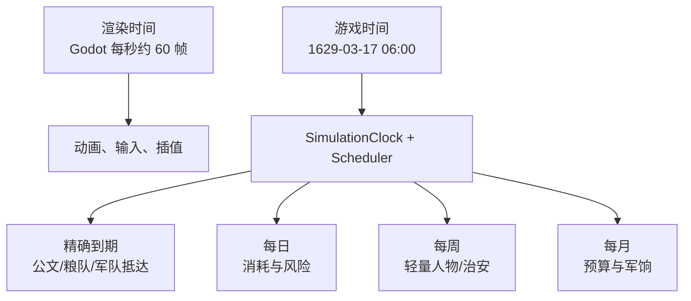
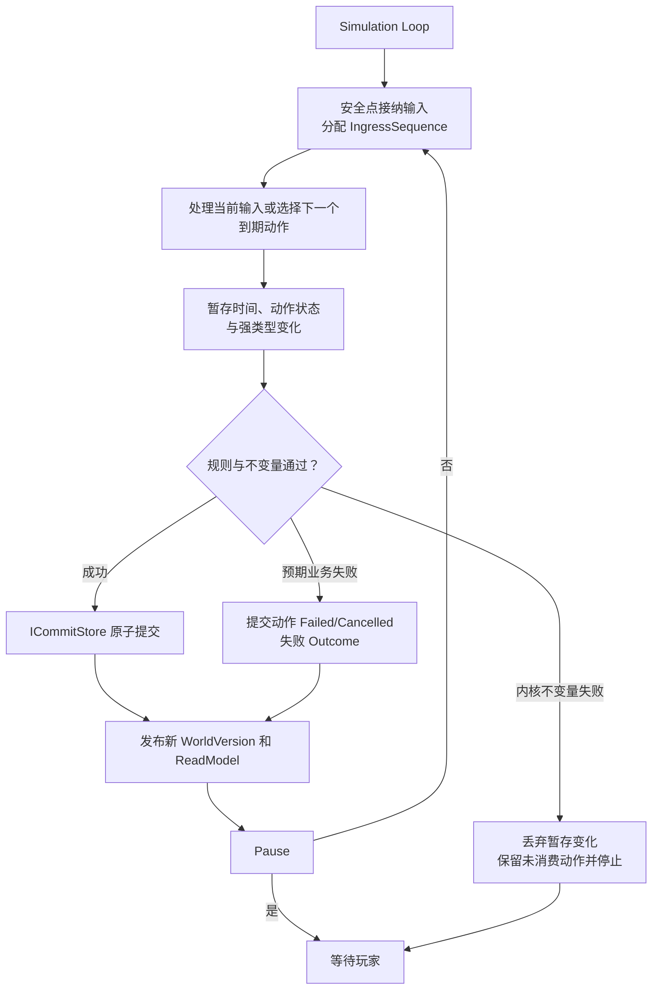
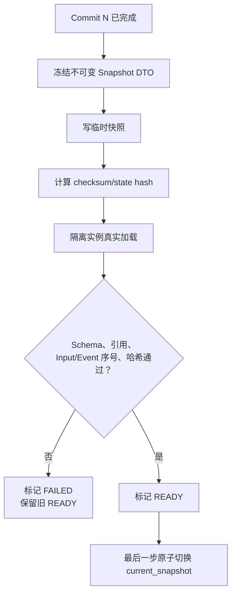
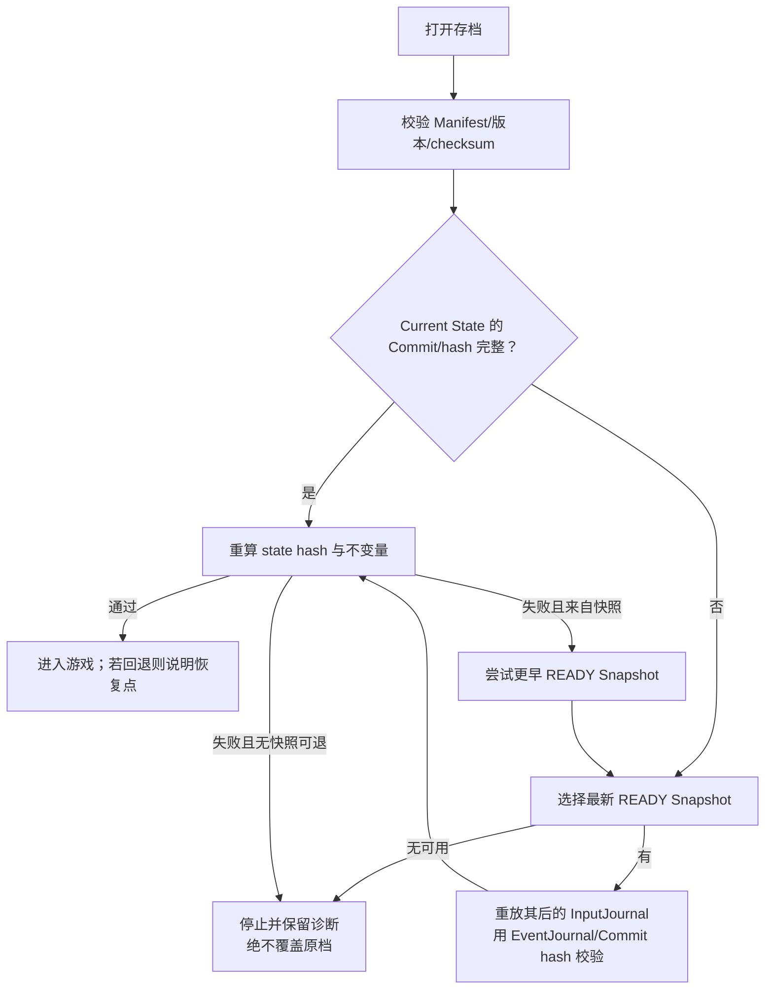

# 时间、调度、确定性与存档详细设计

## 1. 先把旧“回合”概念统一掉

最终玩法是可暂停实时，不再以“玩家点一次结束回合”为世界核心。

需要区分三个编号：

| 概念 | 用途 |
| --- | --- |
| `GameTime` | 世界中的日期和时刻，例如 1629-03-17 06:00 |
| `WorldVersion` | 每次权威世界状态（含时间/调度状态）成功提交后递增，用来发现过期命令 |
| `CommitId` | 某次提交的稳定身份，用于审计、存档和因果链 |
| `IngressSequence` | 单写者接纳外部输入时分配的连续序号，用来固定玩家命令、模型结果等输入顺序 |

现有 `TurnNumber` 可以在迁移期兼容旧原型，但新命令、存档和 UI 不应继续把它当作时间真相。旧 `TurnOrchestrator` 的“整回合原子提交”思想保留为**短提交批次**，名称和流程统一到实时 Simulation Runtime。

## 2. 三种时间



- **渲染时间**只影响画面；
- **游戏时间**是权威历史日期；
- **系统更新时间**决定各项规则何时运行。

同一游戏输入在 30 FPS、60 FPS、暂停后快速推进时都必须得到相同世界结果。

## 3. 游戏时钟与倍速

玩家控制：暂停、1/2/3/5 速。速度是 UI/运行时配置：

```text
现实经过时间 × 当前速度映射 = 想推进到的游戏时间
```

具体“1 秒等于几小时”属于手感参数，不写入领域规则。自动测试直接要求推进到一个 `GameTime`，不等待真实秒数。

核心 API 语义应接近：

```text
AdvanceTo(targetGameTime)
```

而不是：

```text
Update(deltaFromGodotFrame)
```

Godot 可以每帧请求运行时推进，但 Simulation 自己决定完整、稳定的游戏时间边界。

## 4. 调度器

### 4.1 调度项

```text
ScheduledActionId
DueGameTime
Phase
Priority
CreationSequence
ActionType
Payload
CausalCommandId
Status
SchemaVersion
```

稳定排序键：

```text
(DueGameTime, Phase, Priority, CreationSequence)
```

不能只按时间排序后依赖优先队列的偶然顺序。

### 4.2 外部输入先取得权威顺序

UI 点击、模型返回和后台结果到达进程的先后可能受操作系统调度影响。它们不能自行填写权威游戏时间。Simulation 只在**安全点**接纳输入，并为每条输入分配：

```text
IngressSequence（单调递增）
AcceptedGameTime（接纳时的权威 GameTime）
```

客户端提供的 `SubmittedGameTime` 只作诊断元数据。Replay 以 `IngressSequence` 为准，因此一次真实游玩的输入顺序即使受玩家/网络时机影响，也会被完整记录并可重复。

同一个安全点内先按 `IngressSequence` 处理已经接纳的外部输入，再推进到未来时刻。同一 `DecisionRequest` 的模型结果、规则回退和过期动作只能抢占一个终态，不能同时生效。

### 4.3 Scheduled Action 的 Phase

MVP 可采用很少的阶段：

```text
0  截止时间/回退边界
1  到达/状态边界
2  日常消耗
3  风险与冲突
4  人物/机构反应
5  通知与决策请求
```

Phase 只有在同一时刻存在确定顺序需求时才增加，不为每个模块预设十几个阶段。

`DecisionDeadline` 采用半开区间：只有 `AcceptedGameTime < deadline` 的模型结果才可能被接受；等于截止时刻已经过期。这样“模型恰好在截止时返回”不会因线程运气产生两种结果。

### 4.4 推进算法

```text
1. 在安全点接纳外部输入，分配 IngressSequence/AcceptedGameTime
2. 先按 IngressSequence 独立处理当前时刻的输入
3. 找到下一个到期动作或必要日历边界
4. 在临时工作区暂存“时间推进 + 一个 Scheduled Action 的状态变化”
5. 计算该动作的强类型变化并检查规则/不变量
6. 成功：原子提交；预期业务失败：原子提交时间、动作终态和失败 Outcome
7. 内核不变量失败：丢弃全部暂存变化，保留动作未消费并停止模拟
8. 发布新 ReadModel
9. 同时刻其余动作按稳定顺序逐个处理，直到目标时间或自动暂停
```

“一游戏小时”只是首个实验候选，不是已经定死的 P0 规则。实现先把最小日历边界做成配置/值对象并测试一小时方案；绝大多数小时不遍历全国对象。经玩法与性能验证后可选择更细/更粗边界，或在结果不变时直接跳到下一个到期时刻。

## 5. 单写者运行循环



三种失败必须分开：

- **玩家命令业务拒绝**：世界和时间不变，但把该 `CommandId` 的终态 Outcome 持久化，重试仍得到同一结果；
- **到期动作预期失败**：在同一事务推进到期时间、把动作置为 `Failed/Cancelled`、记录失败事件/Outcome，避免它无限重新到期；
- **内核不变量失败**：不提交时间、不出队、不改变动作，立即停止并保留诊断，避免丢动作或扩大损坏。

出队、时间推进、动作终态、状态变化与 Input/Event Journal 必须都在临时工作区中，最后同一事务提交。

## 6. 确定性规则

同一组输入能重放，必须遵守：

1. 核心不读取 `DateTime.Now`、本机时区或真实网络时间；
2. 核心不使用 `Random.Shared` 或无记录的随机源；
3. 权威数量使用整数最小单位或定点数；
4. 不依赖 `Dictionary`/并行任务的偶然枚举顺序；
5. 外部输入按单写者分配的 `IngressSequence`，调度动作按 `(DueGameTime, Phase, Priority, CreationSequence)` 排序；
6. 规则不依赖画面 FPS；
7. 内容版本、规则版本、随机状态进入存档；
8. LLM 回放时使用当时接受的 Intent，不再次请求模型；
9. 外部 I/O 结果先转成记录过的输入，才能影响世界；
10. 所有权威状态都进入规范化哈希。

## 7. 随机数

### 7.1 不共用一条全局随机流

如果天气多抽一次随机数，不能导致下一场战斗结果完全变化。

推荐按用途分流：

```text
weather
logistics-risk
combat
politics
health
```

V1 可采用版本化的“带键随机”：

```text
random_schema_version = 1
attemptIndex = 0
digest = SHA-256(worldSeed || LP_UTF8(streamName) || LP_BYTES(causalKey) || U64_BE(drawIndex) || U32_BE(attemptIndex))
candidate = U64_BE(digest[0..8])
space128 = (UInt128)UInt64.MaxValue + 1
limit128 = (space128 / (UInt128)rangeSize) * (UInt128)rangeSize
candidate128 = (UInt128)candidate
若 candidate128 >= limit128：attemptIndex += 1，并重新计算 digest
否则 offset = (UInt64)(candidate128 % (UInt128)rangeSize)
value = checked(minInclusive + offset)
```

其中 `LP_UTF8` 表示文本先做 Unicode NFC，再用“大端 32 位字节长度 + UTF-8 字节”；`U64_BE/U32_BE` 明确使用无符号大端整数。`rangeSize = maxExclusive - minInclusive` 以 checked/UInt128 中间值计算，V1 接受 `1..UInt64.MaxValue`；若未来真要覆盖完整 `2^64` 个结果，单独定义为直接返回 `candidate`，不把 `2^64` 塞进 `UInt64`。`limit` 和比较必须用 `UInt128`，防止 `2^64` 溢出成 0 后永久拒绝。拒绝后只递增 `attemptIndex` 重算，所有实现使用同一规则。`causalKey` 使用稳定的 Command/Action/领域对象 ID，不能使用会因无关事件插入而改变的全局事件序号。算法或编码变化必须增加 `random_schema_version`。

优点是结果与调用顺序耦合更少；同一因果动作内 `drawIndex` 必须由规则固定并记录。若保留有状态 PRNG，则每条随机流的算法版本和内部状态都必须进入快照和哈希。禁止使用 `string.GetHashCode()`、`HashCode` 或运行时默认哈希生成权威随机数。

### 7.2 随机不是不可解释

事件应记录：

```text
stream
causal_key
draw_index / attempt_index
规则输入摘要
结果区间/阈值
最终结果
```

不用向玩家暴露种子，但调试器必须能复现。

## 8. 命令版本、期限与幂等

每个写请求至少包含：

```text
CommandId
ActorId
ExpectedWorldVersion
SubmittedGameTime（非权威诊断字段）
Payload
```

接纳时由 Simulation 追加 `IngressSequence` 与 `AcceptedGameTime`，调用方不能指定它们。

处理规则：

- V1 直接让稳定 `CommandId` 承担幂等；同一世界内已出现该 ID 时返回原 Outcome，不再次执行；
- 同一 `CommandId` 却带不同 Payload：返回 `IDEMPOTENCY_CONFLICT` 并记录诊断，不能选一个偷偷执行；
- `ExpectedWorldVersion` 过旧：根据命令类型明确拒绝或在最新世界重新评估；
- 人物决策超过 `DecisionDeadline`：标记过期并使用回退；
- 目标对象已不存在：结构化失败；
- 业务条件变化：按最新状态重新校验，绝不按旧快照透支资源。

UI 重试必须复用原 `CommandId`。Agent Intent 转成命令时，ID 稳定派生自 `DecisionRequestId + intentIndex`，不能每次解析随机生成。只有未来证明确实存在“同一业务请求需要多个不同 CommandId”的需求，才新增独立 `IdempotencyKey`。

命令 Outcome 必须与业务状态在同一 SQLite 事务提交，否则崩溃后可能再次执行。业务拒绝也要原子保存 Outcome，但不增加 `WorldVersion`，因为权威世界没有变化。

## 9. 一次 Commit 包含什么

一个 Commit 是最小持久化原子单位，可以对应：

- 一条玩家命令；
- 一条被接受的 Agent Intent；
- 一条 Scheduled Action；
- 一个周期系统的结算批次。

默认每条同刻 Scheduled Action 按稳定顺序独立提交；一个失败不能阻塞其他无关动作。只有动作共享明确的 `CausalBatchId`，且业务不变量证明“必须全有或全无”时，才合并为一批。不能因为 `DueGameTime` 相同就自动绑成大事务。

一个 Commit 至少写入：

```text
world_version +1
current game time
所有 WorldDelta 状态变化
新增/更新的 Scheduled Actions
对应外部 InputJournal（若有）或 ActionOutcome
append-only Domain Events
随机流状态或随机审计
commit 元数据与 state hash
```

如果其中任何一项失败，全部回滚。

## 10. SQLite 事务设计

逻辑流程：

```text
BEGIN IMMEDIATE
→ 校验数据库 current_world_version == 预期版本
→ 写当前状态变化
→ 写 Scheduler 队列变化
→ 追加 InputJournal / 写 Command 或 Action Outcome
→ 追加 Event Journal
→ 写 Commit 记录与新 State Hash
→ 更新 world_meta.current_version/current_game_time
COMMIT
```

SQLite 成功提交后，Simulation 才发布新的已提交内存世界。如果数据库已提交但内存发布异常，必须停止推进并从最后 Commit 重新加载，不能继续带着不一致状态运行。

正确性基线是：每个**会改变权威世界**的 Commit 同步持久化。空小时直接跳过，不逐小时提交；但只要权威 `GameTime` 实际推进到下一动作、自动/玩家暂停点或一次 `AdvanceTo` 目标，即使没有其他 Delta，也必须提交这次时间状态，使内存与 SQLite 的版本/时间仍一致。这是本项目在 ADR-005 中作出的强化决定，不是原研究稿已经定下的结论。若实测成为瓶颈，只能在写明“最多可丢失多少游戏进度”的新 ADR 和故障实验后改为短耐久批次。

WAL 注意事项：

- 数据库、`-wal` 和 `-shm` 是运行中的整体，不可随意只复制主文件；
- WAL 不适合把活数据库放在网络文件系统；
- 长时间读事务会阻碍 checkpoint；
- checkpoint 策略通过测量再调，首版采用默认或安全的显式闲时策略；
- 存档导出使用 SQLite Backup API、`VACUUM INTO` 或停写后的完整复制方案，不手工拼文件。

物理布局统一为：活动存储在运行时可以出现 `.db`、`-wal`、`-shm` 配套文件；Snapshot Payload/Manifest 也存于该 SQLite 数据库的表或 BLOB/分块行中。玩家点击“导出存档”时，使用 Backup API 生成一个自洽的单 SQLite 文件并命名为 `.mingsave`。因此“单文件存档”指**玩家导出物**，不是声称 WAL 运行时只有一个文件。

## 11. 持久化不是第二个世界

采用：

```text
Current State（便于快速加载和查询）
+ Append-only Input Journal（可重放的输入）
+ Append-only Event Journal（输出审计和因果）
+ Periodic Snapshot（快速恢复和回退）
```

这不是严格全量 Event Sourcing。普通加载可以从最新已验证快照/当前状态开始，不必每次从第一条事件重演整个崇祯朝。

内存 `WorldState` 与 SQLite 当前状态用相同 `WorldVersion` 和 `CommitId` 表示同一版本。数据库不是允许其他线程随意写的第二真源。

## 12. Input Journal 与 Event Journal

这两本账用途不同：

- `InputJournal` 记录“世界被要求处理什么”，是 Replay 的输入；
- `EventJournal` 记录“世界提交后实际发生什么”，是审计收据和 Replay 的预期输出。

### 12.1 Input Journal

每条被单写者接纳的输入至少包含：

```text
ingress_sequence
kind（player_command / accepted_intent / time_control / external_observation）
schema_version
payload
actor_id（若适用）
accepted_game_time
expected_world_version（若适用）
outcome（committed / rejected / expired / cancelled / fallback；写入时已是终态）
causal_id / command_id / decision_request_id
resulting_commit_id（若改变世界）
```

InputJournal 是 append-only：一条外部输入在处理完成后**只追加一次终态行**，不先写 `pending` 再更新。处理中状态只在内存工作区；崩溃前未提交就视为未接纳/未处理。输入 Payload 必须足以离线重放，不能只存一段展示文字。速度按钮本身不是领域规则，但 Replay 若要复现玩家何时让世界前进，就记录权威的 `AdvanceTo`/暂停控制或等价目标时间。模型思维链、API Key 和未被接受的自由文本不进入权威 Replay 包。

Scheduled Action 已存在于 Snapshot/Current State 的调度队列，不再重复追加 InputJournal；它执行后写不可变 `ActionOutcome` 和对应 EventJournal。否则恢复时可能把队列动作和输入日志动作各执行一次。

### 12.2 Event Journal

每条事件至少包含：

```text
event_sequence
event_id
event_type
schema_version
world_id
world_version
game_time
commit_id
causal_command_id
correlation_id
payload
```

要求：

- `event_sequence` 连续且只由单写者分配；
- 只追加，不覆盖已提交历史；
- payload 可版本化；
- Narrative、记忆和统计引用事件 ID；
- 不把模型思维链或秘密 Key 写进 Journal；
- Event 只能在同一 Commit 成功后对外发布。

正常数据库健康时直接加载 Current State；只有做确定性验证，或 Current State 损坏需要从 READY Snapshot 恢复时，才用 Snapshot 后的 `InputJournal` 重放。`EventJournal` 用来逐 Commit 对照事件和哈希，不能反过来假装它天然包含了重建世界所需的全部输入。

## 13. Snapshot

### 13.1 快照必须包含的权威内容

```text
世界和场景 ID
schema/content/rules/build 版本
WorldVersion / CommitId / 最后 IngressSequence / EventSequence
GameTime
所有领域状态
Scheduler 队列和 CreationSequence
随机种子及各流状态
未完成 Decree/Document/Shipment/Project
幂等窗口所需数据
state_hash
父快照 ID
创建时间（仅元数据，不参与规则）
```

`snapshot_checksum` 不放进它自己所校验的正文，否则会出现“为了算校验和又要先知道校验和”的循环。它写在 SQLite 内单独的 Snapshot Manifest 行中，并明确覆盖哪些 Payload 分块、拼接顺序与字节长度；Manifest 自身由数据库事务、主键、长度和版本字段保护。

### 13.2 快照状态

```text
WRITING → VERIFYING → READY
                  ↘ FAILED
```

### 13.3 先验证再切换



“文件成功写完”不等于“存档可用”；必须真实加载和验证。

## 14. 状态哈希

状态哈希用于证明两个世界版本是否相同。规范化内容必须包括所有会影响未来结果的状态：

- GameTime、WorldVersion；
- Scheduler 队列和序号；
- 随机状态；
- 地图拓扑和动态状态；
- 人物、任职、权限、关系、Belief；
- 账户、库存、运输、军队、政令和项目；
- 内容与规则版本引用。

V1 固定 `hash_schema_version = 1`，使用 SHA-256 计算规范 UTF-8 字节：

- 字段顺序由显式 Hash Schema 定义，不依赖反射或普通字典序列化；
- 字符串先做 Unicode NFC，长度使用固定端序前缀；
- 权威数值只用整数/定点数，整数端序固定；
- 枚举使用稳定代码，`null` 与缺失字段严格区分；
- 无序集合按稳定 ID 的 ordinal 字节顺序排列；有序列表保留业务顺序；
- 每个子对象写类型/Schema 版本，避免拼接歧义。

禁止用 `string.GetHashCode()`、`HashCode`、本地文化格式或“把 Dictionary 普通转 JSON”计算权威哈希。Hash Schema 改变就增加版本；旧存档继续用它记录的版本验证。

UI 主题、窗口位置、动画插值不进入权威世界哈希；它们可有独立偏好存档。

## 15. 加载与恢复



恢复后应告诉玩家：

```text
当前快照损坏，已恢复至 1629-03-18 06:00。
丢失范围：最后 2 个提交；原损坏文件已保留供诊断。
```

不要悄悄回滚，也不要自动删除唯一坏档。

## 16. 存档迁移

迁移规则：

1. 识别旧 `schema_version`；
2. 保留原文件，生成可恢复副本；
3. 在临时目标或事务中迁移；
4. 真实加载、校验引用、不变量和哈希；
5. 通过后才把新版本设为可用；
6. 失败时原档保持不变；
7. 新程序遇到更高未知版本明确拒绝，不猜着读；
8. 每个迁移脚本有来自真实旧档的自动测试。

## 17. Replay

最小重放包：

```text
format_version
initial_snapshot_id/hash
content_hash
rules/build version
world seed/random state
有序 InputJournal（含 Command/accepted Intent/推进控制）
对应 Domain Event 与 Commit 哈希（只作预期输出校验）
每个关键 Commit 的预期 state hash
```

普通 Replay 不调用 LLM。模型当时产生并被接受的 Intent 已经是输入记录的一部分。

重放用途：

- 玩家回看；
- 复现 Bug；
- CI 确定性测试；
- 验证存档迁移；
- 比较规则版本造成的结果变化。

不同规则版本不承诺得到相同结果，除非明确进入兼容重放模式；必须清楚提示版本差异。

## 18. ReadModel 与 UI 插值

Simulation 定期发布不可变 ReadModel：

```text
published_world_version
game_time
地图控制
可见军队/运输位置与进度
玩家所知情报
御案待办
风险与失败解释
```

Godot 在两份 ReadModel 之间做图标平滑移动，但插值只影响画面。Simulation 说“进度 43%”，Godot 可以画成连续移动；不能反过来把屏幕坐标写回军队位置。

## 19. 自动暂停与错误级别

| 级别 | 示例 | 行为 |
| --- | --- | --- |
| 业务拒绝 | 粮不足、越权 | 命令失败，世界继续或按玩家设置暂停 |
| 重大游戏事件 | 前线断粮、敌军突破 | 正常提交后自动暂停 |
| 可降级外围故障 | 模型超时 | Utility AI 回退，世界继续 |
| 持久化故障 | SQLite 提交失败 | 不发布新世界，暂停并提示 |
| 内核不变量失败 | 负库存、悬空引用 | 立即停止推进，保留旧提交和诊断 |
| 快照失败 | 新快照校验失败 | 旧 READY 快照保持当前，游戏可在安全策略下继续 |

## 20. 测试矩阵

| 测试 | 验收结果 |
| --- | --- |
| 帧率独立 | 30/60/144 FPS 下同输入同哈希 |
| 倍速独立 | 连续 1 速与分段 5 速推进同结果 |
| 同时刻排序 | 多动作顺序固定 |
| 并发输入全序 | 同一 InputJournal 在不同进程/线程调度下得到同一结果 |
| Decision 单终态 | 模型返回与 fallback 竞态时只能有一个 Accepted/Fallback/Expired |
| RNG 隔离 | 新增天气抽样不改变战斗随机 |
| 命令幂等 | 重发 10 次只提交一次 |
| 到期动作失败 | 预期失败只处理一次并成终态；不变量失败保留未消费动作并停止 |
| 过期版本 | 明确拒绝/重校验，不透支资源 |
| Commit 故障注入 | 每个写步骤崩溃都全有或全无 |
| Snapshot 故障注入 | 写入/哈希/加载/切指针失败均保留旧档 |
| Input/Event Journal 连续性 | 缺号、重复、乱序均拒绝加载 |
| Replay | 同输入得到同一关键 Commit 哈希 |
| 模型 Replay | 不联网也能重现被接受的 Intent |
| 迁移 | 所有真实旧档通过；失败不改原档 |
| MVP 长跑 | 90 日场景多随机种子重复运行，并完成一年合成长跑；内存/队列不失控。十年 Soak 只在纵切稳定后按风险决定 |

## 21. 第一实现顺序

1. 定义 `GameTime`、`WorldVersion`、`CommitId`、`IngressSequence`；
2. 统一实时命令 Envelope，用稳定 `CommandId` 实现幂等；
3. 建立 InputJournal、权威接纳顺序和可序列化 Scheduler；
4. 写到期动作成功/业务失败/内核失败三条事务测试；
5. 让“运粮”从出发到抵达都走同一单写者；
6. 固定 Hash/Random Schema 并补全权威状态哈希；
7. 建 SQLite 单事务 Commit Store；
8. 用 InputJournal 写重放测试，并以 EventJournal/hash 校验；
9. 再做验证后切换的快照与单文件导出；
10. 最后接 Godot 倍速和插值；模型接入在上述流程可靠后加入。
