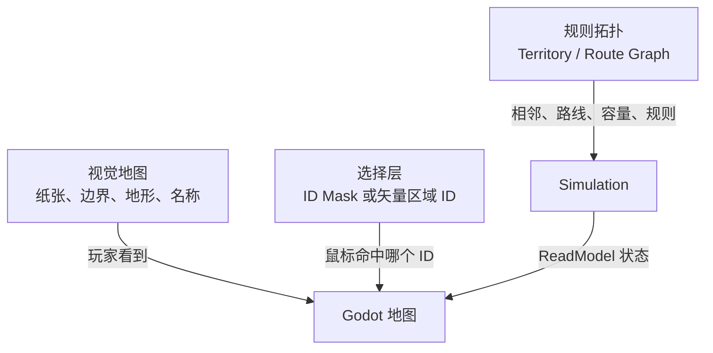
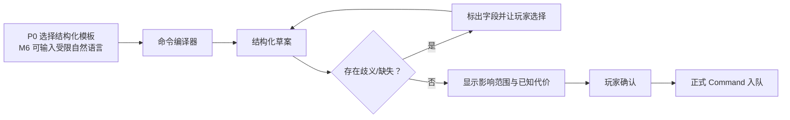

# UI 信息架构与交互详细设计

## 1. 核心隐喻：御案 + 活地图

UI 的任务不是把所有后台字段摆出来，而是让第一次玩策略游戏开发项目的人也能回答三件事：

1. 现在发生了什么？
2. 为什么会这样？
3. 我能做什么，代价是什么？

```text
┌──────────────────────────────────────────────────────────┐
│ 日期 / 暂停与速度      国家摘要       重大风险 / AI状态  │
├──────────────┬────────────────────────┬──────────────────┤
│   御案待办   │       天下活地图       │  人物 / 机构     │
│ ● 辽东急报   │  军队、城池、粮道      │ 公开身份         │
│ ● 户部请旨   │  仓储、风险、情报      │ 已知关系与证据   │
│ ○ 御史弹劾   │  可切换少量地图图层    │ 当前职权         │
├──────────────┴────────────────────────┴──────────────────┤
│ [召见] [询问] [批奏] [下旨] [交部议] [调查] [留中]       │
│ 朕欲……________________________________________________ │
└──────────────────────────────────────────────────────────┘
```

MVP 用一个主界面和上下文侧栏/弹窗即可，不先做六个互相跳转的大型页面。

## 2. 信息优先级

玩家每次打开游戏，信息按这个顺序出现：

```text
当前世界状态
→ 必须处理的事务
→ 玩家目前能采取的行动
→ 行动所需条件与代价
→ 执行中的进度
→ 已提交结果与失败原因
```

AI 对话框排在这些信息之后。一个很会说话的大臣不能遮住粮仓、期限、路线和权限。

## 3. MVP 页面结构

### 3.1 顶栏：时间与世界安全状态

始终显示：

- 当前游戏日期和时刻；
- 暂停/1/2/3/5 速；
- 是否有自动暂停原因；
- 存档状态（已保存/正在保存/失败）；
- AI 模式（规则模式/模型增强/预算耗尽/离线）；
- 当前剧本目标摘要。

不要显示技术线程、Token 等开发细节；成本详情放设置/调试页。

### 3.2 左栏：御案（Imperial Inbox）

每项显示：

```text
标题
来源与送达时间
观察发生时间（若不同）
紧迫度/截止时间
可信度或是否待复核
需要：知悉 / 决定 / 签发 / 追责
```

分类只保留少量：待决定、执行中、已完成/归档。不要一开始做复杂标签系统。

### 3.3 中央：地图

MVP 地图需要：

- 点击 6–7 个节点；
- 显示道路/海路；
- 显示玩家**已知的**库存、在途粮队、驻军和风险；
- 平移、缩放、选中；
- 2–4 个真正用于决策的 Overlay；
- 选中对象后在侧栏显示详情。

有限认知规则：中央直属仓在账册当前且玩家有权查看时可显示精确数；远方库存/驻军必须显示成“某日上报、约多少、可信度多少”。地图不能绕过情报系统直接读取全知真值。

### 3.4 右栏：上下文详情

根据选中内容展示：

- 地区：库存、仓储、路段瓶颈、已知风险；
- 人物：公开身份、职位、行为证据、可用职权；
- 机构：职责、任职者、积案、当前能力；
- 粮队：计划、路线、当前状态、预计到达、损耗；
- 政令：原目标、责任链、期限、执行差异。

后台人格数值不直接显示；使用玩家有证据知道的信息。

### 3.5 底部：行动区

根据当前选中事务显示少量上下文行动：

```text
召见 / 询问 / 要求复核 / 拟旨 / 交部议 / 改派 / 追责
```

P0 这里只显示结构化政令模板；到 M6，受限自然语言输入才成为“拟定政令”的一种入口，而且仍不是万能控制台。

## 4. 地图三层



- Visual Map 可以换皮，不影响规则；
- 选择层把鼠标位置转成稳定 Territory ID；
- 拓扑层才决定是否相邻、能否运输。

现有项目曾误用现代中国省级轮廓，现已从正式场景撤下。MVP 玩法图使用东亚物理底图、明确标成草稿的历史区域层，以及 6–7 个有规则作用的节点和路线；不会再用现代省界冒充明代边界，也避免全国地图制造“全国都可玩”的错误预期。

## 5. Overlay 设计

Overlay 是同一张地图上的状态视图，不是复制第二张世界。

MVP 只做：

| 图层 | 回答的问题 |
| --- | --- |
| 补给 | 哪些仓有粮、哪段路线是瓶颈、前线能撑几天？ |
| 军事 | 哪些部队/袭扰力量在哪里，战备如何？ |
| 情报 | 哪些地区信息新鲜、可信或未知？ |
| 政务（可选） | 文书、承办人和执行项目在哪里？ |

颜色不能是唯一信息渠道，同时使用图标、线型、数值和文字。图层切换只改变显示，不改变世界。

## 6. 政令编译与确认交互



P0 的可玩入口是结构化表单/模板，可附一句不参与规则的备注；自由文本编译属于 M6 增强。无论入口是哪种，确认面板至少显示：

- 玩家原话；
- 系统理解的目标；
- 负责人/协作机构；
- 地区和对象；
- 数量与单位；
- 预算上限；
- 期限；
- 禁止事项；
- 已知风险和缺失信息；
- 这是“提交申请”还是“已执行”的明确状态。

确认前还必须给出同口径的方案对比卡；数值不确定时显示区间、观察日期与可信度：

| 方案 | 时间 | 预计实到 | 银耗 | 风险 | 地方负担 | 情报可信度 |
| --- | ---: | ---: | ---: | --- | --- | --- |
| 陆运 | 约 12 日 | 约 4,600 石 | 1,000 两 | 中 | 中 | 高 |
| 海运 | 约 8 日 | 区间值 | 1,600 两 | 较高 | 低 | 中 |
| 两路并行 | 分批到达 | 区间值 | 两项合计 | 分散 | 较高 | 中 |

卡片同时写清“会挤占哪笔军饷、哪段路线容量或哪个承办人的时间”；否则玩家只是在选最快按钮，不是在做策略。

不确定字段不能用灰色小字藏起来。示例：

> “尽快”尚未解析：请选择 5 日 / 10 日 / 20 日，或允许承办人提出期限。

## 7. 状态语言

所有动作使用统一、不会误导的用语：

| 内部状态 | 玩家文字 |
| --- | --- |
| `DRAFT` | 草拟中，尚未生效 |
| `QUEUED` | 已提交，等待世界处理 |
| `COMMITTED` | 已批准/已正式发生（根据事件类型写具体词） |
| `IN_TRANSIT` | 已发出，在途 |
| `ARRIVED` | 已实际到达并入库 |
| `REJECTED` | 未执行，原因…… |
| `BLOCKED` | 暂时无法继续，需要…… |
| `EXPIRED` | 已过期限，未执行 |

禁止把 `QUEUED` 翻译成“已完成”，把 `ShipmentCreated` 翻译成“粮食已到”。

## 8. 结果与失败解释面板

每个重要命令固定五段：

```text
你要求什么
实际执行什么
资源和关系怎样变化
为什么发生差异
接下来能做什么
```

示例：

```text
要求：20 日内向宁远发粮 12,000 石
执行：已发出 8,000 石，预计实到 7,360 石
差异：山海关—宁远路段运力不足；预计运输损耗 8%
责任：户部已拨粮；运输官只征集到计划 71% 的车马
补救：延长期限 / 增加预算 / 改走海运 / 降低驻军日耗
```

预测阶段的数据只能来自明确标为 `PreviewDelta` 的草案，并在 UI 显示“预计/尚未生效”。正式结果只来自已提交 ReadModel、Commit Outcome 和 Domain Event；未提交的内部 `WorldDelta` 永远不能作为“实际结果”。AI 只能润色，不负责填数。

## 9. 人物面板

### 玩家可见

- 姓名、年龄、公开履历和当前职位；
- 玩家已知的能力证据；
- 公开或已知关系；
- 近期相关言行与承诺；
- 当前可使用的正式职权；
- 报告可信度和来源；
- 玩家与此人的可用互动。

### 玩家不可直接见

- 精确隐藏性格权重；
- 完整私有记忆；
- 未被发现的阴谋；
- 世界真相与其 Belief 的后台差值；
- LLM Prompt、系统指令、思维链。

调试模式可显示这些数据，但必须用明显开发者外观并禁止进入正式截图/存档玩法。

## 10. 情报显示

一条数值情报不能只显示一个精确数：

```text
敌军：约 18,000–26,000
观察：三日前
来源：宁远侦骑
可信度：中
佐证：尚无第二来源
```

过时程度、来源偏差和是否交叉验证需要同屏可见。鼠标提示或展开项可说明为什么可信度是中，但关键信息不能只藏在提示里。

## 11. 时间、进度和插值

Godot 接收两个只读快照：

```text
T0：粮队在山海关，路段进度 20%
T1：粮队仍在路段，进度 45%
```

UI 在两者之间平滑移动图标。玩家暂停时，动画也应停在相应表现状态；但不把图标屏幕坐标写回 Simulation。

进度显示优先用“预计抵达日期、当前路段、已损耗/风险”，百分比只是辅助。未知敌情下不要伪造精确到分钟的到达承诺。

## 12. 新手引导

首 30 分钟只教一个闭环：

1. 点击宁远急报；
2. 在地图找到宁远和粮道；
3. 查看为什么缺粮；
4. 召见户部/兵部获得两种意见；
5. 草拟并确认一份运粮政令；
6. 解除暂停；
7. 处理中途风险；
8. 阅读实到量与差异解释。

不在教程一次解释所有官制、税制和 Agent 架构。术语出现时用白话短句，例如：

> “预约”表示这批粮还在仓里，但已不能被别的命令使用。

## 13. 可访问性与可读性

- 中文正文字号在 1600×960 基准下仍清晰，允许 UI 缩放；
- 颜色含义配合图标/文本；
- 所有图标有文字标签或可读说明；
- 快捷键可重新绑定；
- 暂停、速度和重大警报支持键盘；
- 长奏疏先给摘要，再展开原文；
- 数字统一千位、单位和换算；
- 动画可降低/关闭；
- 不用仿古字体牺牲正文可读性；仿古风用于标题和装饰。

## 14. UI 组件最小集合

MVP 先做：

```text
ImperialShell（整体布局）
TimeControls
InboxList / InboxItem
MapView / MapOverlayLegend
ContextPanel
PersonSummary
DecreeDraftForm
CommandStatus
FailureExplanation
ResourceFlowRow
Modal/Confirmation
Toast/Alert（只用于短状态）
```

已有 `ImperialPanel`、`MemorialCard` 等视觉概念可整合，但不为每种奏疏类型复制组件；用内容和状态驱动同一个组件。

## 15. Godot 与核心的接口

Godot 只使用两类端口：

```text
Queries → 获得 ReadModel
Commands → 获得 Receipt，稍后观察 Outcome
```

Godot 脚本不得：

- 引用可变 `WorldState`；
- 调用领域对象的修改方法；
- 执行 SQL；
- 直接调用模型并据此改 UI 状态为成功；
- 自己计算权威库存、战斗或时间。

Presenter/ViewModel 把 ReadModel 转成 Godot 控件属性，动画层再做纯表现插值。

## 16. UI 完成判据

让一名不了解代码的试玩者在半小时内完成“宁远急饷”后，能准确回答：

- 粮为什么不够？
- 我的命令目前是草案、排队、已发出还是已到达？
- 哪个路段是瓶颈？
- 哪份情报可能不可信？
- 哪个人/机构负责下一步？
- 失败后至少有哪两种补救方法？

如果玩家只能说“我点了按钮，系统弹了很多字”，UI 还没有完成。
