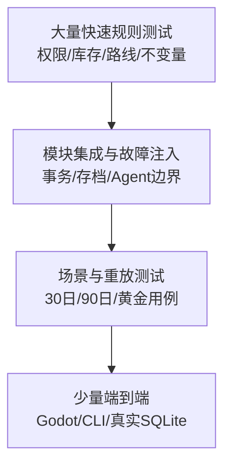

# 生产计划、质量门与风险

## 1. 生产原则

这是一项个人/小团队高复杂度项目。正确节奏不是“先把所有系统都写一点”，而是：

> 每个阶段只打通一个可证明的纵向闭环；上一阶段未通过质量门，不扩张下一层内容。

所有里程碑必须有可运行证据。文档、代码文件、漂亮 UI 或模型回复都不能单独代表完成。

## 2. 角色与文档责任

即使当前只有一个开发者，也要在思考上区分帽子：

| 帽子 | 责任 | 主要文档 |
| --- | --- | --- |
| 产品负责人 | 决定做什么、不做什么、为什么好玩 | 01、02、03 |
| 游戏系统设计 | 规则、反馈、平衡与玩家选择 | 02、领域详设 |
| 总架构师 | 层、模块、状态、依赖、ADR | 04、05、06 |
| AI 设计 | 人物认知、决策、记忆、权限 | 07 |
| 数据/存档 | 事务、版本、恢复、迁移 | 08 |
| UI/UX | 信息优先、操作和解释 | 09 |
| 技术负责人 | 最小代码、实现和代码审查 | 10 |
| QA | 自动测试、故障注入、试玩证据 | 本文、验收报告 |
| 历史内容 | Source Ledger、人物/机构/场景数据 | 16、后续内容包文档 |

一人可以戴多顶帽子，但不能用“程序能跑”替代产品和 QA 判断。

## 3. 路线图总览


模型接入排在规则闭环之后。否则模型会掩盖底层尚未真实执行的问题。

## 4. 各里程碑交付物和质量门

### M0：设计基线

交付：

- 本文档集；
- ADR 暂选的 1629“宁远急饷”范围与非目标；
- 架构/年份 ADR；
- 需求追踪矩阵；
- 一条“运 5000 石粮”的黄金用例；
- 现有代码差距审计。
- 宁远最小 Source Ledger（年份、人物、节点、路线、初始数值逐项标记 FACT/DESIGN/OPEN）；
- 场景控制表的纸面/小脚本数值试玩记录，证明陆运、海运、并行方案至少存在可解释取舍。

质量门：

- 技术小白能用自己的话说明 UI、模拟器、AI、存档分别干什么；
- Command、Intent、Event、WorldState 不混淆；
- P0/P1/P2 以及未决事项已区分；
- 任何新代码任务都能指向一个 P0 用例或风险。
- 17 号账本中会阻塞人物/路线内容的 `OPEN` 已有补证计划；场景设计值经过至少一次纸面/数值试玩。未满足时图纸可评审，但 M0 不冻结。

### M1：无 UI 世界机器

交付：

- `GameTime/WorldVersion/CommitId`；
- 稳定 Scheduler；
- 单写运行循环；
- 确定性随机分流；
- 最小命令日志和世界哈希；
- 30 日 headless 运行与 Replay。

质量门：

- 不启动 Godot 运行 30 日；
- 连跑 20 次结果哈希一致；
- 暂停/分段/倍速推进等价；
- 同时刻动作顺序固定；
- 不再新增依赖旧 `TurnNumber` 的核心功能。

### M2：真实运粮闭环

交付：

- 6 个节点、两条路线；
- 两个仓库和银/粮；
- `Shipment` 生命周期；
- 路线容量、时长、损耗；
- 固定角色 + 单项调粮权限、幂等、结构化失败；
- SQLite 原子 Commit、Input/Event Journal、Snapshot/Replay 最小版。

质量门：

- 5000 石在来源→在途→目的→损耗间守恒；
- 无权限调粮被拒绝；
- 重复命令十次只执行一次；
- 提交任意一步崩溃后没有半状态；
- 同一日志重放同一哈希；
- 新快照损坏时旧 READY 仍能加载。

M2 的权限只是一个可证明边界的最小检查，不提前实现完整任职系统；M4 再扩展 Appointment、辖区、额度和临时委托。

### M3：御案 + 活地图

交付：

- Godot 主壳；
- 地图节点、道路、库存和粮队；
- 暂停/倍速；
- ReadModel 与 Presenter；
- 政令草案、确认、状态和失败解释；
- 基础无障碍和 UI 缩放。

质量门：

- Godot 不引用可写 `WorldState`；
- UI 每种状态用语准确；
- 地图动画与模拟位置分离；
- 一名新玩家能判断粮在仓、在途还是已到；
- 存档/AI 状态清楚可见但不干扰玩法。

### M4：人物、机构、权限与文书

交付：

- 4–6 名关键人物、6–12 名背景人物、3 个群体；
- 6–8 个职位/机构；
- Appointment + Capability + Scope/Limit；
- 政令文书传递；
- Utility AI 方案选择；
- 最小关系、报告和 Belief；
- Utility AI/UI 共用的 `PerceptionPacketBuilder`，不接模型 Context Compiler。

质量门：

- 换任后权限跟职位/委托正确变化；
- 人物只看到 Perception Snapshot；
- 文书抵达与事情办成严格分开；
- 不接模型也能产生至少两种合理方案；
- 伪造 Actor 或越权目标均被拒绝。

### M5：可玩“宁远急饷”

交付：

- 60–90 日完整场景；
- 海陆方案、一次护卫/袭粮自动结算、一次天气延误、三份时效/可信度不同的报告；
- 日耗、欠饷/战备最小规则；
- 自动暂停；
- 混合结局与因果复盘；
- 30 分钟新手引导。

质量门：

- 至少三种有意义策略能通关/失败；
- 不存在一个显然支配所有选择的无脑方案（经试玩确认）；
- 玩家能解释一次失败原因和两个补救方案；
- 离线完整可玩；
- headless 长跑、故障注入和真实 UI 试玩均通过。

### M6：LLM 增强

交付：

- 一个 OpenAI-compatible Provider；
- 最多 3 名关键人物模型增强；
- DecisionRequired、模型 Context Compiler、结构化输出解析、期限/版本；
- fake/录制 Provider 契约测试；
- API 预算、停止和 Utility 回退；
- 模型审计与密钥安全路径。

质量门：

- 模型离线/超时不阻塞世界；
- 非法、越权、过期和重复输出均不执行；
- 模型叙事不改变任何状态；
- Replay 不请求模型；
- 关键密钥不出现在日志/存档；
- 开启模型后只增强人物表达/策略，不改变相同 Intent 的规则结果。

### M7：纵切稳定

交付：

- 90 日场景多随机种子重复运行 + 一年合成长跑；纵切稳定后再决定是否需要十年 Soak；
- 存档迁移和兼容测试；
- 性能/内存基线；
- Crash/Save 恢复报告；
- 多轮可用性和平衡迭代；
- 完整纵切 Source Ledger（最小版本已在 M0 建立）。

质量门：

- 所有 P0 自动门通过；
- 无已知存档损坏高风险；
- 低配目标机性能可接受；
- 关键历史内容来源可追；
- P1 扩展不会要求推翻核心边界。

## 5. Backlog 规则

每项任务必须包含：

```text
玩家/风险价值
范围
明确非目标
依赖
状态所有者
验收证据
失败路径
预计删除/替换的旧代码（若有）
对应文档与需求 ID
```

禁止只有“做一下外交系统”“优化架构”“接入 AI”这种无法验收的大任务。

## 6. Definition of Ready

一个开发任务进入编码前：

- 用户/玩家问题清楚；
- 属于当前里程碑；
- 输入、输出、失败和非目标清楚；
- 状态所有者明确；
- 依赖和接口已存在或任务包含最小新增；
- 能写出自动/试玩验收；
- 不依赖未决历史事实；若依赖，先完成 Source Ledger 研究；
- 新增范围有对应删减或预算。

## 7. Definition of Done

完成必须同时有：

- 生产实现；
- 自动测试；
- 真实入口端到端验证；
- 失败路径验证；
- 文档/Schema/迁移同步；
- 性能没有明显倒退；
- 无新增无用抽象/依赖；
- 用户可读结果；
- 可恢复提交或存档证据（涉及状态时）。

“配置改了”“代码编译了”“AI 回了一段话”都只是中间证据。

## 8. 测试金字塔



UI 自动化不替代规则测试；规则测试不替代真实 Godot/SQLite 路径。

## 9. 必须长期保存的回归样本

- `grain_to_ningyuan_happy_path`；
- `unauthorized_shipment_rejected`；
- `capacity_bottleneck_partial_plan`；
- `shipment_attacked_losses_conserved`；
- `duplicate_command_idempotent`；
- `model_claims_success_no_state_change`；
- `late_intent_expired`；
- `snapshot_failure_falls_back`；
- `replay_same_hash`；
- `migration_from_each_released_schema`。

每个样本包含初始内容哈希、输入日志、预期关键事件和最终哈希。

## 10. 性能预算（先设观测目标，不伪造承诺）

MVP 需要记录：

- 每推进一个游戏日的 CPU 时间分布；
- Scheduler 队列长度和到期批次大小；
- 活跃人物/群体/运输数量；
- 每次 Commit 时长和 WAL 大小；
- ReadModel 生成大小和频率；
- 内存占用随 30 日、1 年、10 年变化；
- 模型请求延迟、失败、Token 和成本（开启时）。

具体毫秒/内存门槛在确定目标硬件并建立 M2 基线后设置。不要凭空写一个“支持上万人物 60 FPS”数字。

## 11. 风险登记册

| 风险 | 概率/影响 | 早期信号 | 缓解 | 负责人/阶段 |
| --- | --- | --- | --- | --- |
| 范围爆炸：全国/完整制度同时开工 | 高/致命 | P2 任务进入当前 Sprint | 03 范围门、每加一项必须删一项 | 产品/M0起 |
| 回合与实时两套内核并存 | 高/高 | 新代码继续依赖 TurnNumber | M1 统一 GameTime/WorldVersion，旧路只兼容 | 架构/M1 |
| 内存、SQLite、UI 出现多真相 | 中/致命 | UI/后台直接写状态 | 单写者、Commit、ReadModel、架构测试 | 技术/M1–M3 |
| AI 幻觉变事实 | 中/致命 | 文本解析“已完成” | Structured Intent、权限、叙事只读 | AI/M4–M6 |
| 存档半提交/损坏 | 中/致命 | 状态与日志分开写 | SQLite 单事务、快照先验证 | 数据/M2 |
| 过度抽象导致开发停滞 | 高/高 | 空接口/空模块大量增长 | 最小代码准则、具体用例优先 | 全阶段 |
| 历史研究无限扩张 | 高/高 | 玩法无需求仍继续考证 | Source Ledger 与纵切需求绑定 | 内容/M0起 |
| 历史证据错配或过时 | 中/高 | 引用聊天内不可复用标记 | 正式来源账本、逐条重验 | 内容/M5前 |
| 模型成本/延迟不可控 | 中/中 | 日常事件触发 API | Utility first、预算和按需唤醒 | AI/M6 |
| 单机性能不足 | 中/高 | 每小时遍历所有对象 | 多频率调度、Cohort、Profile 后优化 | 技术/M1起 |
| 地图资产许可证/来源问题 | 中/高 | 直接复制外部数据 | 来源清单、许可证审计、独立内容导入 | 内容/UI |
| 战斗系统设计空缺 | 高/高（后续） | 用随机胜负占位后不断扩张 | MVP 限于袭粮；战斗单独立项 | 设计/M5后 |
| 信息/社会/外交尚无详设 | 高/中 | 提前建通用引擎 | 标 P2，真实纵切需求出现再设计 | 产品 |
| 单人知识集中 | 高/高 | 决策只存在聊天/脑内 | ADR、追踪矩阵、可运行样本 | 全阶段 |

## 12. 未决问题登记

当前必须承认而不是假装已定：

- 完整战斗、围城、伤亡和追击的最小模型；
- 农业、灾害、市场和社会群体的细度；
- 正式命令渠道的历史术语和差异；
- 首发正式标题与是否支持非皇帝角色；
- 1629 场景精确开局日和史实初始数值；
- Godot 与 Simulation 是否在 M3 就分线程；
- 一游戏小时基础边界是否经性能/玩法验证；
- API Key 的 Windows 安全存储具体方案；
- 目标最低硬件和 UI 缩放基线。

未决问题不进入核心接口硬编码。到达对应里程碑前用小实验/Source Ledger/试玩裁决并写 ADR。

## 13. 开源复用流程

现有参考仓库只提供思想和有限候选代码，不整仓拼接。

复用前：

1. 明确想解决的具体问题；
2. 定位最小相关文件；
3. 核对许可证和资产来源；
4. 记录 commit；
5. 比较技术版本；
6. 决定“直接复用、重写思想或不采用”；
7. 保留版权/许可证；
8. 写本项目测试证明行为；
9. 不让外部架构反向控制核心边界。

详见既有 [开源架构考古与复用边界](../开源架构考古与复用边界.md)。

## 14. 内容生产流程

```text
提出纵切需要的历史问题
→ 找一手/权威二手来源
→ Source Ledger 记录出处、时间、范围和置信度
→ 区分史料事实 / 高置信解释 / 游戏化推导 / 未决假设
→ 转成内容数据草案
→ Schema 校验和悬空引用检查
→ 规则/平衡试玩
→ 审核后合入场景
```

原策划中无法直接打开的聊天引用标记不能作为生产内容的证据；正式数据需要重新找可核对来源。

## 15. 每周/每阶段汇报格式

```text
本阶段要证明什么：
已完成且有证据：
仍只是原型/未验证：
自动测试结果：
真实入口结果：
新增风险/未决：
范围变化（新增了什么、删/推迟了什么）：
下一质量门：
```

这样能避免把“写了 5000 行”误当成进度。
